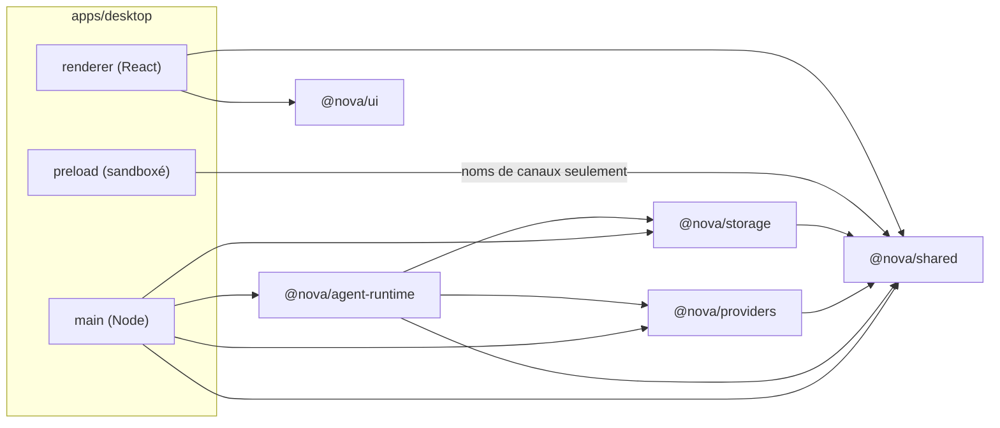
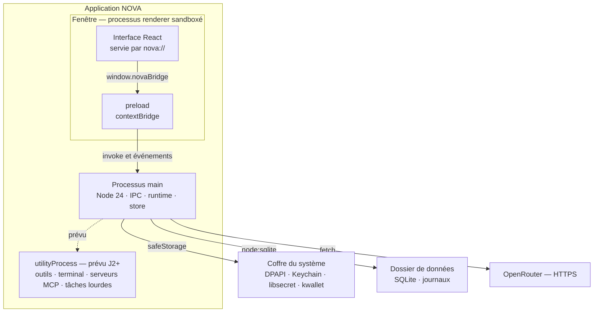
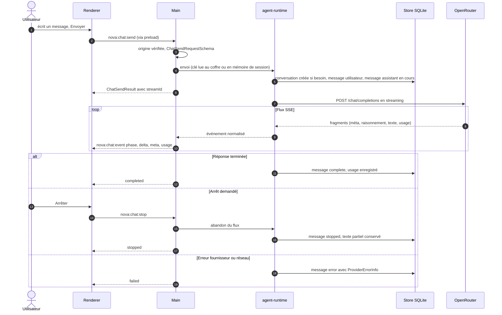
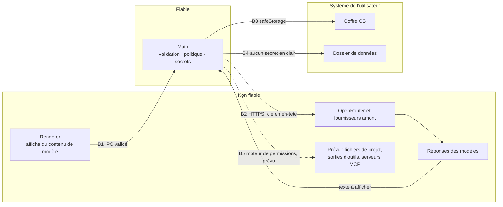

# Architecture

Comment NOVA est construit aujourd'hui, et ce qui est prévu. Ce qui est « prévu » n'existe pas dans le code. L'état réellement vérifié est dans [`STATUS.md`](STATUS.md) ; les raisons des choix sont dans [`DECISIONS.md`](DECISIONS.md).

## Vue d'ensemble

- Application desktop Electron (ADR-001) : un processus **main** fiable qui détient les secrets, le stockage et le réseau ; un **renderer** React isolé qui ne fait qu'afficher et demander (ADR-005).
- Le contrat entre les deux est un IPC typé et validé (`packages/shared/src/ipc.ts`).
- L'état produit est local, en SQLite (ADR-003). Aucun service distant n'est activé par défaut ; le seul trafic réseau du jalon 1 va vers OpenRouter (ADR-006).

## Carte des modules

| Module | Rôle | État |
| --- | --- | --- |
| `apps/desktop/src/main` | Fenêtre, protocole `nova://`, gestionnaires IPC, coffre `safeStorage`, instanciation du store et du runtime | J1, en cours |
| `apps/desktop/src/preload` | Pont `contextBridge` : expose `window.novaBridge` (type `NovaBridge`), canaux fixes | J1, en cours |
| `apps/desktop/src/renderer` | Interface React : trois zones, conversation, réglages, Nomi. Microcopie dans `renderer/copy` | J1, en cours |
| `apps/desktop/e2e` | Playwright `_electron`, faux serveur OpenRouter local, trousseau Linux privé | J1, en cours |
| `packages/shared` | Types du domaine, schémas zod de l'IPC, noms de canaux, masquage des secrets | Contrat en place |
| `packages/providers` | Interface `ModelProvider` et adaptateur OpenRouter (catalogue, clé, streaming, erreurs) | Contrat en place, adaptateur J1 en cours |
| `packages/storage` | `NovaStore` sur `node:sqlite`, migrations versionnées | Contrat en place, implémentation J1 en cours |
| `packages/agent-runtime` | Orchestration d'une génération : conversation → fournisseur → persistance → événements | J1, en cours |
| `packages/ui` | Tokens de design, composants, compagnon Nomi, assets de marque | J1, en cours |

Modules prévus, créés seulement au démarrage de leur jalon (ADR-002) :

| Module prévu | Rôle | Jalon |
| --- | --- | --- |
| `packages/tools` | Lecture, recherche, patchs multi-fichiers, terminal contrôlé, aperçu web | J2 |
| Moteur de permissions | Politiques allow/ask/deny évaluées hors du modèle. Emplacement à décider | J2 |
| `packages/mcp` | Client MCP (spécification stable 2025-11-25), serveurs locaux isolés | J3 |
| `packages/skills` | Installation, désinstallation, exécution des skills | J3 |
| `packages/voice` | Pipeline voix : appui pour parler, transcription visible | J4 |
| `packages/pets` | Profils et comportements du compagnon | J4 |
| `apps/web`, `apps/server` | Client Web/PWA et backend hébergé | J5 |

### Sens des dépendances autorisé

Règles : le renderer n'importe jamais `providers`, `storage` ni `agent-runtime` (code Node) ; `shared` ne dépend d'aucun autre paquet NOVA ; le preload n'importe que `@nova/shared/channels`.

## Modèle de processus

| Processus | Peut | Ne peut pas |
| --- | --- | --- |
| main | Lire et écrire le dossier de données, appeler le coffre, appeler OpenRouter, ouvrir un lien `https` autorisé dans le navigateur | Exécuter du code fourni par le renderer ou par un modèle |
| preload | Relayer les appels de l'API fixe `window.novaBridge` | Exposer `ipcRenderer` ou un canal arbitraire |
| renderer | Afficher, envoyer des requêtes typées, recevoir des événements | Accéder à Node, au disque, au réseau, aux clés |
| utilityProcess (prévu) | Exécuter un outil ou un serveur MCP dans le dossier de travail, avec des droits limités | Hériter des secrets ; sortir du périmètre accordé par le moteur de permissions |

## Flux d'un message de conversation

Contrat observable, indépendant des détails internes (ordre de lecture de la clé, rythme d'écriture du texte partiel) :

1. `chat.send` répond immédiatement avec la conversation, les deux messages et un `streamId`.
2. Des événements `phase` (`waiting` → `reasoning` → `writing`), `delta`, `meta`, `usage` suivent.
3. Un seul événement terminal clôt le flux : `completed`, `stopped` ou `failed`. Invariant attendu, à couvrir par les tests du runtime.
4. Au démarrage, `markInterruptedStreams()` passe en `interrupted` tout message resté `streaming` : le résultat côté fournisseur est inconnu, il n'est pas rejoué.
5. `chat.active()` permet au renderer de retrouver les flux en cours après un rechargement de la fenêtre.
6. `chat.retry` ne régénère que la dernière réponse d'une conversation, si elle est en erreur, arrêtée ou interrompue, et seulement à la demande de l'utilisateur.

Contexte envoyé au modèle (`packages/agent-runtime/src/prompt.ts`, en cours d'écriture) : un prompt système qui présente Nomi et précise qu'il n'a accès ni aux fichiers, ni au terminal, ni à Internet ; puis les messages de l'utilisateur et les réponses complètes non vides les plus récentes, dans une limite de 120 000 caractères. Le dernier message de l'utilisateur est toujours inclus.

## Frontières de confiance

Le détail des menaces et des contrôles par frontière est dans [`SECURITY.md`](SECURITY.md).

## Stockage

- Un fichier SQLite dans le dossier de données de l'application (`AppInfo.dataDir`) ; les journaux dans `AppInfo.logDir`. Les fichiers de projet ne sont jamais copiés dans la base.
- Migrations en ajout seul, suivies par `PRAGMA user_version`, chacune dans sa propre transaction avec la mise à jour de version. Une base écrite par une version plus récente de NOVA est refusée (`UnsupportedSchemaError`), jamais rétrogradée.
- Source de vérité du schéma : `packages/storage/src/migrations.ts`.

### Schéma v1

| Table | Contenu | Remarques |
| --- | --- | --- |
| `settings` | Réglages (`AppSettings`) en clé/valeur | Valeurs par défaut : `DEFAULT_SETTINGS` |
| `secrets` | `id`, `ciphertext`, `backend`, `created_at` | Texte chiffré uniquement ; `backend` indique le niveau réel (`basic_text` = coffre faible) |
| `provider_connections` | Fournisseur, `secret_ref`, mode de stockage, `key_hint` (4 caractères), état, dernière vérification, dernière erreur | `secret_ref` nul pour une clé de session |
| `model_catalog` | Catalogue par fournisseur et date de récupération | Sert de copie hors ligne (`source: "cache"`, `refreshError`) |
| `conversations` | Titre, dernier modèle choisi, dates | Index par date de mise à jour |
| `messages` | Rôle, contenu, statut, modèle demandé, modèle et fournisseur servis, erreur, usage | Ordre par `seq` ; statuts `complete`, `streaming`, `stopped`, `error`, `interrupted` |
| `usage_records` | Jetons (prompt, complétion, raisonnement, cache) et coût par génération | Survit à la suppression de son message : une réponse relancée a quand même été facturée |

### Entités prévues

Le modèle de données complet du produit est introduit jalon par jalon, chaque fois par une nouvelle migration. Les secrets restent toujours référencés par identifiant de coffre.

| Entité | Rôle | Jalon |
| --- | --- | --- |
| Conversation, Message | Conversations persistées | J1 (existe) |
| ProviderConnection | Connexion à un fournisseur | J1 (existe) |
| UsageRecord | Usage et coût rapportés | J1 (existe) |
| ModelCapability | Capacités connues d'un modèle | J1 via le catalogue ; routage mesuré en J6 |
| Workspace, Project | Dossier de travail choisi, projet | J2 |
| Attachment, Artifact | Pièces jointes, productions (fichiers, aperçus, rapports) | J2 |
| Mission, Task, AgentRun, ToolCall | Exécution d'une mission et de ses appels d'outils | J2 (J3 pour la reprise) |
| Approval, Policy | Décisions d'autorisation et règles du moteur de permissions | J2 |
| Checkpoint | Point de restauration de l'état de travail | J2 (fichiers), J3 (missions) |
| MemoryItem | Mémoire avec provenance, portée et date | Proposé J3 (question Q6) |
| SkillInstall, MCPConnection | Extensions installées, serveurs MCP | J3 |
| PetProfile, VoiceSession | Compagnon, sessions vocales (sans enregistrement conservé par défaut) | J4 |

## Contrat IPC

- Le preload expose `window.novaBridge` (`NovaBridge`) ; chaque méthode renvoie une enveloppe `IpcResult<T>`. Côté renderer, `createNovaClient` la transforme en valeur ou en `NovaIpcError`, car une sous-classe d'`Error` ne traverse pas `contextBridge`.
- Le main valide chaque requête avec son schéma zod et vérifie l'origine de l'émetteur avant tout traitement.

| Canal | Méthode | Requête | Résultat |
| --- | --- | --- | --- |
| `nova:app:info` | `app.info()` | — | `AppInfo` (version, plateforme, dossiers, niveau de coffre) |
| `nova:app:open-external` | `app.openExternal` | URL `https` | — |
| `nova:settings:get` | `settings.get()` | — | `AppSettings` |
| `nova:settings:update` | `settings.update` | `SettingsPatchSchema` (partiel, strict) | `AppSettings` |
| `nova:connection:get` | `connection.get` | `providerId` | `ProviderConnectionView` |
| `nova:connection:set-key` | `connection.setKey` | clé (8 à 512 caractères, sans espace), mode `vault`, `weak-vault` ou `session` | `ProviderConnectionView` |
| `nova:connection:test` | `connection.test` | `providerId` | `ProviderConnectionView` |
| `nova:connection:remove` | `connection.remove` | `providerId` | `ProviderConnectionView` |
| `nova:models:catalog` | `models.catalog` | `providerId`, `refresh` | `ModelCatalog` |
| `nova:conversations:list` | `conversations.list` | recherche (200 caractères max) | `ConversationSummary[]` |
| `nova:conversations:get` | `conversations.get` | `conversationId` (UUID) | `ConversationDetail` |
| `nova:conversations:rename` | `conversations.rename` | titre (1 à 120 caractères) | `Conversation` |
| `nova:conversations:delete` | `conversations.delete` | `conversationId` | — |
| `nova:chat:send` | `chat.send` | conversation ou `null`, contenu (100 000 caractères max), modèle | `ChatSendResult` |
| `nova:chat:stop` | `chat.stop` | `streamId` | — |
| `nova:chat:retry` | `chat.retry` | conversation, message assistant, modèle | `ChatRetryResult` |
| `nova:chat:active` | `chat.active()` | — | `ActiveStream[]` |
| `nova:chat:event` | `chat.onEvent` (poussé par le main) | — | `ChatStreamEvent` |

Ajouter un canal : nom dans `channels.ts`, schéma et type dans `ipc.ts`, méthode dans `NovaApi` et `createNovaClient`, gestionnaire validé dans le main, test.

## Modèle d'erreurs

Deux niveaux : l'enveloppe IPC (le main ne lève jamais d'exception brute vers le renderer) et l'erreur fournisseur normalisée.

### Erreurs IPC (`IpcErrorCode`)

| Code | Signification |
| --- | --- |
| `invalid_request` | La requête ne respecte pas son schéma. |
| `not_found` | Conversation, message ou flux introuvable. |
| `conflict` | Opération incompatible avec l'état courant. |
| `vault_unavailable` | Le mode de stockage demandé n'est pas disponible sur ce système. |
| `no_key` | Aucune clé configurée pour le fournisseur. |
| `provider` | Échec côté fournisseur ; le détail est dans `providerError`. |
| `internal` | Erreur inattendue ; message court, secrets masqués. |

Le texte affiché est choisi par le renderer à partir du code ; le message technique n'est qu'un détail.

### Erreurs fournisseur (`ProviderErrorInfo`)

Correspondance appliquée par l'adaptateur OpenRouter (source de vérité : `packages/providers/src/errors.ts`). `retryable` est dérivé du code et indique seulement qu'une relance **par l'utilisateur** peut réussir : NOVA ne relance jamais seul une requête payante.

| Code | Origine | Relance utile |
| --- | --- | --- |
| `no_key` | Aucune clé enregistrée | Non |
| `invalid_key` | HTTP 401 | Non |
| `insufficient_credits` | HTTP 402 | Non (recharger le crédit) |
| `forbidden` | HTTP 403 (modération, restriction de la clé) | Non |
| `not_found` | HTTP 404 | Non |
| `timeout` | HTTP 408, pas d'en-têtes en 30 s, silence de plus de 120 s | Oui |
| `rate_limited` | HTTP 429, avec `Retry-After` si fourni | Oui, après le délai |
| `model_unavailable` | HTTP 502 | Oui |
| `no_provider` | HTTP 503 : aucun fournisseur ne satisfait les contraintes (dont `data_collection`) | Oui, ou changer de modèle ou de réglage |
| `bad_request` | HTTP 400 | Non |
| `provider_error` | Autre 5xx, erreur envoyée en cours de flux | Oui |
| `network` | Hors ligne, DNS, connexion refusée | Oui |
| `stream_interrupted` | Flux coupé avant la fin | Oui |
| `aborted` | Arrêt demandé par l'utilisateur | — |
| `unknown` | Tout autre cas | Non |

Le message du fournisseur est masqué (`redactSecrets`) et tronqué à 500 caractères (`sanitizeProviderMessage`) avant d'être stocké ou affiché.

## Web et PWA (J5, prévu)

Un navigateur ne peut ni lancer de processus locaux ni accéder librement aux fichiers. La version Web ne reproduira donc pas le desktop à l'identique ; deux modes d'exécution sont prévus, jamais activés automatiquement :

| Mode | Principe | Conditions |
| --- | --- | --- |
| Exécuteur distant | Les missions s'exécutent sur un serveur hébergé, dans un espace de travail distant. | Backend séparé (`apps/server`) avec PostgreSQL et stockage objet, uniquement pour l'hébergement multi-utilisateur ; isolation stricte entre comptes (scénario 17). |
| Compagnon local appairé | Le client Web pilote l'application desktop de l'utilisateur. | Appairage explicite initié par l'utilisateur ; pont authentifié par jeton révocable ; origines autorisées restreintes ; écoute locale uniquement ; aucune découverte ni activation automatique ; mêmes permissions que dans le desktop. |

Le desktop reste l'environnement de référence tant que ces modes ne sont pas vérifiés.
