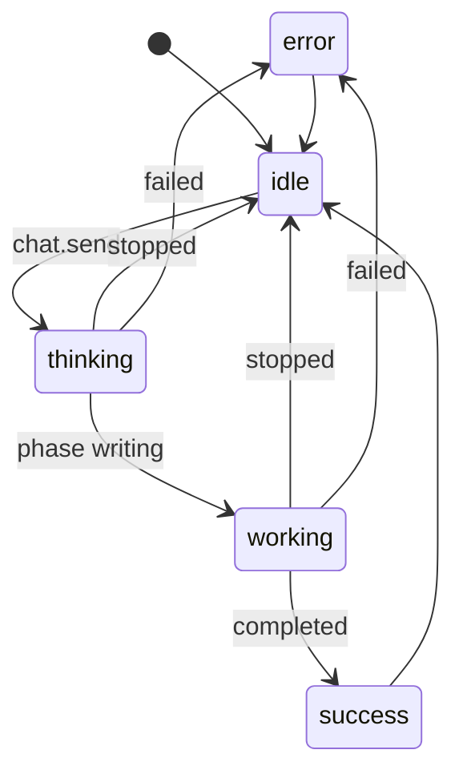

# Système de design

Règles visuelles, de ton et d'accessibilité de NOVA. La source de vérité des valeurs est le code de `packages/ui` (`src/tokens.ts`, `src/styles/tokens.css`) ; ce document explique les intentions et doit rester aligné sur le code.

## Identité

- **Caractère** : un atelier calme et précis. Chaleureux sans familiarité, concret, sans effets gratuits.
- **Noms** : NOVA (produit) et Nomi (compagnon), provisoires tant que la question Q1 de [`DECISIONS.md`](DECISIONS.md) n'est pas tranchée.
- **Thèmes** : « Nuit minérale » (sombre) et « Papier minéral » (clair). Réglage par défaut : suivre le système (`theme: "system"`) ; sans indication, la feuille de style applique le thème sombre.
- **Marque** : le concept de ruban du propriétaire, redessiné en vecteur (commit `996fd02`) : un ruban jade en forme de N dont les deux extrémités s'enroulent en orbite, avec une lune. C'est une forme **pleine**, un seul tracé (`MARK_PATH` dans `packages/ui/src/brand/paths.ts`, `viewBox` `0 0 256 256`, marge de 8 %), lune comprise ; ni trait, ni cercle séparé. Le redessin recouvre l'image de référence à 0,98 (IoU). Assets dans `packages/ui/assets` (marque, marque monochrome, mot-symbole, combinaison, icône d'application) ; icônes PNG régénérées par `pnpm icons`.
- **Nomi** : un petit cairn de trois galets doux, deux yeux, une orbite inclinée à la taille et un satellite.
- **Signature** : l'orbite. Elle relie la marque et Nomi, et signale l'activité réelle (voir [Signature orbite](#signature-orbite)).
- **Polices** : Manrope (interface) et JetBrains Mono (code, identifiants de modèles, valeurs chiffrées), embarquées localement (ADR-010).
- **Icônes** : lucide-react, toujours accompagnées d'un nom accessible.
- **À éviter** : dégradés criards, confettis, animations d'attente sans activité réelle, compteurs décoratifs.

## Voix et microcopie

La microcopie de l'application vit dans `apps/desktop/src/renderer/copy` et fait foi. Règles :

1. Français clair, phrases courtes, un verbe d'action par bouton : « Enregistrer la clé », « Arrêter », « Réessayer », « Garder », « Annuler les changements ».
2. Une seule forme d'adresse dans tout le produit. Les libellés actuels de Nomi tutoient (« Nomi attend ta réponse ») ; confirmation attendue du propriétaire (question Q7).
3. Un message d'erreur dit **ce qui s'est passé**, **pourquoi** si on le sait, et **quoi faire**. Pas de reproche, pas de point d'exclamation, pas de code seul.
4. Inconnu s'écrit « inconnu ». Jamais 0, jamais une estimation présentée comme une mesure.
5. Nombres au format français : `1 234 jetons`, `0,0012 $`. Les coûts viennent du fournisseur ; un total incomplet est présenté comme « au moins ».
6. NOVA n'affirme pas ce qu'il n'a pas vérifié : « Le test passe » seulement après l'avoir lancé.
7. Mode Créer : mots du quotidien (« changements »). Mode Expert : vocabulaire technique (« diff », identifiant de modèle, jetons).

### Glossaire

| Terme utilisé | Plutôt que | Sens |
| --- | --- | --- |
| clé | token, API key | Clé OpenRouter de l'utilisateur |
| coffre | keyring, vault | Stockage chiffré du système |
| modèle | LLM, IA | Modèle choisi dans le catalogue |
| fournisseur | provider | Service qui sert le modèle (OpenRouter, puis fournisseur amont) |
| jetons | tokens | Unité de facturation |
| crédit | balance | Solde OpenRouter |
| mission | tâche, job | Travail confié à NOVA sur un dossier (J2+) |

### Messages d'erreur : direction

Exemples de ton, pas le texte final.

| Code | Message | Action proposée |
| --- | --- | --- |
| `invalid_key` | OpenRouter refuse cette clé. | Remplacer la clé |
| `insufficient_credits` | Le crédit OpenRouter de cette clé est épuisé. | Ouvrir la page des crédits |
| `rate_limited` | Trop de requêtes pour l'instant. Nouvel essai possible dans 7 s. | Réessayer (actif après le délai) |
| `timeout` | Le modèle n'a pas répondu à temps. | Réessayer · Choisir un autre modèle |
| `network` | Impossible de joindre OpenRouter. Connexion à vérifier. | Réessayer |
| `stream_interrupted` | La réponse a été coupée. Le texte reçu est conservé. | Réessayer |
| `truncated` | Réponse coupée à sa longueur maximale. Le texte reçu est conservé. | Réessayer |
| `filtered` | Réponse bloquée par le filtre du fournisseur. | Changer de modèle |
| `empty_response` | Le modèle n'a rien répondu. | Réessayer |
| `no_provider` | Aucun fournisseur ne sert ce modèle avec le réglage de confidentialité actuel. | Voir le réglage · Choisir un autre modèle |
| `model_unavailable` | Ce modèle est indisponible pour le moment. | Réessayer · Choisir un autre modèle |
| statut `interrupted` | Réponse interrompue par la fermeture de NOVA. Son résultat côté fournisseur est inconnu. | Réessayer |
| arrêt (`stopped`) | Réponse arrêtée. | — (état neutre, pas une erreur) |

## Tokens — valeurs initiales

> **Non validées.** Valeurs relevées dans `packages/ui/src/tokens.ts` et `src/styles/tokens.css` le 2026-09-27, pendant que la voie design y travaille encore. Si le code diffère, le code a raison. Les valeurs finales sont reportées dans [Tokens validés](#tokens-validés).

Variables CSS préfixées `--nv-` (par exemple `textSecondary` → `--nv-text-secondary`). Thème posé par `data-theme` sur `<html>`.

### Couleurs principales

| Token | Nuit minérale | Papier minéral | Usage |
| --- | --- | --- | --- |
| `bg` | `#111619` | `#F5F3EC` | Fond de l'application |
| `panel` | `#192226` | `#EEEBE3` | Zones, panneaux |
| `raised` | `#243035` | `#FFFFFF` | Menus, dialogues, cartes |
| `field` | `#0D1215` | `#FFFFFF` | Champs de saisie |
| `border` | `#2A363B` | `#DDD8CC` | Séparateurs décoratifs |
| `borderStrong` | `#758689` | `#76848A` | Bords de champs et de contrôles |
| `text` | `#F2F5F3` | `#172328` | Texte principal |
| `textSecondary` | `#ABB9BB` | `#4B5A5D` | Texte secondaire |
| `accent` | `#86D8BB` | `#216B56` | Orbite, actions principales, liens |
| `onAccent` | `#111619` | `#FFFFFF` | Texte sur fond d'accent |
| `amber` | `#EEC181` | `#7D5310` | Attention (coffre faible, coût inconnu) |
| `danger` | `#F18A8A` | `#B3261E` | Erreur, action destructrice |
| `info` | `#9CC7D6` | `#2B6076` | Information |
| `focus` | `#86D8BB` | `#216B56` | Anneau de focus |

Le code définit aussi des variantes (`*Hover`, `*Soft`, `selection`, infobulles) et les couleurs de Nomi (normal, erreur, hors ligne).

Contrastes calculés sur ces valeurs (formule WCAG 2.x), pire cas parmi `bg`, `panel`, `raised`, `field` :

| Token | Nuit minérale | Papier minéral | Seuil |
| --- | --- | --- | --- |
| `text` | 12,35:1 | 13,48:1 | 4,5:1 |
| `textSecondary` | 6,71:1 | 6,04:1 | 4,5:1 |
| `accent` | 8,10:1 | 5,34:1 | 4,5:1 |
| `amber` | 8,12:1 | 5,66:1 | 4,5:1 |
| `danger` | 5,64:1 | 5,49:1 | 4,5:1 |
| `info` | 7,46:1 | 5,80:1 | 4,5:1 |
| `focus` | 8,10:1 | 5,34:1 | 3:1 |
| `borderStrong` | 3,57:1 | 3,24:1 | 3:1 |
| `onAccent` sur `accent` | 10,89:1 | 6,36:1 | 4,5:1 |
| `onDanger` sur `danger` | 7,58:1 | 6,54:1 | 4,5:1 |

`packages/ui/src/contrast.ts` fournit le même calcul au code et aux tests.

### Typographie

| Token | Valeur |
| --- | --- |
| `--nv-font-ui` | Manrope Variable, puis polices système |
| `--nv-font-mono` | JetBrains Mono Variable, puis polices à chasse fixe du système |
| `--nv-text-xs` … `--nv-text-3xl` | 12, 13, 14, 16, 20, 26, 34 px |
| `--nv-leading-tight`, `--nv-leading-normal` | 1,25 · 1,5 |
| `--nv-weight-regular`, `medium`, `bold` | 450 · 560 · 680 |

Chiffres tabulaires (`font-variant-numeric: tabular-nums`) pour les coûts, jetons et durées.

### Espacement, rayons, contrôles

| Espacement | Valeur | | Rayon | Valeur |
| --- | --- | --- | --- | --- |
| `--nv-space-1` | 4 px | | `--nv-radius-xs` | 6 px |
| `--nv-space-2` | 8 px | | `--nv-radius-sm` | 10 px |
| `--nv-space-3` | 12 px | | `--nv-radius-md` | 12 px |
| `--nv-space-4` | 16 px | | `--nv-radius-lg` | 16 px |
| `--nv-space-5` | 24 px | | `--nv-radius-pill` | 999 px |
| `--nv-space-6` | 32 px | | | |
| `--nv-space-7` | 48 px | | | |

Hauteur des contrôles : 30 px (`--nv-control-sm`) et 36 px (`--nv-control-md`), au-dessus de la cible minimale de 24 px.

### Mouvement

| Token | Valeur | Usage |
| --- | --- | --- |
| `--nv-duration-fast` | 120 ms | Survol, focus, petits changements |
| `--nv-duration-base` | 180 ms | Ouverture de menus, panneaux |
| `--nv-duration-slow` | 220 ms | Transitions de zone, changements d'état de Nomi |
| `--nv-ease-standard` | `cubic-bezier(0.2, 0, 0, 1)` | Transitions courantes |
| `--nv-ease-out` | `cubic-bezier(0.16, 1, 0.3, 1)` | Entrées |

Mouvement réduit : `data-motion="reduce"`, ou préférence du système tant que l'application n'impose pas `data-motion="full"`. Nomi fige alors toute animation et garde une pose statique distincte par état. Aucune information ne dépend d'une animation.

## Tokens validés

> **À remplir par l'intégrateur** à partir de `packages/ui`, une fois la voie design terminée, avec les ratios de contraste mesurés sur les valeurs finales. Tant que cette section est vide, les valeurs ci-dessus ne sont qu'un relevé intermédiaire.

| Token | Nuit minérale | Papier minéral | Contraste mesuré | Source |
| --- | --- | --- | --- | --- |
| à compléter | | | | |

## Signature orbite

- **Forme** : une orbite et un satellite. Dans la marque, ce sont les deux extrémités du ruban qui s'enroulent en orbite, avec la lune ; chez Nomi et dans l'indicateur d'activité, une ellipse inclinée et fine entoure la taille.
- **Usages** : marque, Nomi, indicateur d'activité ; plus tard la carte des missions (J2+).
- **Règle d'or** : l'orbite ne bouge que si le runtime rapporte une activité réelle (phase de flux, état de mission). Au repos, elle est immobile : pas de boucle décorative, ce qui compte aussi pour la consommation au repos.
- **Toujours doublée d'un texte** : l'orbite ne porte jamais seule une information ; chaque état de Nomi a un nom accessible en français.

## Composants

Liste de travail pour `packages/ui` et le renderer. L'état réel est suivi dans [`STATUS.md`](STATUS.md). Exports de `packages/ui/src/index.ts` au 2026-09-27 :

- marque : `LogoMark`, `Wordmark`, `Lockup` ;
- primitives : `Button`, `IconButton`, `TextField`, `TextArea`, `Switch`, `SegmentedControl`, `Badge`, `StatusPill`, `Callout`, `EmptyState`, `Dialog`, `Toaster` et `useToast`, `Tooltip`, `Kbd`, `VisuallyHidden`, `Skeleton`, `OrbitIndicator` ;
- compagnon : `Nomi`, `NOMI_STATES`, `NOMI_STATE_LABELS` ;
- galerie de développement : `ComponentGallery`.

| Composant | Rôle | Jalon |
| --- | --- | --- |
| Marque (`LogoMark`, mot-symbole, combinaison) | Identité, en couleur d'accent ou en couleur du texte | J0 |
| Nomi | Compagnon relié aux événements réels, nom accessible par état | J1 (états), J4 (voix) |
| Coque à trois zones | Navigation, conversation ou tâche, panneau de travail ; redimensionnables au clavier et à la souris | J1 |
| Barre de navigation | Espaces disponibles uniquement | J1 |
| Barre de commande | Toutes les actions disponibles, au clavier | J1 |
| Liste des conversations | Recherche, renommage, suppression | J1 |
| Fil de conversation | Messages en Markdown (sans HTML brut), blocs de code, statut de chaque message | J1 |
| Zone de saisie | Envoi, arrêt, modèle courant | J1 |
| Sélecteur de modèle | Nom, auteur, contexte, prix par million de jetons ou « inconnu », prix variable, capacités, date de retrait | J1 |
| Configuration de la clé | Saisie, choix du stockage, niveau réel du coffre, consentement au coffre faible | J1 |
| Résumé d'usage | Jetons, coût, mention « au moins » si un coût manque | J1 |
| Avis d'erreur | Message, détail repliable, action | J1 |
| Dialogue de confirmation | Actions destructrices (supprimer une conversation, une clé) | J1 |
| Panneau de travail | Aperçu, fichiers, diff, terminal, documents | J2 |
| Vue de diff | Par fichier, acceptation partielle, restauration | J2 |
| Carte d'approbation | Ce que l'agent veut faire, portée, durée ; accepter ou refuser | J2 |
| Carte de mission, jauge de budget | État de la mission, dépenses réservées et réelles | J2–J3 |

## États par écran

Chaque écran prévoit ses six états. « — » : sans objet.

| Écran | Vide | Chargement | Hors ligne | Erreur | Succès | Refusé |
| --- | --- | --- | --- | --- | --- | --- |
| Premier lancement (clé) | Ce qu'est une clé OpenRouter, où la créer, choix du stockage | « Vérification de la clé… » | Clé enregistrée comme non vérifiée, vérification relançable | Message selon le code | Libellé, limite et reste (ou « inconnu ») | Coffre indisponible : clé de session seulement, expliqué ; coffre faible : consentement demandé |
| Conversation | Invitation à écrire, modèle courant visible | Phase réelle : attente, réflexion, écriture | Avis réseau, texte reçu conservé, « Réessayer » | Avis selon le code, sans bloquer la saisie | Réponse, modèle et fournisseur servis, usage | Clé refusée, crédit épuisé, contenu refusé (403) : action proposée |
| Sélecteur de modèle | Aucun modèle ne correspond au filtre | Squelette de liste | Copie en cache datée, erreur d'actualisation visible | Pas de cache et échec : réessayer | Catalogue | — |
| Historique | « Aucune conversation » ; recherche sans résultat | Squelette de liste | — (local) | Base illisible : message et chemin du fichier | Liste triée par date | — |
| Réglages | — | Valeurs en cours de lecture | Vérification de clé impossible, signalée | Réglage refusé par la validation | Changement appliqué immédiatement | Option indisponible sur ce système (coffre) expliquée |

## États de Nomi

États définis dans `packages/ui/src/nomi/states.ts` (`NomiState`), avec leur nom accessible. Chaque état doit correspondre à un événement réel du runtime ; la correspondance ci-dessous est une proposition, celle qu'applique le renderer fait foi.

| `NomiState` | Nom accessible (code) | Événement runtime proposé | Jalon |
| --- | --- | --- | --- |
| `idle` | « Nomi est disponible » | Aucun flux actif, clé valide | J1 |
| `offline` | « Nomi est hors ligne » | Pas de clé utilisable, ou OpenRouter injoignable | J1 |
| `thinking` | « Nomi réfléchit » | Phase `waiting` ou `reasoning` (ADR-008) | J1 |
| `working` | « Nomi travaille » | Phase `writing` | J1 |
| `success` | « Terminé » | Événement `completed`, puis retour à `idle` | J1 |
| `error` | « Quelque chose a échoué » | Événement `failed` | J1 |
| `waiting` | « Nomi attend ta réponse » | Mission en `waiting-approval` | J2 |
| `listening` | « Nomi écoute » | Appui pour parler actif | J4 |
| `speaking` | « Nomi parle » | Lecture vocale en cours | J4 |

Un arrêt (`stopped`) ramène à `idle` : ce n'est pas une erreur. Nomi affiche d'abord « Génération arrêtée » quelques secondes, puis « Nomi est disponible ». Compagnon masqué (`companion.visible = false`) : l'état reste affiché en texte dans la conversation.

## Accessibilité

Cible : WCAG 2.2 niveau AA sur tout parcours livré.

- **Contraste** : 4,5:1 pour le texte, 3:1 pour le grand texte, les contrôles et l'indicateur de focus (`CONTRAST_TEXT`, `CONTRAST_UI` dans `packages/ui/src/contrast.ts`).
- **Clavier** : tout le parcours principal au clavier ; ordre de tabulation logique ; focus toujours visible (couleur `focus`) ; pas de piège ; Échap ferme menus et dialogues ; poignées des zones redimensionnables accessibles au clavier.
- **Lecteurs d'écran** : `lang="fr"` ; nom accessible pour chaque bouton-icône et pour Nomi ; une région par zone ; la fin d'une réponse et les erreurs sont annoncées (`aria-live="polite"`, `assertive` seulement pour une erreur bloquante) sans annoncer chaque fragment du flux.
- **Couleur** : jamais seule porteuse d'information ; chaque état a un texte ou une icône nommée.
- **Mouvement** : réduction respectée partout ; réglage propre au compagnon (`system`, `reduce`, `full`).
- **Cibles** : 24 × 24 px minimum.
- **Zoom** : utilisable à 200 % sans perte de contenu ni défilement horizontal du fil de conversation.
- **Vérification** : tests de composants (rôles, noms, focus) ; passage manuel avec Orca (Linux), NVDA (Windows), VoiceOver (macOS) ; résultats consignés dans `STATUS.md` (scénario 15).
