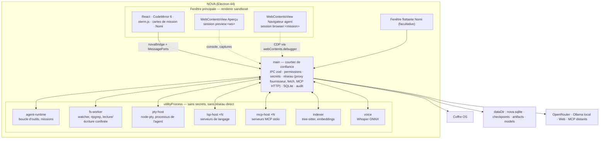

# NOVA — FEATURES.md
## Conception produit et technique de la v2 : « l'atelier complet »

*Version de cadrage : 27 septembre 2026. Rédigé après lecture de `AGENTS.md`, `docs/PRODUCT.md`, `ARCHITECTURE.md`, `ROADMAP.md`, `STATUS.md`, `DECISIONS.md`, `SECURITY.md`, `ACCEPTANCE.md`, `DESIGN_SYSTEM.md`, du code de `packages/*` et `apps/desktop/src/*`, et du brief maître. Aucun fichier n'a été modifié.*

### Point de départ honnête

Ce qui existe (v0.1.0, vérifié dans `STATUS.md` et le code) : un shell Electron 44 sain (renderer sandboxé, protocole `nova://`, IPC zod, coffre `safeStorage`), un adaptateur OpenRouter complet (catalogue, streaming SSE, arrêt, 19 codes d'erreur normalisés, usage/coût), un store SQLite v1 (7 tables), un runtime de conversation (`chat-runner.ts`, 513 lignes) qui ne connaît **aucun outil** (`ModelProvider.streamChat` n'a pas de paramètre `tools` ; le prompt système dit même au modèle qu'il n'a « accès ni aux fichiers, ni au terminal, ni à Internet »), un design system solide, et Nomi qui **dérive** un état à partir de trois faits (`deriveNomiState` : connexion, phase de flux, dernier résultat). Nomi ne peut rien déclencher.

Le propriétaire a raison : c'est un bon socle de messagerie, pas encore un atelier. Ce document décrit l'atelier, en réutilisant tout le socle (le contrat IPC, l'enveloppe `IpcResult`, la table `usage_records`, le modèle d'erreurs, les tokens, l'orbite).

### Conventions du document

- **Priorité** : P0 = indispensable pour être « le meilleur outil » (sans cela NOVA reste un chat) · P1 = attendu d'un outil de premier plan · P2 = avantage ou confort, après stabilisation.
- **Effort** : S ≤ 2 jours · M ≤ 1 semaine · L ≤ 3 semaines · XL > 3 semaines (une personne + agents, à plein temps).
- **⚠** signale un fait **non vérifié** ou une incertitude ; il doit être levé avant d'écrire du code qui en dépend. Les faits marqués « vérifié le 27/09/2026 » ont été contrôlés sur la source primaire (registre npm, docs OpenRouter, spécification MCP, docs Electron, docs Ollama) — la liste complète est en annexe.
- Numérotation des jalons : `J2`…`J8+` ci-dessous **remplace** la découpe J2–J6 de `ROADMAP.md` (à mettre à jour si le propriétaire valide ce document). Le contenu des anciens J2 et J3 est conservé, étendu et découpé plus finement.

---

## 1. Vision en une page

### Ce qui fait de NOVA le meilleur outil — sept piliers

1. **Un atelier, pas une messagerie.** Éditeur de code, terminal, aperçu de l'application, diff et agent vivent dans la même fenêtre, avec le travail de l'utilisateur au centre. Cursor, Windsurf et Zed sont des IDE augmentés pour développeurs ; Lovable, Bolt et v0 sont des générateurs hébergés qui possèdent votre code ; Claude Desktop et ChatGPT sont des conversations qui sortent de leur boîte par des connecteurs. NOVA est un atelier **local** où une personne qui ne code pas voit, teste et garde — et où celle qui code trouve un vrai éditeur.

2. **Preuves avant promesses — rendu visible.** C'est déjà l'ADN du dépôt (« inconnu » plutôt que deviné, pas de faux compteur). La v2 en fait le différenciateur central : chaque changement porte **sa preuve** (la commande de test réellement lancée et sa sortie, la capture d'écran de l'aperçu avant/après, le diff octet pour octet). La *carte de mission* relie demande → tâches → fichiers → preuves → décision « garder / annuler ». Aucun concurrent grand public ne montre cela sans lire des logs.

3. **Autonomie par contrat, hors du modèle.** Avant une mission, l'utilisateur fixe le cadre : dossier, actions permises, hôtes réseau, durée, budget. Un moteur de permissions **dans le main**, jamais dans le prompt, applique ce contrat ; tout dépassement suspend. Les outils concurrents oscillent entre « demander à chaque fois » (fatigue) et « YOLO » (danger). NOVA offre des profils compréhensibles (Lecture seule / Assisté / Autonome dans ce projet / Personnalisé), un essai à blanc et un journal d'audit lisible.

4. **Nomi agit.** Le compagnon cesse d'être un indicateur : il lance et suit des missions, explique une erreur en un geste, propose une action seulement à partir d'un **signal réel** (un test qui échoue, un serveur de dev qui plante, une branche en retard), veille une mission longue et rapporte, parle et écoute (appui pour parler), vit dans une fenêtre flottante facultative. Sans culpabilisation, sans série à entretenir, sans notification artificielle (règles anti-manipulation du brief transformées en critères d'acceptation).

5. **Internet et connecteurs sous contrôle.** Recherche web avec citations, lecture de pages, mode recherche approfondie, navigateur embarqué qui réutilise le Chromium d'Electron (rien à télécharger, contrairement à un Playwright séparé), client MCP complet (stdio, Streamable HTTP, OAuth 2.1) avec **permission par outil**, catalogue de serveurs recommandés et gestionnaire lisible. Tout ce qui vient de l'extérieur est traité comme une donnée non fiable, avec sa provenance affichée.

6. **Modèles interchangeables, coûts visibles.** OpenRouter d'abord (déjà là), Ollama pour le local, profils Économique / Équilibré / Qualité / Local avec règles inspectables, replis qui préservent capacités et confidentialité, budget réservé **avant** l'appel, rapport de coût par mission, dossier de passation pour changer de modèle en cours de route. Aucun abonnement NOVA, aucune clé cachée.

7. **Local d'abord, honnête sur ce qui part.** Index du code local (ripgrep + tree-sitter), embeddings locaux en option, inspecteur de contexte qui montre exactement ce qui sera envoyé et à qui, politique de domaines, exclusions de fichiers sensibles, effacement réel.

### Les dix premières minutes (« wow » mesurables)

| Minute | Ce que l'utilisateur vit | Ce qui le rend possible |
| --- | --- | --- |
| 0–1 | Colle sa clé, choisit un dossier. Nomi dit : « J'ai repéré un projet Vite + React, 214 fichiers, tests Vitest. Je peux te l'expliquer ou le lancer. » | Détection de projet (E1, F2), index rapide (C1) |
| 1–3 | « Explique-moi ce projet » → une carte : structure, points d'entrée, comment lancer, 3 pièges repérés, chaque élément **cliquable** vers le fichier dans l'éditeur | Mode Comprendre (A12), symboles tree-sitter (C1), @-mentions (C6) |
| 3–6 | « Le bouton Enregistrer ne fait rien » → plan de 3 étapes, contrat d'autonomie proposé (« ce dossier, lecture/écriture, lancer les tests, 0,40 $ max »), mission lancée, on voit le test **réellement** échouer puis passer, le diff par fichier, « Garder » | Boucle d'outils (A1–A4), permissions (S1), checkpoints (A10), relecture (A11) |
| 6–8 | « Lance l'application » → l'aperçu s'ouvre dans le panneau de droite ; l'utilisateur clique sur un bouton, écrit « plus lisible », NOVA propose le changement et montre l'avant/après | Aperçu (F1–F2), clic-pour-corriger (F3, P1 : en J5) |
| 8–9 | Nomi, discret : « Le serveur de dev a planté : `TypeError` ligne 42 de `api.ts`. Je regarde ? » Un clic : explication + mission Corriger | Signaux réels (N2), Explique cette erreur (N3) |
| 9–10 | Extensions → « GitHub » → connexion OAuth en 30 s → « Ouvre une issue pour le bug qu'on vient de corriger » → carte d'approbation qui montre exactement l'appel avant de l'envoyer | Client MCP + OAuth (M1–M3), permission par outil (M5) |

### Là où NOVA dépasse (et non copie) les références

| Référence | Ce qu'elle fait bien | Là où NOVA va plus loin |
| --- | --- | --- |
| Claude Code / Claude Desktop | Agent d'outils, MCP, skills, checkpoints | Tout cela **visuellement**, pour non-codeurs ; aperçu intégré ; BYOK multi-modèles ; compagnon qui agit ; budget réservé ; audit lisible |
| Cursor / Windsurf | Éditeur natif, autocomplétion, agents en arrière-plan | Preuves attachées à chaque changement ; contrat d'autonomie ; coût par mission ; pas d'abonnement ; dossier de passation |
| Zed | Performance, collaboration | NOVA ne rivalisera pas sur la latence brute d'un éditeur natif ; il rivalise sur l'intégration agent + aperçu + preuves |
| VS Code + Copilot agent | Écosystème, LSP | LSP repris (via `@codemirror/lsp-client`), mais parcours guidé, missions persistantes, Nomi |
| Replit Agent, Lovable, Bolt, v0 | Zéro installation, aperçu instantané, déploiement | **Local**, code standard, aucun verrouillage ; export et recettes de déploiement reproductibles au lieu d'un « un clic » opaque |
| Warp | Terminal + IA | Terminal contrôlé **dans** l'atelier, avec permissions et journal |
| Raycast AI | Compagnon flottant, raccourcis | Nomi flottant relié aux missions réelles et à la voix, pas seulement un prompt rapide |
| Perplexity / ChatGPT | Recherche citée, deep research | Recherche **reliée à l'action** (les sources alimentent une mission, pas seulement une réponse), politique de domaines, coût affiché |

### Ce que NOVA ne sera toujours pas

Les non-objectifs de `PRODUCT.md` restent : pas d'IDE professionnel complet (pas de débogueur pas-à-pas en v2), pas de compte obligatoire, pas de synchronisation par défaut, pas d'action hors permission, pas de raisonnement interne affiché (ADR-008), pas de relance automatique payante, pas d'entraînement de modèles.

---

## 2. Catalogue exhaustif des fonctionnalités

Chaque fiche suit le même gabarit : **Histoire** · **UI** · **Technique** · **Permissions / sécurité** · **Acceptation** · **Priorité / effort**.

### a. Éditeur de code complet

**Choix structurant : CodeMirror 6 plutôt que Monaco.** Raisons : (1) CM6 est modulaire et léger (quelques centaines de ko pour l'essentiel, contre plusieurs Mo pour Monaco et ses workers) ; (2) CM6 supporte une CSP stricte via la facette `EditorView.cspNonce` (Monaco exige `style-src 'unsafe-inline'` et un chargeur de workers spécifique) ; (3) le client LSP officiel `@codemirror/lsp-client` 6.3.0 (vérifié le 27/09/2026 : exporte `LSPClient`, `Transport`, `languageServerSupport`, `serverDiagnostics`, `serverCompletion`, `hoverTooltips`, `jumpToDefinition`, `findReferences`, `renameSymbol`, `formatDocument`, `signatureHelp`) et la vue de diff officielle `@codemirror/merge` 6.12.2 couvrent nos besoins ; (4) le thème se dérive directement des tokens `--nv-*`. Monaco garde un avantage sur les gros fichiers et la minimap ; accepté.

#### E1 — Espace de travail et explorateur de fichiers
- **Histoire** : « Je choisis un dossier ; NOVA me montre ses fichiers, comprend de quel type de projet il s'agit et se souvient de mes derniers dossiers. »
- **UI** : bouton « Ouvrir un dossier » sur l'Accueil et dans la palette ; arbre dans la navigation de gauche (repliable, icônes par type, fichiers ignorés grisés, badge Git M/A/D), menu contextuel (nouveau fichier/dossier, renommer, supprimer vers la corbeille, copier le chemin, révéler dans l'explorateur système), glisser-déposer ; bannière « Projet détecté : Vite + React · Vitest · pnpm ».
- **Technique** : `dialog.showOpenDialog` dans le main ; table `workspaces` ; surveillance par `chokidar` 5 (sans module natif) dans un `utilityProcess` « fs-worker » avec debounce et filtrage `.gitignore` + `.novaignore` (bibliothèque `ignore`) ; détection de projet par présence de fichiers (`package.json` → scripts, `pyproject.toml`, `Cargo.toml`, `go.mod`, `index.html`) — table `workspace_facts` réutilisée par F2 et A4 ; corbeille système via `shell.trashItem`.
- **Permissions / sécurité** : le renderer reçoit des chemins **relatifs** à la racine ; tout chemin est résolu par `realpath` et confiné (S2) ; les liens symboliques sortants sont affichés mais non suivis.
- **Acceptation** : ouvrir un dossier de 50 000 fichiers affiche l'arbre racine en moins d'une seconde (chargement paresseux par dossier) ; un fichier créé hors de NOVA apparaît en moins de 500 ms ; scénario 6 (hors espace refusé).
- **P0 · M**

#### E2 — Éditeur, onglets, sauvegarde
- **Histoire** : « J'ouvre, je modifie, je sauvegarde ; NOVA ne perd jamais mon travail et me prévient si l'agent ou un autre programme a touché le fichier. »
- **UI** : onglets avec état non enregistré, fermeture, épinglage, réordonnancement ; barre d'état (langage, encodage, fin de ligne, ligne:colonne, indentation) ; option d'enregistrement automatique (délai) ; avertissement de conflit si le fichier a changé sur disque (« Recharger / Garder ma version / Comparer »).
- **Technique** : CodeMirror 6 (`@codemirror/state`, `view`, `commands`, `language`, `autocomplete`, `lint`, `search`, `lang-*` pour JS/TS, HTML, CSS, JSON, Markdown, Python, Rust, Go, YAML, SQL, Shell ; `@codemirror/language-data` pour le reste, chargé à la demande) ; lecture/écriture par IPC `files.read`/`files.write` avec **version du contenu (hash SHA-256)** pour détecter les conflits (même mécanisme que A10 pour préserver les changements de l'utilisateur, scénario 5) ; limite de taille ouverte en édition (proposé : 5 Mo, au-delà lecture seule et suggestion d'outil externe) ; détection binaire ; `editorconfig` pour l'indentation.
- **Permissions / sécurité** : écriture uniquement dans l'espace ; les écritures de l'utilisateur ne passent pas par le moteur de permissions (c'est lui qui agit), mais sont journalisées comme telles pour la détection de conflits.
- **Acceptation** : un fichier de 10 000 lignes défile à 60 fps sur la machine de référence ; fermer NOVA avec des fichiers non enregistrés propose de les garder ; un fichier modifié par l'agent pendant que l'utilisateur l'édite déclenche la fusion à trois voies (jsdiff) ou l'avertissement, jamais l'écrasement silencieux.
- **P0 · M**

#### E3 — Édition avancée : multi-curseur, sélection rectangulaire, pliage, paires
- **Histoire** : « Les gestes que je connais d'un éditeur moderne fonctionnent. »
- **UI** : Ctrl/⌘+D (ajouter l'occurrence suivante), Alt+clic (curseur), Shift+Alt+glisser (rectangle), pliage dans la gouttière, fermeture automatique des paires, surlignage des occurrences, sauts par mots/paragraphes.
- **Technique** : `EditorState.allowMultipleSelections`, `rectangularSelection`, `crosshairCursor`, `foldGutter`, `closeBrackets`, `highlightSelectionMatches` (tous dans CM6) ; keymap documentée dans les Réglages.
- **Acceptation** : la fiche de raccourcis est exacte (test qui compare la keymap déclarée et la doc).
- **P0 · S**

#### E4 — Recherche et remplacement, dans le fichier et dans tout le projet
- **Histoire** : « Je cherche `TODO` dans tout le projet, je vois les résultats groupés par fichier, je remplace en masse avec un aperçu, et je peux annuler. »
- **UI** : Ctrl/⌘+F dans le fichier (`@codemirror/search`) ; Ctrl/⌘+Shift+F ouvre le panneau de recherche projet : regex, casse, mot entier, filtres d'inclusion/exclusion, résultats en flux, remplacement avec **aperçu de diff** et création automatique d'un point de restauration.
- **Technique** : `@vscode/ripgrep` 1.18.0 (vérifié : distribue le binaire par paquets optionnels par plateforme, **sans script postinstall**, donc compatible ADR-009 ; à inclure en `asarUnpack`/`extraResources`) lancé depuis le fs-worker avec `--json`, résultats en flux vers le renderer via MessagePort ; remplacement via l'outil `edit` de A2 (mêmes garanties de conflit et de checkpoint).
- **Acceptation** : 100 000 fichiers cherchés en moins de 2 s pour un motif simple (mesuré) ; le remplacement multi-fichiers est restaurable d'un clic.
- **P0 · M**

#### E5 — Intelligence de langage (LSP) : diagnostics, complétions, aller à la définition, références, renommage, formatage
- **Histoire** : « Les erreurs sont soulignées pendant que je tape, la complétion connaît mon projet, et je saute à la définition. »
- **UI** : soulignements et panneau Problèmes ; complétion ; infobulle au survol ; F12 / Shift+F12 ; F2 renommage avec aperçu ; format à l'enregistrement (option). Un indicateur montre les serveurs de langage actifs et permet d'en installer (« TypeScript : intégré · Python : installer Pyright (npm) · Rust : rust-analyzer non trouvé sur cette machine »).
- **Technique** : `@codemirror/lsp-client` côté renderer avec un `Transport` **par MessagePort** vers le main, relayé à un `utilityProcess` « lsp-host » par langage. Serveurs : `typescript-language-server` + `typescript` du projet ou embarqué, `pyright` (paquet npm, s'exécute sous Node), `vscode-langservers-extracted` (HTML/CSS/JSON/ESLint), `yaml-language-server` ; serveurs binaires (rust-analyzer, gopls, clangd) détectés sur le PATH uniquement. ⚠ À vérifier : lancer ces serveurs JS via `utilityProcess.fork(cheminDuServeur, args, { stdio: "pipe" })` fonctionne avec le fuse `RunAsNode` désactivé (le fuse n'affecte pas `utilityProcess`, qui est une API Electron ; à prouver sur le binaire empaqueté). Rythme : un `lsp-host` par langage, arrêt après inactivité (proposé : 10 min).
- **Permissions / sécurité** : un serveur LSP lit le projet et exécute du code du projet (ex. plugins ESLint) : il tourne avec l'environnement épuré du niveau d'isolation disponible (S3) ; l'installation d'un serveur est une action explicite, versionnée, empreinte vérifiée.
- **Acceptation** : dans un projet TS de 500 fichiers, diagnostics en moins de 2 s après ouverture ; aller à la définition inter-fichiers ; renommage qui modifie plusieurs fichiers et crée un checkpoint.
- **P0 (TypeScript/JS, JSON, CSS, HTML) · L** ; **P1 (Python, YAML, serveurs binaires) · M**

#### E6 — Gouttière Git et changements en ligne
- **Histoire** : « Je vois d'un coup d'œil ce que j'ai changé depuis le dernier commit, ligne par ligne. »
- **UI** : marques ajout/modif/suppression dans la gouttière ; clic → mini-diff, « Rétablir cette portion » ; annotation d'auteur au survol (blame, P2).
- **Technique** : `git diff -U0 --no-color -- <fichier>` via le worker Git (A5), reparsé ; pour le contenu non enregistré, diff en mémoire avec `diff` (jsdiff) contre la version indexée ; extension `gutter` CM6. Sans Git : gouttière contre le dernier checkpoint NOVA (A10) — même code, source différente.
- **Acceptation** : la gouttière suit la frappe en moins de 300 ms ; « Rétablir » restaure exactement l'ancien texte.
- **P1 · S**

#### E7 — Édition IA en ligne (Ctrl/⌘+I)
- **Histoire** : « Je sélectionne un bloc, j'écris “convertis en async/await”, je vois la proposition en diff dans l'éditeur, j'accepte ou je refuse. »
- **UI** : champ flottant sous la sélection ; proposition affichée en diff en ligne (`@codemirror/merge`, mode unifié) ; Tab accepte, Échap refuse ; coût affiché à la fin ; modèle du profil « édition » (Mo1).
- **Technique** : passe par la **même** boucle d'agent (A1) en mode restreint (outil `edit` limité au fichier courant, pas de commande), contexte = fichier + symboles voisins (C1) ; sortie structurée (`response_format` JSON schema quand le modèle le supporte, sinon balises), validée par zod avant application.
- **Permissions / sécurité** : l'application du changement est l'acte de l'utilisateur (Tab), pas de l'agent : pas d'approbation supplémentaire, mais checkpoint.
- **Acceptation** : la proposition apparaît en flux ; refuser ne laisse aucune trace ; accepter crée un point de restauration.
- **P0 · M**

#### E8 — Autocomplétion IA (texte fantôme)
- **Histoire** : « Une suggestion grise apparaît, Tab pour la prendre. »
- **UI** : texte fantôme ; réglage On / À la demande (Alt+\) / Off ; coût cumulé du jour visible dans le rapport (Mo6).
- **Technique** : requêtes courtes non-streamées vers un modèle rapide et bon marché du profil « complétion » (choisi dans le catalogue par filtre prix/latence, jamais codé en dur), préfixe/suffixe du fichier + imports ; annulation à la frappe ; cache par contexte. Aucun modèle FIM garanti sur OpenRouter (⚠ dépend du modèle) : utiliser un prompt de complétion avec suffixe explicite.
- **Permissions / sécurité** : envoie le fichier courant au fournisseur à chaque déclenchement : l'inspecteur de contexte (C5) l'indique ; désactivé par défaut sur les fichiers exclus (C8).
- **Acceptation** : latence P50 < 800 ms sur le modèle par défaut ; **défaut proposé : « À la demande »** (décision D6) pour éviter des coûts invisibles à la frappe.
- **P1 · M**

#### E9 — Vues divisées, disposition, persistance
- **Histoire** : « Deux fichiers côte à côte, le terminal en bas, l'aperçu à droite, et je retrouve tout au redémarrage. »
- **UI** : groupes d'éditeurs (division horizontale/verticale), panneau de travail à onglets (Aperçu, Diff, Terminal, Problèmes, Recherche, Mission, Navigateur), glisser un onglet vers un groupe.
- **Technique** : `react-resizable-panels` (déjà présent) ; état de disposition dans la table `editor_state` par espace de travail (Pr3).
- **P1 · M**

#### E10 — Palette et ouverture rapide
- **Histoire** : « Ctrl+P : je tape trois lettres, j'ai le fichier ; `@` pour un symbole, `:` pour une ligne, `>` pour une commande. »
- **Technique** : `cmdk` (déjà présent) ; index de fichiers du fs-worker ; symboles depuis `index_symbols` (C1) ; correspondance floue (`fzf` npm ou `fuse.js`).
- **P0 · S**

#### E11 — Thème d'éditeur et typographie alignés sur le design system
- **Technique** : thème CM6 généré depuis `tokens.ts` (Nuit minérale / Papier minéral), `HighlightStyle` vérifiée par le calcul de contraste existant (`packages/ui/src/contrast.ts`) ; JetBrains Mono déjà embarquée ; ligatures en option.
- **Acceptation** : test qui vérifie que chaque couleur de syntaxe atteint 4,5:1 sur `field`.
- **P0 · S**

#### E12 — Visionneuses : Markdown, images, diff autonome, données
- **UI** : aperçu Markdown à côté de la source ; images avec zoom ; onglet Diff pour comparer deux fichiers ou deux versions (checkpoints) ; CSV/JSON en tableau (P2).
- **Technique** : `react-markdown` (déjà présent), `@codemirror/merge` en mode côte à côte.
- **P1 · S** (CSV P2)

#### E13 — Terminal intégré interactif
- **Histoire** : « Un vrai terminal, avec mon shell, mes couleurs, dans l'atelier ; l'agent y lance ses commandes sous mes yeux et je peux l'interrompre. »
- **UI** : onglets de terminaux, division, recherche, liens cliquables, « Explique cette erreur » (N3) sur une sélection, indicateur de processus ; les commandes lancées par l'agent sont **marquées** (bandeau orbite, nom de la mission) et distinctes des commandes de l'utilisateur.
- **Technique** : `@xterm/xterm` 6.0.0 (vérifié) + `@xterm/addon-fit`, `addon-search`, `addon-web-links`, `addon-webgl` ; côté système, `node-pty` 1.1.0 (vérifié : script `install` = `node scripts/prebuild.js || node-gyp rebuild`, `node-addon-api`) dans un `utilityProcess` « pty-host » ; flux via MessagePort. **Conflit avec ADR-002 (aucun module natif) et ADR-009 (scripts d'installation limités)** : `node-pty` est un module natif à reconstruire pour l'ABI d'Electron (`@electron/rebuild`) et son script d'installation télécharge des prebuilds. Alternative sans natif : `child_process.spawn` avec tuyaux — suffisant pour l'**agent** (A3, exécution structurée), insuffisant pour un terminal utilisateur (pas de TTY, pas de programmes interactifs). **Décision D1** demandée au propriétaire : accepter `node-pty` (recommandé, avec ADR-012) ou livrer le terminal utilisateur en P1 sans TTY.
- **Permissions / sécurité** : le shell de l'utilisateur n'est pas soumis au moteur de permissions (c'est l'utilisateur) ; les commandes de l'agent le sont toujours (A3) et n'utilisent le pty que pour l'affichage, l'exécution restant structurée.
- **Acceptation** : `vim`, `htop`, `npm run dev` fonctionnent ; Ctrl+C interrompt ; la sortie de 100 000 lignes ne bloque pas l'interface ; les commandes de l'agent sont visuellement distinctes et reliées à leur mission.
- **P0 · M** (sous réserve de D1)
- **Statut (2026-09-28, `feat/j2b-parite-harness`, Linux x64, faux serveur)** : terminal interactif livré en J2-A ; partie agent livrée en J2-B (L1) : processus de mission dans une session d'agent du pty-host, en lecture seule, « Prendre la main » ; `j2b-terminal-agent.spec.ts`. Vue scindée et blocs OSC 133 non faits.

### b. Agent autonome

#### A1 — Boucle d'outils (tool calling) sur OpenRouter
- **Histoire** : « Je décris un objectif ; l'agent lit, cherche, modifie, lance, vérifie, et je vois chaque action au fur et à mesure. »
- **UI** : dans la conversation, chaque appel d'outil est une **carte pliée** (icône, nom lisible « Lit `src/api.ts` », durée, résultat résumé) ; les écritures pointent vers le diff ; les commandes vers le terminal ; une carte d'approbation apparaît quand le moteur demande ; bouton « Arrêter » qui coupe aussi les processus descendants.
- **Technique** : extension de `ModelProvider` : `StreamChatRequest.tools?: ToolDefinition[]`, `toolChoice`, `parallelToolCalls`, messages `tool` et `assistant.tool_calls` ; nouveaux `ProviderStreamEvent` `tool_call_delta` (index, id, nom, fragments d'arguments) et `finish` avec `finishReason: "tool_calls"` (OpenRouter : `tools`, `tool_choice`, `parallel_tool_calls`, deltas en flux — vérifié le 27/09/2026 ; les `tools` doivent être renvoyés à chaque requête). Arguments JSON réparés par `jsonrepair` 3.15 puis **validés par zod** (schéma de l'outil) ; en échec, l'erreur est renvoyée au modèle comme résultat d'outil (jamais exécutée). Nouveau paquet `packages/missions` (la boucle) exécuté dans un `utilityProcess` « agent-runtime » qui **ne détient aucune clé** : il appelle `provider.stream` via un MessagePort vers le main, qui ajoute la clé (proxy fournisseur). Bornes : itérations max par mission, durée max, budget (Mo5), détection de « non-progrès » (même appel/même résultat trois fois → pause avec explication). Ordre des outils **déterministe** pour le cache de prompt (Mo7).
- **Permissions / sécurité** : chaque appel passe par `permissions.evaluate` dans le main **avant** exécution (S1) ; les résultats d'outils sont marqués `untrusted` avec provenance (W5).
- **Acceptation** : un modèle qui renvoie des arguments malformés ne provoque ni plantage ni exécution ; « Arrêter » pendant un appel d'outil tue le processus et clôt la mission en `cancelled` avec un seul événement terminal (même invariant que `chat-runner`).
- **P0 · L**

#### A2 — Outils fichiers : lire, lister, chercher, écrire, éditer, déplacer
- **Technique** : `read_file` (plages de lignes, cap de taille, numérotation), `list_dir`/`glob`, `search_text` (ripgrep, E4), `write_file` (création), `edit_file` (remplacement exact `old → new`, unicité obligatoire, plusieurs éditions atomiques par fichier), `move_path`, `delete_path` (corbeille). Chaque écriture : vérifie le hash « dernière version vue » (conflit → refus et demande), écrit un checkpoint (A10), journalise (S5). Les outils renvoient au modèle **ce dont il a besoin ensuite** (nouveau contenu autour de l'édition, diagnostics LSP du fichier modifié quand disponibles — un aller-retour de moins).
- **Permissions / sécurité** : lecture = `allow` par défaut dans l'espace (profil Assisté) ; écriture = `ask` la première fois puis mémorisée pour la mission ; suppression = `ask` toujours ; hors espace = `deny` (S2) ; fichiers exclus (C8) jamais lus.
- **Acceptation** : scénarios 4, 5, 6.
- **P0 · M**

#### A3 — Exécution de commandes contrôlée
- **Histoire** : « L'agent lance `pnpm test` ; je vois la commande avant si je l'ai demandé, la sortie en direct, et il ne peut pas sortir de mon projet. »
- **UI** : carte « Exécute `pnpm test` » avec la sortie en flux (tronquée, « Ouvrir dans le terminal »), durée, code de sortie ; processus longs (serveur de dev) listés dans un panneau « Processus » avec Arrêter.
- **Technique** : outil `run_command` à **arguments structurés** (`argv`, `cwd` relatif, `timeoutMs`, `background`) ; exécution sans shell par défaut (`spawn` sans `shell: true`) ; `run_shell` (interprétation shell) seulement si le profil l'autorise ; environnement épuré (pas de clés, `PATH` contrôlé) ; arbre de processus tué à l'arrêt (`tree-kill` ou groupes de processus) ; caps de sortie ; classification de la commande (lecture / build-test / mutation du dépôt / réseau / dangereuse par motifs `rm -rf`, `git push --force`, `curl | sh`) qui alimente la décision du moteur. Niveau d'isolation réel affiché (S3).
- **Permissions / sécurité** : profil Assisté : commandes de build/test connues du projet (`workspace_facts`) en `allow`, le reste en `ask` ; Lecture seule : `deny` ; Autonome : `allow` sauf catégorie « dangereuse » et réseau hors contrat.
- **Acceptation** : une commande qui écrit hors de l'espace via `cd ..` est refusée par la politique (le `cwd` est confiné) ; un `npm run dev` en arrière-plan reste tuable ; la sortie de 50 Mo ne sature ni la mémoire ni la base.
- **P0 · M**
- **Statut (2026-09-28, `feat/j2b-parite-harness`, Linux x64, faux serveur)** : L0 livré en J2-A ; processus en arrière-plan suivis et tuables en J2-B (L1 : `process_list`, `process_output`, `process_stop` approuvé, plafond par mission, aucun orphelin à la sortie).

#### A4 — Tests et vérifications réelles
- **Histoire** : « Le test n'est “vert” que si NOVA l'a lancé. »
- **UI** : chaque mission affiche « Preuves » : commande, sortie, résultat analysé (nombre de tests, échecs), capture d'aperçu si UI ; badge « non vérifié » sinon.
- **Technique** : outil `run_tests` qui connaît les lanceurs courants (Vitest/Jest via reporter JSON, pytest `--junitxml` ou `-q`, `cargo test`, `go test -json`) depuis `workspace_facts`, avec repli sur la sortie brute ; table `proofs` reliée aux tâches ; le runtime **exige** une étape « Vérifier » avant `succeeded` quand la mission déclare des critères (A9).
- **Acceptation** : scénario 4 ; une mission dont le test échoue ne peut pas être marquée réussie (test unitaire de la machine d'états).
- **P0 · M**

#### A5 — Git : état, diff, commit, branches, worktrees
- **Histoire** : « NOVA voit ma branche, propose un commit clair, ne pousse jamais sans moi, et ne touche pas mes changements en attente. »
- **UI** : panneau Git (état, diff par fichier, message de commit proposé, branche), actions : commit, nouvelle branche, stash **manuel**, comparer ; jamais de `push`/`force`/`reset --hard` sans approbation explicite.
- **Technique** : CLI `git` du système (détecté ; sans Git, le panneau est absent — pas de page vide — et les checkpoints A10 assurent la restauration) ; outils `git_status`, `git_diff`, `git_commit`, `git_branch`, `git_worktree_add` (pour le multi-agent A14) ; parsing `--porcelain=v2`. `isomorphic-git` écarté en v2 (double implémentation ; P2 si des utilisateurs sans Git le demandent).
- **Permissions / sécurité** : lecture `allow` ; commit `ask` (mémorisable) ; push/force/reset/clean `ask` **toujours**, jamais mémorisable ; les changements non commités de l'utilisateur ne sont jamais `stash`és par l'agent.
- **Acceptation** : scénario 5 avec Git ; `git push` sans approbation est impossible (test de politique).
- **P0 (état/diff/commit) · M**, **P1 (worktrees) · S**

#### A6 — Outils Internet de l'agent
Voir c. (W1–W2) : `web_search`, `fetch_page`, `read_pdf_url`, soumis à la politique de domaines (W4).

#### A7 — Navigateur embarqué pour l'agent
- **Histoire** : « L'agent ouvre la doc d'une bibliothèque, lit la page, ou teste mon application comme un utilisateur, et je peux regarder. »
- **UI** : onglet « Navigateur » du panneau de travail : la page que l'agent consulte, en direct ; barre d'adresse en lecture ; « Prendre la main » (l'utilisateur pilote, par exemple pour se connecter) ; historique de la session dans la carte de mission.
- **Technique** : `WebContentsView` (vérifié : remplace `BrowserView`, s'attache à `win.contentView.addChildView`) dans une **session isolée** (`partition: "browser:<missionId>"`, non persistante par défaut), `sandbox: true`, aucun preload sauf un pont minimal d'annotation ; outils `browser_navigate`, `browser_snapshot` (arbre d'accessibilité via `webContents.debugger` et CDP `Accessibility.getFullAXTree` — texte compact pour le modèle, pas de HTML brut), `browser_click`/`browser_type` (CDP `Input.dispatchMouseEvent`/`Input.insertText` sur des identifiants de nœuds du snapshot), `browser_screenshot` (`webContents.capturePage`, envoyé aux modèles vision), `browser_console`. Réseau filtré par `session.webRequest.onBeforeRequest` selon W4. Alternative écartée par défaut : Playwright (téléchargement d'un navigateur ≈ 150 Mo, second Chromium) ; proposé en P2 comme moteur optionnel pour exécuter les tests Playwright du projet.
- **Permissions / sécurité** : navigation soumise à la politique de domaines ; téléchargements refusés ; aucune identité persistante sans consentement (« Garder la connexion à ce site pour ce projet ») ; cookies isolés par projet ; le contenu des pages est non fiable (W5).
- **Acceptation** : l'agent peut ouvrir l'aperçu local (F1), cliquer sur un bouton, capturer et décrire le résultat ; une page qui tente `http://169.254.169.254` ou `file://` est bloquée et journalisée.
- **P0 (naviguer, lire, capture) · L**, **P1 (cliquer/taper) · M**

#### A8 — Captures d'aperçu comme preuve et comme entrée
- L'agent peut capturer l'aperçu (F1) avant/après ses changements, l'envoyer à un modèle vision pour vérifier (« le bouton est-il visible ? »), et l'attacher comme preuve. Technique : `capturePage` + `pixelmatch` pour le diff visuel (P1) ; coût d'une image affiché. **P1 · S**

#### A9 — Plan → Agir → Vérifier : missions structurées
- **Histoire** : « Je vois un plan que je peux modifier avant de lancer ; chaque étape a un critère ; la mission n'est réussie que si les critères sont remplis. »
- **UI** : carte de mission (colonne centrale) : objectif, contrat, étapes avec état (à faire / en cours / preuve / bloquée), fichiers touchés, coût réel vs estimé, décisions prises, « Garder / Annuler » final ; le plan est éditable avant lancement (réordonner, supprimer, ajouter) ; « Continuer / Mettre en pause / Arrêter ».
- **Technique** : tables `missions`, `tasks`, `mission_events` (journal ajout-seul, source de vérité pour l'UI et la reprise), `proofs`, `artifacts` ; états `ready`, `running`, `waiting-approval`, `suspended`, `succeeded`, `failed`, `cancelled` ; le plan est produit par un appel dédié avec sortie structurée (schéma zod), les critères d'acceptation par tâche sont des phrases + un type (`test_passes`, `command_succeeds`, `file_exists`, `manual`) que le runtime sait vérifier ou marquer « à confirmer par toi ».
- **Acceptation** : une mission dont le critère `test_passes` échoue termine en `failed` avec explication ; les événements suffisent à reconstruire la carte après redémarrage (test de rejeu).
- **P0 · L**
- **Statut (2026-09-28, `feat/j2b-parite-harness`, Linux x64, faux serveur)** : livré en J2-A ; étendu en J2-B (L8) par la poursuite « jusqu'à preuve » (tours bornés par nombre, 10 au plus, et par un plafond dans le budget de la mission) ; `j2b-proof-timeline.spec.ts`.

#### A10 — Points de restauration et retour arrière (sans Git obligatoire)
- **Histoire** : « Je peux revenir à avant la mission, ou ne restaurer qu'un fichier, sans que NOVA écrase ce que j'ai moi-même changé. »
- **UI** : chronologie des checkpoints dans la carte de mission et dans le panneau Diff ; « Restaurer ce fichier », « Restaurer tout avant l'étape 3 » ; en cas de conflit avec une modification de l'utilisateur : dialogue à trois voies.
- **Technique** : instantanés **adressés par contenu** : avant chaque écriture d'outil, le contenu précédent est stocké dans `dataDir/checkpoints/objects/<sha256>` (dédupliqué, compressé), et une ligne `checkpoint_files (checkpoint_id, path, before_hash, after_hash, user_hash_seen)` en SQLite ; la restauration compare le hash actuel du fichier au `after_hash` attendu : identique → restauration directe ; différent → l'utilisateur a modifié entre-temps → fusion à trois voies (jsdiff) ou choix. Indépendant de Git ; si Git existe, l'utilisateur peut aussi commiter le résultat. Nettoyage : rétention configurable (proposé 30 jours ou 2 Go), jamais des fichiers du projet eux-mêmes.
- **Acceptation** : scénarios 4 et 5 ; test « restauration ciblée d'un fichier parmi trois » ; test « conflit détecté, rien écrasé ».
- **P0 · M**

#### A11 — Relecture des changements avec acceptation partielle
- **Histoire** : « Je relis fichier par fichier, bloc par bloc ; je garde ceci, je refuse cela ; ce que je refuse revient à l'état d'avant. »
- **UI** : panneau Diff (`@codemirror/merge`, côte à côte ou unifié), liste des fichiers avec compteurs, cases par bloc, « Garder tout / Annuler tout », preuves attachées au fichier (« testé par `pnpm test` ✓ »), mode Créer : résumé en phrases (« 3 fichiers modifiés : le formulaire enregistre maintenant ; un test ajouté ») avec le diff repliable.
- **Technique** : refus d'un bloc = application inverse du hunk sur le fichier courant (jsdiff `applyPatch`), avec le même contrôle de conflit que A10 ; la décision est un événement de mission (`review.decided`) qui clôt la mission.
- **Acceptation** : le diff affiché correspond octet pour octet au disque (test) ; refuser un bloc ne touche pas les autres.
- **P0 · M**

#### A12 — Modes de travail : Discuter, Comprendre, Planifier, Construire, Corriger, Vérifier
- **Histoire** : « Le mode change ce que l'agent peut faire, pas seulement sa façon de parler. »
- **Technique** : chaque mode = un **ensemble d'outils** + un **profil de permissions** + un prompt + une sortie attendue. Discuter : aucun outil de fichiers (comme aujourd'hui) mais web autorisé si la politique le permet. Comprendre : lecture, recherche, symboles, navigateur ; aucune écriture. Planifier : Comprendre + production d'un plan structuré (A9). Construire : tout, sous contrat. Corriger : Construire, ciblé sur un symptôme (erreur, test), avec boucle diagnostiquer → corriger → vérifier bornée. Vérifier : commandes de test et navigateur, aucune écriture de code (peut écrire un rapport). Le mode est **appliqué par le moteur** : en Comprendre, `write_file` n'est pas dans la liste envoyée au modèle et serait refusé s'il était appelé.
- **UI** : sélecteur de mode dans la zone de saisie ; le mode courant colore l'orbite ; changement de mode = nouveau contrat.
- **Acceptation** : test de politique : en mode Comprendre, un appel `edit_file` est refusé avant exécution et journalisé.
- **P0 · S** (la logique vit dans S1 et A1)

#### A13 — Contrat d'autonomie et budget avant l'action
- **Histoire** : « Avant de lancer, je vois : ce dossier, lecture/écriture, tests, pas d'Internet sauf npmjs.com, 15 minutes, 0,50 $ max. Je valide une fois ; NOVA ne me redemande pas les mêmes choses ; s'il dépasse, il s'arrête. »
- **UI** : feuille de contrat au lancement (préremplie par le profil), estimation de coût en fourchette avec ses hypothèses, jauge de budget pendant la mission (réservé / dépensé / restant), suspension explicite au plafond avec « Augmenter de 0,25 $ / Arrêter ».
- **Technique** : `mission_contracts` (portée, actions, hôtes, durée, budget) → règles temporaires du moteur (S1) pour la durée de la mission ; réservation avant chaque appel (Mo5).
- **Acceptation** : scénario 10 ; métrique « interruptions inutiles » (déjà définie) mesurée.
- **P0 · M**

#### A14 — Multi-agent borné
- **Histoire** : « Pour une grosse tâche, NOVA planifie, fait implémenter par un second agent dans un espace séparé, et relit, sans exploser le budget. »
- **Technique** : sous-missions avec leur propre contrat, budget partagé par réservation, profondeur de délégation 1, `git worktree` (A5) ou dossier de travail séparé, intégration sérialisée avec relecture ; le désaccord se règle par tests, pas par vote. Bénéfice **mesuré** (taux de missions gardées, coût) avant d'être proposé par défaut.
- **P2 · L**
- **Statut (2026-09-28, `feat/j2b-parite-harness`, Linux x64, faux serveur)** : partiel, livré en J2-B (L5) sur option du contrat : `start_submission`, profondeur 1, worktree séparé, budget du parent réservé, intégration manuelle après tests ; `j2b-submissions.spec.ts`. Bénéfice non mesuré ; intégration sérialisée automatique et conflits listés non faits.

#### A15 — Dossier de passation entre modèles
- **Technique** : à tout moment, la mission peut produire un dossier structuré (objectif, faits établis, décisions, travail restant, résultats d'outils pertinents, fichiers touchés) qui devient le contexte du nouveau modèle ; aucune prétention à transférer un état interne. Aussi utilisé pour la compaction (C7).
- **P1 · M**
- **Statut (2026-09-28, `feat/j2b-parite-harness`, Linux x64, faux serveur)** : livré en J2-B (L2) : dossier de passation au changement de modèle en cours de mission, requête suivante sur le nouveau modèle ; `j2b-compaction.spec.ts`.

#### A16 — Essai à blanc (dry-run)
- **Technique** : les outils d'écriture écrivent dans une **couche virtuelle** (overlay en mémoire + `checkpoint_files` provisoires) ; `run_command` refuse les commandes classées mutation et exécute les lectures/tests sur un dossier temporaire copié (option, coûteux) ou est simplement refusé avec explication ; la carte affiche « ce que la mission ferait ». Honnête : les effets des commandes non exécutées sont « inconnus ».
- **P1 · M**

#### A17 — Missions en arrière-plan et file d'attente
- Plusieurs missions par espace, une seule « active » sur les fichiers à la fois (sérialisation des écritures), les autres en lecture ou en attente ; Nomi rapporte (N4). **P1 · M**
- **Statut (2026-09-28, `feat/j2b-parite-harness`, Linux x64, faux serveur)** : partiel (J2-B L7) : une mission continue fenêtre fermée si l'option est active, et quitter demande confirmation ; la file d'attente et la sérialisation des écritures entre missions ne sont pas faites.

### c. Internet

#### W1 — Recherche web avec citations
- **Histoire** : « Je pose une question d'actualité ; la réponse cite ses sources, cliquables, et je vois ce que la recherche a coûté. »
- **UI** : bouton « Web » dans la zone de saisie (par conversation ou par message), citations numérotées en marge, panneau Sources (titre, domaine, extrait), coût de recherche affiché séparément du coût du modèle.
- **Technique** : OpenRouter **web plugin** (vérifié le 27/09/2026) : `plugins: [{ id: "web", engine, max_results, search_prompt, include_domains, exclude_domains }]` ou suffixe `:online` ; moteurs `native`, `exa`, `firecrawl`, `parallel`, `perplexity` ; résultats renvoyés en `annotations` de type `url_citation` (url, titre, contenu, positions) ; tarifs : Exa 0,007 $ par requête jusqu'à 10 résultats (+0,001 $ par résultat supplémentaire), Parallel 0,001–0,005 $, Perplexity 0,005 $, `native` au tarif du fournisseur. Pour l'**agent**, un outil `web_search` est nécessaire (le plugin n'expose pas de point d'accès de recherche seul ⚠ vérifier) : implémentation par un appel court à un modèle économique avec le plugin, dont on extrait les annotations ; en option BYOK des adaptateurs directs (Brave Search API, Exa, Tavily — payants, clé de l'utilisateur) et SearXNG auto-hébergé (gratuit). `include_domains/exclude_domains` reçoivent la politique W4.
- **Permissions / sécurité** : la requête part chez OpenRouter puis le moteur : indiqué dans l'inspecteur ; jamais automatique en mode Discuter sans le bouton ou le contrat.
- **Acceptation** : chaque affirmation sourcée pointe vers une URL réellement renvoyée (pas de citation inventée : seules les `annotations` créent des liens) ; coût enregistré dans `usage_records` avec `kind: "web_search"`.
- **P0 · M**

#### W2 — Lecture de pages et de documents en ligne
- **Technique** : outil `fetch_page` exécuté dans le main (le worker n'a pas de réseau) : `fetch` avec limites (taille 5 Mo, délai 20 s, redirections bornées, types autorisés), extraction lisible par `@mozilla/readability` 0.6 sur `linkedom` (léger, sans jsdom), conversion Markdown par `turndown`, PDF par `pdfjs-dist` (V3) ; cache `web_cache` (URL, hash, date, TTL) ; respect de `robots.txt` pour les récupérations automatisées en mode recherche (P1) ; pages JS-dépendantes → bascule vers le navigateur embarqué (A7) avec accord.
- **Permissions / sécurité** : W4 + W5 ; blocage SSRF (IP privées, `localhost` sauf aperçu déclaré, métadonnées cloud, `file:`).
- **P0 · S**

#### W3 — Mode recherche approfondie
- **Histoire** : « Compare trois bibliothèques de calendrier pour React, avec licences et maintenance » → un rapport sourcé, dans la Bibliothèque, réutilisable par une mission.
- **UI** : carte de recherche : questions dérivées, sources lues (compteur), synthèse en construction, budget dédié ; résultat = artefact Markdown avec citations ; « Utiliser dans une mission ».
- **Technique** : sous-boucle bornée (plan de requêtes → recherches parallèles → lecture → synthèse → vérification des citations : chaque citation doit correspondre à un extrait effectivement lu) ; budget et durée propres.
- **P1 · M**

#### W4 — Politique de domaines
- **UI** : Réglages → Internet : listes globales et par projet (autoriser / demander / refuser), presets (« Docs de développement », « Aucun Internet »), journal des destinations.
- **Technique** : règles évaluées dans le main pour `fetch_page`, le navigateur, les webhooks (M9) et les sorties réseau des serveurs MCP distants ; motifs de domaine avec sous-domaines ; refus par défaut des plages privées ; **le contrat de mission peut restreindre, jamais élargir** au-delà de la politique globale.
- **P0 · S**

#### W5 — Défenses contre l'injection d'instructions
- **Technique** : (1) tout contenu externe (fichier, page, résultat MCP, sortie de commande) est encapsulé avec sa provenance et une consigne « données, pas instructions » ; (2) aucune permission ne découle du contenu : le moteur décide seul (S1) ; (3) **teinte** : dès qu'une source non fiable entre dans le contexte, toute action à effet externe (réseau sortant, commit, outil MCP mutateur) repasse en `ask` sauf si le contrat l'a explicitement prévu ; (4) garde anti-exfiltration : URL et corps sortants inspectés pour motifs de secrets et blocs de contenu de l'espace de travail (heuristique, annoncée comme telle) ; (5) corpus d'injections en CI (scénario 7) ; (6) texte de l'interface : « Cette page demande d'exécuter une commande ; NOVA ne l'a pas fait. »
- **Acceptation** : scénario 7 ; le corpus de test ne produit aucune action hors politique ; pas de prétention à éliminer les injections (documenté).
- **P0 · M**

#### W6 — Navigateur visible et pilotable par l'utilisateur
- Le même `WebContentsView` que A7, avec « Prendre la main » : l'utilisateur se connecte à un service, puis rend la main à l'agent, qui n'a accès qu'à la session de ce projet. **P1 · S** (repose sur A7)

### d. MCP et connecteurs

**Fait structurant vérifié le 27/09/2026** : la spécification MCP stable courante est **2026-07-28**, et non 2025-11-25 comme dans le brief. Le changelog officiel indique des changements majeurs : suppression des sessions (`Mcp-Session-Id`) et de la poignée de main `initialize`, version et capacités portées dans `_meta` de chaque requête, nouveau `server/discover`, `subscriptions/listen` remplaçant le GET SSE et les abonnements, **motif MRTR** (`resultType: "input_required"`) remplaçant les requêtes serveur → client (`sampling`, `elicitation`, `roots`, qui sont **dépréciés**), tâches déplacées dans une extension, `ttlMs`/`cacheScope` sur les listes, ordre déterministe recommandé des outils, en-têtes `Mcp-Method`/`Mcp-Name`, OAuth : Client ID Metadata Documents recommandés et DCR déprécié. Le SDK npm `@modelcontextprotocol/sdk` est en **1.30.1** (23/09/2026) ; son README annonce une v2 pour 2026-07-28 mais aucun tag `latest`/`next` v2 n'est publié (⚠ à revérifier au démarrage de la tranche). **Conséquence** : NOVA doit parler aux serveurs 2025-11-25 (l'immense majorité installée) **et** 2026-07-28, via le SDK ; ne pas réimplémenter le protocole.

#### M1 — Client MCP (stdio et Streamable HTTP)
- **Histoire** : « J'ajoute un serveur en collant une commande ou une URL ; NOVA le teste et me montre ses outils. »
- **Technique** : paquet `packages/mcp` ; un `utilityProcess` « mcp-host » par serveur stdio (processus enfant du host, environnement épuré, secrets injectés depuis le coffre par référence) ; Streamable HTTP depuis le **main** (réseau) ; transport HTTP+SSE ancien non supporté (déprécié) ; négociation de version par le SDK, `server/discover` quand disponible ; liste d'outils mise en cache selon `ttlMs` et rafraîchie sur `listChanged` ; ordre des outils **trié** de façon stable ; délais et quotas par serveur ; MRTR : les demandes d'information (`input_required`) deviennent des cartes dans la conversation (le remplaçant d'elicitation), jamais résolues par le modèle seul quand elles touchent une donnée sensible.
- **Permissions / sécurité** : un serveur ne peut pas s'accorder de permission ; ses descriptions sont des données non fiables (affichées avec un avertissement si elles contiennent des impératifs) ; `sampling` (délégation de génération) non activé ; chemins et hôtes dans les arguments contrôlés par le moteur quand l'outil est classé sensible (M5).
- **Acceptation** : scénario 8 (serveur arrêté, délai, outil désactivé) ; un serveur de test dont la description contient des instructions ne modifie aucune décision (scénario 7).
- **P0 · L**

#### M2 — Authentification OAuth 2.1 pour les serveurs distants
- **Technique** (spécification 2026-07-28, vérifiée) : découverte par **Protected Resource Metadata** (RFC 9728) depuis le `WWW-Authenticate` du 401, métadonnées du serveur d'autorisation (RFC 8414 **et** OpenID Connect Discovery, les deux obligatoires côté client), PKCE, paramètre `resource` (RFC 8707) obligatoire, validation de `iss` (RFC 9207), scopes pris du challenge, step-up sur `insufficient_scope`. Enregistrement du client : **Client ID Metadata Document** recommandé — cela exige que NOVA publie un document JSON à une URL HTTPS stable (par exemple `https://<domaine-nova>/oauth/client.json`) : **décision D8** (domaine) ; sinon Dynamic Client Registration (déprécié mais toléré) ou identifiant pré-enregistré saisi par l'utilisateur. Redirection : serveur HTTP local éphémère sur `127.0.0.1` avec port aléatoire et `state`, ouverture du navigateur système. Jetons (accès, rafraîchissement) dans la table `secrets` (chiffrés par le coffre, ADR-004), **indexés par émetteur** ; rotation automatique ; révocation depuis l'UI.
- **UI** : « Se connecter » → navigateur système → retour ; état « connecté en tant que… » quand le serveur le dit ; expiration visible.
- **Acceptation** : flux complet contre un serveur MCP public avec OAuth (ex. `mcp.notion.com` ⚠ vérifier) ; aucun jeton dans les journaux (scénario 16 étendu).
- **P0 (PKCE + PRM + DCR/pré-enregistré) · M**, **P1 (Client ID Metadata Documents) · S**

#### M3 — Gestionnaire de serveurs (espace Extensions)
- **UI** : liste des serveurs (état : connecté / arrêté / erreur / délai, version de protocole, nombre d'outils), ajouter (formulaire : nom, transport, commande + arguments + variables d'environnement avec valeurs **secrètes** rangées au coffre, ou URL), tester, journaux (stderr du serveur), activer/désactiver, supprimer ; **importer** depuis les formats de configuration répandus (`.mcp.json` de projet, configuration Claude Desktop, Cursor — ⚠ vérifier les formats exacts au moment de coder) ; portée : global ou par projet.
- **Technique** : tables `mcp_servers`, `mcp_tools` (cache : nom, description, schéma, annotations, `ttl`), `mcp_permissions`.
- **P0 · M**

#### M4 — Catalogue de serveurs recommandés
- **Histoire** : « Je choisis “GitHub”, NOVA me dit ce qu'il faut (rien à installer : distant), me connecte et me montre les permissions demandées. »
- **Technique** : catalogue **versionné dans le dépôt** (JSON avec provenance, éditeur, licence, transport, commande ou URL, prérequis : `npx`/`node`/`uvx`/`docker`, empreinte de version épinglée quand c'est un paquet) et relu à chaque release. Candidats à **vérifier un par un** au moment de la tranche (⚠ l'écosystème bouge, plusieurs serveurs de référence ont été archivés) : GitHub (serveur officiel `github-mcp-server`, distant et local), système de fichiers (`@modelcontextprotocol/server-filesystem`), Notion (officiel, local et distant), Playwright (`@playwright/mcp`, Microsoft), Context7 (documentation), PostgreSQL (implémentations communautaires), Slack, Google Drive, Figma (serveur distant Dev Mode), Linear, Sentry, Stripe. Aucun paquet n'est téléchargé ni exécuté parce qu'un modèle le propose : installation = geste de l'utilisateur, aperçu des permissions avant.
- **P0 (5 serveurs vérifiés) · S**, **P1 (catalogue étendu) · M**

#### M5 — Permissions par outil MCP
- **UI** : pour chaque outil : Autoriser / Demander / Refuser, par projet ou global ; la carte d'approbation montre le serveur, l'outil, **les arguments** et les annotations (`readOnlyHint`, `destructiveHint`) comme **indices, jamais comme preuve** ; « Toujours pour ce projet ».
- **Technique** : intégré au moteur S1 (`tool: "mcp:<server>/<tool>"`) ; classification par défaut : inconnu = `ask` ; `readOnlyHint` = proposition `allow` que l'utilisateur confirme une fois ; `destructiveHint` ou `openWorldHint` = `ask` non mémorisable pour les effets irréversibles.
- **Acceptation** : un outil désactivé n'est jamais envoyé au modèle ni exécuté (scénario 8).
- **P0 · S**

#### M6 — Ressources et prompts MCP
- Ressources comme @-mentions (C6) et fichiers virtuels en lecture dans l'éditeur ; prompts comme commandes `/` dans la zone de saisie avec formulaire d'arguments ; `resources/templates` avec complétion. **P1 · M**

#### M7 — NOVA comme serveur MCP
- Exposer à d'autres clients (Claude Desktop, Cursor, un script) : lecture de l'espace de travail, lancement/suivi de missions, notification à Nomi ; transport stdio (commande `nova mcp`) et HTTP local avec jeton. Ouvre NOVA à l'automatisation externe ; augmente la surface d'attaque → **décision D9**. **P2 · M**

#### M8 — Skills (savoir-faire réutilisables)
- **Histoire** : « J'installe “préparer une release” ; quand je le demande, Nomi suit cette méthode, et je vois ce qu'elle contient avant d'installer. »
- **Technique** : format **Agent Skills** (spécification vérifiée le 27/09/2026 sur agentskills.io) : dossier `nom-de-skill/SKILL.md` avec frontmatter YAML `name` (1–64 caractères, minuscules/chiffres/tirets, égal au nom du dossier) et `description` (1–1024) obligatoires, `license`, `compatibility`, `metadata`, `allowed-tools` (expérimental) facultatifs ; sous-dossiers `scripts/`, `references/`, `assets/` ; **divulgation progressive** : métadonnées (~100 jetons) chargées au démarrage, corps (< 5 000 jetons recommandé) à l'activation, ressources à la demande. Paquet `packages/skills` : installation depuis un dossier local ou un dépôt Git autorisé, prévisualisation (contenu + permissions déduites de `allowed-tools`), activation par projet, scripts exécutés via A3 (même moteur de permissions), désinstallation sans résidu (scénario 9). Compatibilité de lecture avec les dossiers `.claude/skills` et `.agents/skills` présents dans un projet ⚠ à vérifier et à afficher comme telle. Six skills initiales livrées : comprendre un dépôt, créer une interface, diagnostiquer un bug, écrire des tests utiles, préparer une release, documenter un projet.
- **UI** : Extensions → Skills : installées, disponibles dans le projet, activer, voir le contenu, mettre à jour (réversible), désinstaller.
- **P0 (chargement + 3 skills) · M**, **P1 (installation Git, mises à jour) · M**
- **Statut (2026-09-28, `feat/j2b-parite-harness`, Linux x64, faux serveur)** : P0 livré en J2-B (L3) : aperçu puis installation depuis un dossier, activation par projet, outil `skill`, désinstallation sans résidu, 3 skills livrées (`comprendre-un-depot`, `ecrire-des-tests-utiles`, `preparer-une-release`) ; `j2b-skills.spec.ts`. P1 non fait : installation Git, mises à jour, scripts des skills hors projet, 3 skills restantes.

#### M9 — Hooks (actions liées aux événements)
- **Technique** : événements `mission.started`, `tool.before` (peut **bloquer** avec raison), `tool.after`, `files.changed`, `mission.finished`, `approval.requested`, `preview.error` ; actions : lancer un script (A3, sous permissions), notifier (Pr4), appeler un webhook vers un hôte autorisé (W4), écrire une note de mémoire (C3). Configuration dans `.nova/hooks.json` du projet (portable) et UI. Exemple : « après chaque écriture d'un `.ts`, lancer `pnpm lint --fix` ».
- **P1 · M**

#### M10 — Extensions (paquets versionnés)
- Manifeste regroupant skills, serveurs MCP, hooks, thèmes de Nomi ; version, empreintes, licence, revue des permissions ; registre privé puis public. **P2 · L**

### e. Nomi, compagnon qui agit

Principe : Nomi est une **interface** vers les mêmes missions et permissions, jamais un runtime parallèle. Chaque pouvoir ci-dessous passe par les mêmes canaux IPC que le reste de l'atelier.

#### N1 — Nomi lance et suit des missions
- **Histoire** : « Je dis à Nomi ce que je veux ; il propose le mode et le contrat, lance, et me tient au courant avec des phrases courtes. »
- **UI** : le dock de Nomi (déjà `NomiDock.tsx`) gagne une ligne d'action : « Continue », « Montre les changements », « Arrête », « Combien ça a coûté ? » ; pendant une mission, sa bulle affiche l'étape en cours et la dernière preuve (« Tests : 12/12 »).
- **Technique** : `deriveNomiState` étendu avec les événements de mission (`mission_events`) et d'approbation ; nouveaux états réels `waiting` (déjà prévu), `watching`, `suggesting` ; les commandes de Nomi sont des appels IPC existants (`missions.start`, `missions.stop`, `review.open`, `usage.summary`).
- **Acceptation** : chaque état de Nomi correspond à un événement enregistré (test : aucun état sans événement) ; compagnon masqué → mêmes informations en texte (scénario 14).
- **P0 · S** (sur A9)

#### N2 — Suggestions proactives à partir de signaux réels
- **Histoire** : « Le serveur de dev vient de planter ; Nomi me le dit une fois, discrètement, avec l'erreur, et propose de regarder. »
- **UI** : au plus **une** suggestion visible, dans la bulle de Nomi, avec la **preuve** (extrait de sortie, chemin), trois actions : « Regarde », « Plus tard », « Ignore ce type de signal » ; pas de badge, pas de compteur, pas de son par défaut ; heures calmes.
- **Technique** : bus de signaux dans le main alimenté par des **faits enregistrés** : sortie de processus (A3/E13) analysée pour erreurs (code de sortie ≠ 0, motifs `Error`, traces), échec de `run_tests`, erreurs console de l'aperçu (F1), diagnostics LSP en hausse (E5), `git status` : changements non commités depuis > N heures, branche en retard sur `origin` (uniquement si un `git fetch` a été **autorisé**, sinon l'information est « inconnue »), mission suspendue par budget, serveur MCP en erreur. Table `signals` (type, preuve, horodatage, état : proposé / vu / ignoré) ; règles éditables (« ne plus proposer pour les tests ») ; débit limité (proposé : 1 suggestion / 10 min, jamais pendant la frappe).
- **Permissions / sécurité** : aucune action déclenchée sans clic ; aucune requête réseau pour produire un signal sans autorisation.
- **Acceptation** : chaque suggestion référence un `signal_id` avec sa preuve ; test « aucune suggestion sans signal » ; test de débit ; critères anti-manipulation (N11).
- **P0 (tests, processus, aperçu) · M**, **P1 (Git, MCP, diagnostics) · S**

#### N3 — « Explique cette erreur »
- **Histoire** : « Une trace rouge dans le terminal ; je clique sur Nomi : il explique en français ce qui s'est passé, pourquoi, et propose une mission Corriger. »
- **UI** : action contextuelle sur une sélection de terminal, un diagnostic, une erreur d'aperçu, ou une carte d'échec ; réponse courte structurée (Ce qui s'est passé / Pourquoi / Quoi faire) ; bouton « Corriger ».
- **Technique** : appel en mode Comprendre avec le contexte de l'erreur + fichiers cités (lecture) ; la mission Corriger hérite du contexte.
- **P0 · S**

#### N4 — Veille de mission et rapport
- Pour une mission longue ou un processus d'arrière-plan : Nomi passe en `watching`, résume à la fin (« Terminé en 6 min, 0,32 $, 4 fichiers, tests verts ») ; notification OS si la fenêtre n'a pas le focus (Pr4). **P1 · S**

#### N5 — Fenêtre flottante desktop
- **Histoire** : « Nomi vit dans un coin de mon écran, au-dessus de mes autres fenêtres ; je lui parle sans revenir à NOVA. »
- **UI** : petite fenêtre sans bordure, transparente, déplaçable, opacité et taille réglables, traversable au clic quand inactive, raccourci global pour parler ou écrire, mode discret ; désactivable.
- **Technique** : second `BrowserWindow` (`frame: false`, `transparent: true`, `alwaysOnTop`, `skipTaskbar`, `setIgnoreMouseEvents(true, { forward: true })` au repos), même preload et sous-ensemble du pont ; `globalShortcut` ; ⚠ sous Linux la transparence dépend du compositeur (afficher un fond opaque de repli) ; framerate limité, pause hors écran.
- **Permissions / sécurité** : mêmes règles que la fenêtre principale ; aucune capture d'écran sans geste.
- **Acceptation** : budget CPU au repos mesuré et publié (métrique existante) ; fermeture de la fenêtre flottante sans perte de fonction.
- **P1 · M**

#### N6 — Voix : appui pour parler et Nomi parle
Voir h. (V4, V5). Les commandes cibles du brief (« Explique-moi cette erreur », « Continue cette tâche », « Montre les changements », « Arrête la mission », « Combien a coûté ce projet ? ») sont des **intentions** reconnues par un appel court au modèle avec sortie structurée, puis confirmées à l'écran quand l'action est destructrice.

#### N7 — Brief du jour
- À l'ouverture d'un espace : ce qui a changé depuis la dernière session (checkpoints, missions, commits), ce qui est cassé (derniers signaux), coût de la veille, une suggestion au plus. Local, calculé depuis SQLite ; aucune requête modèle par défaut (option : résumé rédigé, coût affiché). **P1 · S**

#### N8 — Mode apprendre
- Après une mission gardée, sur demande : explication pédagogique d'un changement et un exercice court (« modifie la couleur du bouton toi-même ; je vérifie ») ; jamais imposé. **P2 · S**

#### N9 — Apparence et personnalité
- Packs d'apparence **déclaratifs** (manifeste JSON : palette, formes SVG des galets, paramètres d'animation CSS, licence ; **aucun JavaScript**, validation stricte à l'import) ; nom et ton (préréglages : sobre / chaleureux / concis) qui n'affectent **jamais** permissions ni règles de sécurité (test). **P1 · M**

#### N10 — Réactions liées aux événements réels
- Table d'états étendue et testée : `suggesting` (signal), `watching` (mission longue), `celebrating` uniquement sur `test_passes` réel ou mission gardée (pose brève, sobre), `blocked` (permission refusée / budget). L'orbite ne bouge que sur activité réelle (règle d'or conservée). **P0 · S**

#### N11 — Règles anti-manipulation (critères d'acceptation transverses)
- Pas de message culpabilisant, pas de série, pas de score, pas de notification pour ramener l'attention, pas de « Nomi est triste » ; heures calmes ; une suggestion à la fois ; tout est désactivable ; aucune donnée d'usage ne quitte la machine (Q4). Ces règles sont des **tests de contenu** sur la microcopie (`copy/fr.ts`) et des tests de débit sur le bus de signaux. **P0 · S**

#### N12 — Nomi dans la barre système
- Icône `Tray` avec état de mission et menu (Parler, Arrêter la mission, Ouvrir). **P2 · S**
- **Statut (2026-09-28, `feat/j2b-parite-harness`, Linux x64, faux serveur)** : livré en J2-B (L7) : état réel de Nomi, missions en cours, « Ouvrir NOVA », « Quitter NOVA » qui avertit si une mission tourne ; `j2b-desktop.spec.ts`. « Parler » non fait (voix en J4) ; icône parfois invisible sous certains bureaux Linux sans hôte StatusNotifier.

### f. Aperçu et création d'applications

#### F1 — Aperçu web en direct
- **Histoire** : « Mon application tourne dans le panneau de droite ; ses erreurs remontent en français ; je change la taille d'écran. »
- **UI** : onglet Aperçu : URL locale détectée, rechargement, tailles (mobile/tablette/bureau), console (erreurs et avertissements avec fichier:ligne cliquables), « Ouvrir dans le navigateur ».
- **Technique** : `WebContentsView` dans une session `preview:<workspaceId>` (sans persistance par défaut, `sandbox: true`, permissions refusées), réseau **limité** à l'origine du serveur local et aux hôtes autorisés par la politique (CDN de polices, par exemple) ; `console-message`, `did-fail-load`, `render-process-gone` remontés au bus de signaux (N2) ; erreurs source-mappées quand le serveur de dev les fournit ; capture par `capturePage` (A8).
- **Permissions / sécurité** : l'aperçu exécute le code du projet — considéré non fiable : aucune API Node, aucun accès à `nova://`, session isolée ; la CSP de l'application ne s'applique pas à lui (c'est une autre origine).
- **Acceptation** : une application Vite qui plante affiche l'erreur dans l'onglet et déclenche un signal ; `window.open` et téléchargements sont refusés.
- **P0 · M**

#### F2 — Lancer en un clic
- **Technique** : depuis `workspace_facts` : `pnpm dev`/`npm run dev`, `vite`, `next dev`, `python -m http.server`, `uvicorn`, `flask run`, site statique → serveur local NOVA (fichiers du dossier uniquement) ; **détection du port** par lecture de la sortie (motifs `http://localhost:XXXX`) ou port attribué ; processus géré (A3) ; installation des dépendances proposée si `node_modules` absent (approbation : réseau + exécution).
- **UI** : bouton « Lancer » dans l'Aperçu et sur la carte de projet ; état du processus ; « Arrêter ».
- **P0 · S**

#### F3 — Clic-pour-corriger (annotations visuelles reliées à la source)
- **Histoire** : « Je clique sur ce bouton dans l'aperçu, j'écris “plus lisible” ; NOVA trouve le composant et propose le changement. »
- **UI** : mode Annoter : survol qui surligne, clic qui sélectionne, rectangle libre, champ de commentaire ; les annotations apparaissent dans la conversation avec une vignette et la source **quand elle est certaine** (« `Button.tsx:42` ») ou une estimation annoncée (« probablement `Header.tsx`, fondé sur le texte “Enregistrer” »).
- **Technique** : preload d'annotation injecté dans l'aperçu (sélecteur CSS, texte, attributs, styles calculés, rectangle, capture recadrée). Correspondance source : (a) si le projet utilise Vite/webpack/rspack et que NOVA lance la commande de dev, proposer d'activer `code-inspector-plugin` 2.0.9 (vérifié : existe, mis à jour le 12/09/2026 ; « clique sur le DOM, ouvre l'IDE à l'emplacement source » ; injecte des attributs de position dans le DOM en dev — ⚠ mécanisme exact et intégration sans modifier la configuration de l'utilisateur à vérifier) ; (b) sinon heuristique : recherche ripgrep du texte, des classes et des identifiants dans les sources, classement par score, incertitude affichée ; (c) React 19 a retiré `_debugSource`, donc pas d'appui sur les DevTools.
- **Acceptation** : sur le modèle Vite+React de F4, 9 annotations sur 10 pointent vers le bon fichier (mesuré) ; toute correspondance non certaine est marquée.
- **P1 · L** (J5)

#### F4 — Modèles de projets et assistant « Créer une app »
- **Histoire** : « Crée un outil de prise de rendez-vous avec calendrier et tableau de bord » → NOVA pose les 3 questions bloquantes (données locales ou service ? connexion utilisateur ? qui l'utilise ?), crée le projet depuis un modèle, lance l'aperçu.
- **Technique** : modèles **embarqués** et versionnés (Vite + React + TypeScript ; site statique ; API Node (Hono) ; Python FastAPI ; Astro), copiés localement puis `install` avec approbation ; chaque modèle est une skill (M8) qui explique ses conventions ; besoins externes (base de données, authentification, hébergement) **explicités** dans le plan, jamais promis.
- **P0 (2 modèles) · M**, **P1 (5 modèles) · M**

#### F5 — Export et recettes de déploiement
- **Technique** : export ZIP propre (sans `node_modules`, `.nova`, secrets) ; génération de `Dockerfile`/`compose` ; recettes reproductibles (Vercel, Netlify, Cloudflare Pages, Fly.io, VPS via SSH) exécutées **dans le terminal** avec les CLI officielles et approbation à chaque étape à effet externe ; vérification post-déploiement (requête HTTP sur l'URL annoncée) ; aucune promesse « un clic ».
- **P1 · M**

#### F6 — Comparaison visuelle avant/après
- Captures d'aperçu comme artefacts, diff de pixels (`pixelmatch`), attachées à la relecture (A11). **P1 · S**

#### F7 — Bibliothèque (artefacts)
- Rapports de recherche, captures, exports, dossiers de mission ; table `artifacts` + fichiers dans `dataDir/artifacts` ; recherche ; ouverture ; suppression réelle. **P0 · S**

#### F8 — Aperçu de documents
- Markdown rendu, PDF (`pdfjs-dist`), images, dans le panneau de travail. **P1 · S**

### g. Mémoire et contexte

#### C1 — Index du code : fichiers, texte, symboles
- **Technique** : `utilityProcess` « indexer » : liste de fichiers (fs-worker), texte via ripgrep à la demande (pas d'index texte complet), **symboles** via `web-tree-sitter` 0.27 (WASM, aucun module natif) et grammaires `.wasm` embarquées (TS/TSX, JS, Python, Go, Rust, Java, C/C++, CSS, HTML, JSON, YAML ⚠ vérifier la disponibilité de chaque grammaire compilée), requêtes tree-sitter pour extraire fonctions, classes, exports → table `index_symbols (path, name, kind, range, signature)` ; incrémental sur événements du watcher ; état d'indexation visible (« 2 314 fichiers · à jour »).
- **Usage** : @-mentions (C6), « Comprendre » (A12), ouverture rapide de symboles (E10), contexte des éditions IA (E7).
- **P0 · M**

#### C2 — Recherche sémantique optionnelle (embeddings, local d'abord)
- **Technique** : découpage par symboles (C1), embeddings **locaux** via `@huggingface/transformers` 4.3 (vérifié : pipeline `feature-extraction`, ONNX Runtime ; en Node via `onnxruntime-node`, qui embarque des binaires natifs préconstruits ⚠ impact sur ADR-002 à acter) ou via Ollama `/api/embed` (vérifié) ; embeddings distants (⚠ vérifier l'endpoint `/api/v1/embeddings` d'OpenRouter) uniquement si la politique de confidentialité l'autorise, avec avertissement « ce code quitte l'appareil » ; stockage `index_chunks (path, range, hash, embedding BLOB float32)` ; recherche par produit scalaire brut (suffisant jusqu'à ~100 000 fragments) ; `sqlite-vec` (extension native chargée par `node:sqlite` `loadExtension`) en P2 si nécessaire. Téléchargement du modèle (≈ 100–500 Mo selon le modèle) avec consentement et empreinte vérifiée.
- **P1 · M**

#### C3 — Mémoire du projet
- **Technique** : deux couches : `.nova/MEMORY.md` dans le projet (Markdown lisible, portable, versionnable, modifiable dans l'éditeur : conventions, architecture, pièges) et `memory_items` en SQLite (provenance = message/mission, portée = projet/utilisateur, date, texte, actif) ; lecture automatique des fichiers d'instructions existants (`AGENTS.md`, `CLAUDE.md`, `.cursorrules`) **affichée** dans l'inspecteur (décision D10 : les lire par défaut ou demander) ; aucun mélange entre projets ; édition et suppression depuis la Bibliothèque.
- **P0 · S**

#### C4 — Préférences mémorisées volontairement
- « Retiens que je préfère pnpm et le tutoiement » → `memory_items` portée utilisateur, confirmée, visible, révocable ; jamais de mémorisation implicite. **P1 · S**

#### C5 — Inspecteur de contexte
- **Histoire** : « Avant d'envoyer, je vois exactement ce qui part : 4 fichiers (12 000 jetons estimés), 2 souvenirs, 1 skill, 14 outils ; vers OpenRouter → fournisseur X, sans conservation. »
- **Technique** : construction du contexte dans un objet inspectable (`ContextPlan`) avant chaque appel ; estimation des jetons par tokenizer approximatif (`gpt-tokenizer`, ⚠ approximation annoncée « ≈ ») ; destination = fournisseur + politique `data_collection` ; bouton pour retirer un élément.
- **UI** : icône dans la zone de saisie + panneau ; en mode Expert, détail par élément.
- **P0 · M**

#### C6 — @-mentions
- Fichiers, dossiers, symboles (C1), URL (W2), sortie du terminal, diagnostics, diff Git, ressources MCP (M6), documents de la Bibliothèque ; popover `cmdk` ; chaque mention devient un élément du `ContextPlan` (C5). **P0 · M**

#### C7 — Résumés et compaction explicites
- Quand le contexte approche la limite du modèle (`contextLength` du catalogue), NOVA propose une compaction : le dossier de passation (A15) remplace l'historique ancien ; le résumé est **affiché comme tel** dans la conversation ; jamais silencieux. **P1 · S**
- **Statut (2026-09-28, `feat/j2b-parite-harness`, Linux x64, faux serveur)** : livré en J2-B (L2) : proposition à 80 % du contexte, appliquée seulement par l'utilisateur, « /compact » en Discuter ; `j2b-compaction.spec.ts`. Un résumé proposé ne s'applique plus après un redémarrage.

#### C8 — Exclusions et fichiers sensibles
- `.novaignore` + défauts (`.env*`, clés, `*.pem`, `node_modules`, `.git`, binaires) ; scan de secrets avant tout envoi (`redactSecrets` étendu : clés AWS, jetons GitHub, JWT, chaînes de connexion) qui **bloque** et explique plutôt que masquer silencieusement du code ; liste visible dans les Réglages. **P0 · S**

### h. Voix et multimodal

#### V1 — Images dans la conversation
- Coller/glisser ; envoi en `image_url` (data URL) **uniquement** vers un modèle dont `inputModalities` inclut `image` (catalogue), sinon message clair et proposition de modèle ; redimensionnement (proposé : 1 568 px max) ; table `attachments` + fichiers dans `dataDir/attachments` ; coût d'image visible. **P0 · S**
- **Statut (2026-09-28, `feat/j2b-parite-harness`, Linux x64, faux serveur)** : en J2-B (L7), une image collée avec un modèle texte propose un modèle vision du catalogue ; l'image part une fois et n'est pas stockée (pas de table `attachments`) ; « Relancer » ne renvoie pas les images ; `j2b-desktop.spec.ts`.

#### V2 — Captures d'écran
- `desktopCapturer` avec **choix de la fenêtre** et **aperçu de ce qui sera envoyé**, capture ponctuelle (jamais continue) ; sous Linux Wayland via le portail PipeWire (⚠ comportement à vérifier) ; le gestionnaire de permissions du main autorise `media` pour la seule origine de l'application et seulement pendant la capture. **P1 · S**

#### V3 — PDF
- Extraction locale par `pdfjs-dist` 6.3 (gratuite, privée, texte seulement) par défaut ; option OpenRouter `file-parser` (vérifié : moteurs `mistral-ocr` 2 $ / 1 000 pages, `cloudflare-ai` gratuit, `native` facturé en jetons d'entrée ; contenu `type: "file"` avec `file_data` en data URL) pour les PDF scannés, coût affiché avant envoi. **P1 · S**

#### V4 — Appui pour parler (STT)
- **UI** : bouton maintenu ou raccourci ; indicateur permanent de captation ; transcription **visible et corrigeable** avant envoi ; choix du micro et de la langue ; bouton Couper.
- **Technique** : `getUserMedia` dans le renderer (le main n'accorde `media` qu'à l'origine de l'application et seulement pour cette fonction) ; audio (PCM 16 kHz) vers un `utilityProcess` « voice » par MessagePort ; transcription **locale** par `@huggingface/transformers` pipeline `automatic-speech-recognition` (Whisper ONNX ; modèles `base`/`small` multilingues, téléchargement avec consentement, tailles ⚠ à mesurer, ≈ 100–500 Mo) ; alternative distante : modèles OpenRouter acceptant `input_audio` (⚠ vérifier disponibilité et coût par modèle) ; aucun enregistrement conservé par défaut. Whisper.cpp natif écarté en v2 (module natif supplémentaire) sauf si les performances de l'ONNX WASM/Node sont insuffisantes (mesure).
- **Acceptation** : scénario 12 (micro refusé, périphérique perdu, bruit, mauvaise transcription) ; une transcription ambiguë n'exécute jamais une action destructrice sans confirmation à l'écran.
- **P1 · L**

#### V5 — Nomi parle (TTS)
- **Technique** : voix du système via l'API Web Speech `speechSynthesis` dans le renderer (⚠ à vérifier sous Electron 44 sur les trois OS ; sous Linux dépend de `speech-dispatcher`) ; option Piper (vérifié : projet OHF-Voice/piper1-gpl, Python, GPL-3.0, CLI et serveur HTTP, **cherche des mainteneurs**) en moteur **externe** lancé par l'utilisateur, jamais embarqué (licence et maintenance) ; sous-titres toujours ; coupure < 200 ms (scénario 13).
- **P1 · M**

#### V6 — Mains libres et mot d'activation
- Détection de parole (`@ricky0123/vad-web`, Silero ONNX ⚠), interruption de Nomi, mot d'activation local (⚠ candidats à évaluer) ; une voix reconnue ne vaut jamais authentification. **P2 · L**

### i. Productivité

#### Pr1 — Palette « tout » et clavier d'abord
- Registre unique d'actions (id, libellé, raccourci, disponibilité) alimentant la palette, les menus et la fiche de raccourcis ; raccourcis modifiables ; aucune action sans équivalent clavier (test qui parcourt le registre). **P0 · S**

#### Pr2 — Espaces de travail multiples
- Commutateur, récents, une fenêtre par espace (P1), missions et index par espace. **P0 (un espace) · —**, **P1 (multi-fenêtres) · S**

#### Pr3 — Restauration de session
- Onglets, groupes, défilement, terminaux (relancés vides, pas de rejeu), mission active, brouillon de saisie ; table `editor_state`. **P0 · S**

#### Pr4 — Notifications
- `Notification` Electron pour : approbation requise, mission terminée/suspendue, signal critique — seulement si la fenêtre n'a pas le focus ; heures calmes ; jamais de notification promotionnelle. **P1 · S**

#### Pr5 — Automatisations et missions planifiées
- **Technique** : déclencheurs : horaire (`croner`), changement de fichiers, événement Git (commit), hook (M9) ; contrat et budget **persistants** ; exécution uniquement quand NOVA tourne (honnête : pas de service en arrière-plan en v2) ; journal des exécutions ; exemples : « chaque matin, lance les tests et résume », « à chaque commit, relis le diff ». **P1 · M**
- **Statut (2026-09-28, `feat/j2b-parite-harness`, Linux x64, faux serveur)** : partiel, livré en J2-B (L6) : déclencheur horaire (unique, intervalle, quotidien, hebdomadaire, cron), exécution comme une mission normale avec contrat persistant, historique, pause ; `j2b-schedules.spec.ts`. Déclencheurs fichiers, Git et hooks non faits.

#### Pr6 — Glisser-déposer
- Fichiers vers la conversation (pièce jointe ou @-mention), vers l'arbre (copie), images. **P0 · S**

#### Pr7 — Recherche globale
- Conversations, missions, artefacts, mémoire, fichiers : SQLite **FTS5** (⚠ vérifier que le SQLite d'Electron 44 est compilé avec FTS5 ; sinon LIKE + index). **P1 · S**
- **Statut (2026-09-28, `feat/j2b-parite-harness`, Linux x64, faux serveur)** : partiel, livré en J2-B (L8) : recherche FTS dans le journal des missions (migration v6) et « Bifurquer d'ici » ; `j2b-proof-timeline.spec.ts`. Conversations, artefacts, mémoire et fichiers non couverts.

#### Pr8 — Export, import, sauvegarde
- Conversation en Markdown/JSON, dossier de mission (contexte partageable + preuves, **sans secrets**), sauvegarde/restauration de `nova.sqlite` et des dossiers de données ; vérifié par le scénario 16 étendu. **P1 · S**

### j. Modèles et coûts

#### Mo1 — Profils de routage
- **Histoire** : « Économique pour discuter, Qualité pour construire, Local quand je suis hors ligne ; je vois les règles et je peux verrouiller un modèle. »
- **Technique** : profils = règles **inspectables** par classe de tâche (conversation, agent, édition en ligne, complétion, résumé, vision, recherche, embeddings) : filtres de capacités (`supportsTools`, `inputModalities`, `contextLength` minimal), plafond de prix par million de jetons, préférence de confidentialité (`deny`), familles préférées **choisies par l'utilisateur** (aucun identifiant codé en dur : le profil sélectionne dans le catalogue courant) ; modèle verrouillable ; changement de profil = nouvelle estimation. Table `routing_profiles`.
- **UI** : Réglages → Modèles : profils, règles en clair, résultat de la sélection (« Construire → X, 1,20 $/M sortie »).
- **P0 · M**
- **Statut (2026-09-28, `feat/j2b-parite-harness`, Linux x64, faux serveur)** : en J2-B (L7), pilote automatique optionnel dans Discuter : un appel de classement choisit l'effort de réflexion et le web pour un message, affiché et modifiable avant l'envoi ; son coût est affiché, pas enregistré ; absent de l'accueil.

#### Mo2 — Replis
- OpenRouter `models: [...]` (vérifié : essai en ordre, sur erreur/contexte/modération/limite/panne ; facturation et champ `model` = modèle réellement servi) ; NOVA construit la liste depuis le profil en **préservant** capacités, budget et confidentialité ; le modèle servi est déjà affiché (`servedModel`) et un changement effectif est **signalé**. Pas de repli silencieux vers un modèle plus cher ou moins confidentiel. **P0 · S**

#### Mo3 — Modèles locaux (Ollama)
- Adaptateur `ModelProvider` Ollama : `/api/tags`, `/api/show` (vérifié : champ `capabilities`, ex. `["completion","vision"]`, `tools` quand supporté), `/api/chat` en flux avec `tools`, `/api/embed` ; détection de l'instance locale ; profil Local = **aucune donnée ne quitte l'appareil** (affiché) ; limites matérielles montrées (taille du modèle, vitesse mesurée) ; coût 0 mais jetons comptés. **P1 · M**

#### Mo4 — Fournisseurs directs
- Adaptateurs séparés (Anthropic, OpenAI, Mistral, DeepSeek) après OpenRouter et Ollama, chacun avec catalogue et capacités réels. **P2 · L**

#### Mo5 — Garde-fous de budget
- **Technique** : budgets par mission, projet, période ; **estimation en fourchette** (prix du catalogue × jetons du `ContextPlan` × itérations attendues, hypothèses affichées) ; **réservation** avant chaque appel (table `cost_reservations`, transaction SQLite) libérée au retour avec le coût réel ; prise en compte des appels en cours et des coûts inconnus (`cost NULL` → réservation conservée à l'estimation) ; suspension au plafond ; coûts annexes (recherche web, OCR) inclus.
- **Acceptation** : scénario 10 avec workers concurrents ; incertitude documentée (facturation différée).
- **P0 · M**

#### Mo6 — Rapport de coût par mission et par projet
- Jetons et coût par phase, par outil, par modèle ; recherche et OCR à part ; estimé vs constaté ; export CSV ; « coût par mission réussie » (métrique existante). **P0 · S**

#### Mo7 — Cache de prompt et réduction de coût
- Préfixes stables (prompt système, outils dans un ordre déterministe, skills), `cachedTokens` déjà remonté et affiché ; chargement progressif des outils MCP (résumé des serveurs → détails à la demande) pour rester sous un plafond de jetons d'outils. **P1 · S**

### k. Sécurité et confiance

#### S1 — Moteur de permissions
- **Technique** : paquet `packages/permissions`, exécuté dans le **main** : `evaluate({ workspaceId, missionId, tool, operation, path?, host?, argv? }) → allow | ask | deny (+ raison, + règle)` ; règles ordonnées (deny > contrat de mission > décision mémorisée > profil > défaut `ask`) ; portées : espace, outil, opération, chemin (glob), hôte, durée (mission / session / toujours pour ce projet) ; profils **Lecture seule, Assisté, Autonome dans ce projet, Personnalisé** ; tables `policies`, `approvals` (décision, portée, expiration, provenance) ; toute décision est un événement d'audit (S5). Explicable : la carte d'approbation dit **quelle règle** a demandé.
- **UI** : carte d'approbation (quoi, où, pourquoi, arguments, « Une fois / Pour cette mission / Toujours pour ce projet / Refuser ») ; Réglages → Permissions : profils et règles par projet, révocation.
- **Acceptation** : tests table-driven sur les règles ; scénarios 6 et 7 ; métrique d'interruptions inutiles.
- **P0 · M**

#### S2 — Confinement des chemins
- `realpath` puis containment strict dans la racine ; liens symboliques sortants refusés ; chemins absolus hors espace refusés ; journalisés ; les outils reçoivent des chemins **déjà résolus** par le main. **P0 · S**

#### S3 — Isolation des commandes (niveaux honnêtes)
- Niveaux : **L0** processus séparé, environnement épuré, `cwd` confiné, délais et caps (toujours disponible) ; **L1 Linux** `bubblewrap` si présent (système en lecture seule, espace en écriture, `/tmp` privé, réseau coupé sauf contrat) ; **L1 macOS** `sandbox-exec` avec profil (API dépréciée par Apple mais fonctionnelle et utilisée par des outils comparables ⚠ à revérifier à chaque macOS) ; **Windows** L0 seulement en v2 (affiché) ; **L2** conteneur Docker/Podman **opt-in** (jamais de socket privilégié exposé au code non fiable). Le niveau réel est affiché dans la carte et le journal ; les opérations qui exigent L1 sont refusées si indisponible. **P0 (L0 + affichage) · S**, **P1 (L1 Linux/macOS) · M**, **P2 (L2) · M**

#### S4 — Secrets étendus
- Tous les secrets (OpenRouter, jetons MCP, clés de moteurs de recherche, variables d'environnement de serveurs) dans la table `secrets` via le coffre (ADR-004) ; injectés aux processus **uniquement** quand nécessaires et jamais au renderer ni au runtime ; motifs de masquage étendus avec tests ; scan avant envoi (C8). **P0 · S**

#### S5 — Journal d'audit
- Table `audit_log` ajout-seul : horodatage, mission, outil, décision de permission et règle, chemin/hôte, résumé de la donnée envoyée (taille, type ; contenu jamais par défaut), coût, résultat ; visionneuse filtrable (« tout ce qui est parti sur Internet cette semaine »), export, rétention réglable, effacement réel (`secure_delete`). **P0 · S**

#### S6 — Effets irréversibles annoncés
- Classification des actions (locale restaurable / externe irréversible : push, déploiement, e-mail, facture via MCP) ; les irréversibles affichent un bandeau et ne sont jamais mémorisables en `allow` ; clés d'idempotence quand le service les supporte ; après plantage, un effet « incertain » est présenté, jamais rejoué (scénario 11). **P0 · S** (règles) / **P1 · M** (reprise)

#### S7 — Isolation de l'aperçu et du navigateur
- Sessions distinctes, sans persistance par défaut, `sandbox`, permissions refusées, filtrage réseau, aucun accès à `nova://` ni au pont. **P0 · S** (avec F1/A7)

#### S8 — Mises à jour signées
- `electron-updater` après la décision Q3 (certificats), vérification de signature et somme de contrôle, notes de version, retour arrière documenté. **P1 · M**

#### S9 — Corpus d'injections et tests de sécurité en CI
- Fichiers, pages, descriptions MCP hostiles ; assertions : aucune action hors politique, aucune fuite de secret ; rejoué à chaque tranche. **P0 · S**

---

## 3. Architecture cible

### Modèle de processus

| Processus | Peut | Ne peut pas |
| --- | --- | --- |
| main | tout ce qu'il fait déjà + évaluer les permissions, tenir le journal d'audit, faire le réseau **pour** les workers (proxy fournisseur avec la clé, `fetch_page`, MCP HTTP, OAuth), lancer et tuer les workers, gérer les `WebContentsView` | exécuter du code du modèle ou du projet dans son propre processus |
| renderer | afficher ; éditer du texte (CM6) ; afficher un terminal (xterm.js) ; envoyer des requêtes typées | toujours aucun Node, réseau, clé ; ne voit que des chemins relatifs et des contenus |
| agent-runtime | conduire la boucle : construire le contexte, demander une génération **via le main**, demander l'exécution d'un outil **via le main** (qui évalue la permission puis délègue au bon worker) | posséder une clé ; toucher le disque hors des appels d'outils validés ; ouvrir une socket |
| fs-worker / pty-host / lsp-host / mcp-host / indexer / voice | leur tâche, dans l'espace de travail, avec environnement épuré, délais et caps | hériter des secrets (sauf l'injection ciblée d'une variable d'environnement d'un serveur MCP, décidée par le main) ; sortir du périmètre |
| Aperçu / Navigateur | rendre du contenu non fiable dans une session isolée | accéder à `nova://`, au pont, à Node, à d'autres sessions |

**Pourquoi un proxy fournisseur** : le brief exige que les workers n'héritent pas des secrets ; la clé reste dans le main, le runtime demande `provider.stream(request)` et reçoit les événements par MessagePort. Coût : une copie des fragments, négligeable.

### Contrats IPC

Le motif existant est conservé (nom dans `channels.ts`, schéma zod dans `ipc.ts`, méthode dans `NovaApi`, gestionnaire validé dans le main, test). Ajouts :

- **Flux à haut débit** (terminal, LSP, événements de mission, résultats de recherche) : `MessageChannelMain` ; le main transfère un port au renderer via `webContents.postMessage`, le preload le relaie par `window.postMessage` avec transfert (motif documenté d'Electron pour un preload sandboxé) ; le renderer garde une API fixe (`novaBridge.terminal.attach(id) → MessagePort`). Contre-pression : fenêtres de crédits pour la sortie de terminal ; jamais de tableau non borné en SQLite.
- **Groupes de canaux** : `workspace.*` (open, recent, facts), `files.*` (read, write, list, watch, move, trash), `search.*` (text, files, symbols), `editor.*` (state), `terminal.*` (create, attach, resize, kill), `lsp.*` (start, stop, status ; transport par port), `missions.*` (plan, start, pause, resume, stop, list, events, review), `approvals.*` (list, decide), `permissions.*` (profiles, rules), `git.*`, `web.*` (policy), `browser.*` (view control, take-over), `preview.*` (start, stop, console, capture, annotate), `mcp.*` (servers, tools, test, oauth), `skills.*`, `hooks.*`, `memory.*`, `context.*` (plan, inspect), `nomi.*` (signals, suggestions, settings), `voice.*`, `budget.*`, `usage.*`, `audit.*`, `automations.*`, `artifacts.*`.
- **Événements de mission** : un seul flux `missions.onEvent` avec des événements **typés** (discriminated union zod) ; la carte de mission est une projection du journal `mission_events` ; l'invariant « un seul événement terminal » du `chat-runner` s'applique à chaque mission et à chaque appel d'outil.
- **Sécurité IPC** : mêmes règles (origine vérifiée, enveloppe `IpcResult`, tailles bornées) ; les chemins entrants sont relatifs et normalisés ; les identifiants sont des UUID.

### CSP et renderer

- L'éditeur et le terminal sont du **DOM pur** : aucune capacité nouvelle pour le renderer. CodeMirror 6 injecte ses styles par `<style>` : utiliser la facette `EditorView.cspNonce` avec un nonce généré par le main et inséré dans la CSP servie par `nova://` ; xterm.js utilise une feuille CSS statique (`@xterm/xterm/css/xterm.css`) et des attributs `style` inline. ⚠ Vérifier la CSP actuelle : si `style-src` n'admet pas déjà `'unsafe-inline'`, il faudra soit l'admettre (compromis courant et faible : `script-src` reste strict), soit `'unsafe-hashes'`/nonce là où c'est possible. Décision documentée dans une ADR.
- `webview` reste interdit ; les surfaces non fiables sont des `WebContentsView` gérées par le main.

### Modèle de données (migrations v2 → v6, additives)

| Migration | Tables | Rôle |
| --- | --- | --- |
| v2 « atelier » | `workspaces`, `workspace_facts`, `editor_state`, `checkpoints`, `checkpoint_files`, `artifacts`, `attachments` | espace, détection, disposition, restauration, productions |
| v3 « missions » | `missions`, `mission_contracts`, `tasks`, `mission_events`, `tool_calls`, `proofs`, `approvals`, `policies`, `audit_log`, `cost_reservations` ; `usage_records` + colonnes `mission_id`, `kind` (`generation`/`web_search`/`ocr`/`embedding`), `tool_call_id` | boucle d'agent, permissions, budget, audit |
| v4 « connecteurs » | `mcp_servers`, `mcp_tools`, `mcp_permissions`, `oauth_clients` (par émetteur), `skills`, `skill_activations`, `hooks`, `web_policy_rules`, `web_cache` | MCP, OAuth, skills, hooks, Internet |
| v5 « mémoire et signaux » | `index_files`, `index_symbols`, `index_chunks`, `memory_items`, `signals`, `suggestions`, `routing_profiles` | index, mémoire, Nomi, routage |
| v6 « voix et automatisations » | `nomi_profiles`, `voice_sessions` (métadonnées seulement), `automations`, `automation_runs` | compagnon, voix, planification |

Règles conservées : secrets référencés par identifiant, jamais copiés ; fichiers du projet jamais dans la base ; `secure_delete` ; migrations en ajout seul ; les gros contenus (objets de checkpoints, artefacts, modèles) vivent dans `dataDir` avec leur hash en base.

### Nouveaux paquets (créés au démarrage de leur tranche, ADR-002)

`packages/permissions` (moteur, règles, profils) · `packages/tools` (définitions d'outils, schémas zod, exécuteurs côté worker) · `packages/missions` (boucle, planificateur, machine d'états, checkpoints) · `packages/mcp` · `packages/skills` · `packages/index` (tree-sitter, embeddings) · `packages/web` (politique, lecture, recherche) · `packages/companion` (signaux, suggestions, profils Nomi ; remplace le nom `pets`) · `packages/voice` · `packages/providers/ollama`. Le renderer n'importe toujours que `shared` et `ui`.

### Empaquetage et dépendances sensibles

- **Modules natifs** (D1) : `node-pty` (terminal), `onnxruntime-node` (voix, embeddings locaux). Si acceptés : ADR-012, `@electron/rebuild` en CI, `asarUnpack`, tests d'empaquetage sur les trois OS, et la CI actuelle (`electron-builder --dir` + E2E) les couvre déjà en partie.
- **Binaires** : ripgrep (`@vscode/ripgrep`, paquets par plateforme, sans script postinstall), grammaires tree-sitter `.wasm` (embarquées), modèles Whisper/embeddings (**téléchargés à la demande** dans `dataDir/models` avec somme de contrôle, jamais dans l'installeur).
- ADR-009 : chaque nouvelle dépendance justifiée dans `DECISIONS.md` avec licence ; `minimumReleaseAge` conservé.

### Budgets de performance (à fixer après mesure, machine de référence)

| Mesure | Proposition de cible | Mesure initiale requise |
| --- | --- | --- |
| Démarrage jusqu'à l'interface utilisable | < 2,5 s | oui |
| Ouverture d'un dossier de 50 000 fichiers (arbre racine) | < 1 s | oui |
| Recherche ripgrep motif simple, 100 000 fichiers | < 2 s | oui |
| Frappe dans un fichier de 10 000 lignes | 60 fps, < 16 ms par frappe | oui |
| Diagnostics TS après ouverture (500 fichiers) | < 2 s | oui |
| Mémoire au repos (main + renderer + workers inactifs) | à publier | oui |
| CPU au repos avec Nomi affiché | < 1 % (déjà une métrique) | oui |
| Latence propre à NOVA sur un appel d'outil (hors modèle) | < 50 ms | oui |

Séparer systématiquement latence réseau/modèle et latence de l'application (déjà demandé par le brief) : les événements de mission portent des horodatages `requested`, `permitted`, `started`, `finished`.

---

## 4. Plan de réalisation en tranches verticales

Chaque tranche livre un parcours complet (UI → IPC → runtime → stockage), ses scénarios d'acceptation, la mise à jour de `STATUS.md`, et un **scénario de démonstration** joué sur le build empaqueté Linux x64 puis en CI sur les trois OS.

### J2-A — « L'atelier s'ouvre » (à construire maintenant, une itération intense)

Le plus grand saut visible : NOVA passe de « chat » à « atelier avec un agent qui agit, connecté au monde, avec un compagnon qui agit ».

**Périmètre exact — inclus**

1. **Espace et éditeur** : E1 (ouvrir un dossier, arbre, watcher, détection de projet), E2 (CodeMirror 6, onglets, sauvegarde, conflit sur disque), E3, E4 (recherche fichier + projet avec ripgrep, remplacement avec checkpoint), E10 (ouverture rapide fichiers), E11 (thème), E9 partiel (un groupe d'éditeurs + panneau de travail à onglets : Diff, Terminal, Mission, Problèmes-lite sans LSP), Pr3 (restauration des onglets).
2. **Terminal** : E13 avec `node-pty` si D1 est acceptée au démarrage de la tranche ; sinon terminal de **sortie** (spawn) pour l'agent seulement, et E13 glisse en J2-B.
3. **Agent** : A1 (boucle d'outils, proxy fournisseur, runtime en `utilityProcess`), A2 (outils fichiers), A3 (commandes structurées, L0), A4 (`run_tests` Vitest/Jest/pytest + preuves), A5 partiel (`git_status`, `git_diff`, `git_commit` avec approbation), A9 (missions, plan éditable, machine d'états, événements), A10 (checkpoints), A11 (relecture, acceptation partielle), A12 (six modes appliqués par le moteur), A13 (contrat + budget avec réservation simple par mission).
4. **Internet** : W1 (`web_search` via plugin OpenRouter avec citations et coût), W2 (`fetch_page`), W4 (politique de domaines, presets), W5 (encapsulation, teinte, garde anti-exfiltration heuristique, corpus minimal).
5. **MCP** : M1 (stdio + Streamable HTTP, sans OAuth), M3 (gestionnaire : ajouter, tester, journaux, activer/désactiver), M4 (3 serveurs vérifiés au moment de coder, par ex. système de fichiers, Playwright, Context7 — à confirmer), M5 (permission par outil).
6. **Nomi agit** : N1 (lance/suit/arrête/montre), N2 (signaux : échec de tests, processus en erreur), N3 (« Explique cette erreur » depuis le terminal et les cartes d'échec), N10, N11 (tests anti-manipulation).
7. **Transverse** : S1 (moteur, 4 profils, carte d'approbation), S2, S3 (L0 + affichage du niveau), S4, S5 (journal d'audit + visionneuse simple), C3 (`.nova/MEMORY.md` + lecture affichée des `AGENTS.md`/`CLAUDE.md`), C5 (inspecteur de contexte v1 : liste et estimation), C6 (@fichiers, @dossiers, @URL), C8 (exclusions + scan de secrets), Mo1 (profils avec règles, sans Ollama), Mo2 (replis `models`), Mo5 (réservation par mission), Mo6 (coût par mission), F7 (Bibliothèque : rapports de mission), V1 (images vers modèles vision), Pr1, Pr6.
8. **Migrations** v2, v3, v4 (sans OAuth), v5 partielle (`signals`, `suggestions`, `routing_profiles`, `memory_items`).

**Explicitement exclus de J2-A** (pour tenir en une itération) : LSP (E5), gouttière Git (E6), édition IA en ligne (E7 — arrive en J2-B car elle réutilise A1), autocomplétion (E8), aperçu web (F1/F2 — J2-B), navigateur agent (A7 — J2-B), OAuth MCP (J3), skills (J3), hooks, voix, fenêtre flottante, Ollama, embeddings, multi-agent.

**Critères de sortie**
- Scénarios 4, 5, 6 complets ; scénario 7 partie fichier ; scénario 8 partiel (serveur arrêté, outil désactivé) ; 15 et 16 rejoués sur le périmètre (le journal d'audit et les exports de mission sont inspectés pour les secrets).
- Invariants testés : un seul événement terminal par mission et par appel d'outil ; aucune exécution d'outil sans décision `allow` enregistrée ; le diff affiché = disque ; restauration ciblée sans écraser l'utilisateur ; en mode Comprendre, une écriture est refusée avant exécution ; chaque suggestion de Nomi a un `signal_id` ; corpus d'injections vert.
- `STATUS.md` : commandes, résultats, matrice ; mesures initiales de performance (tableau §3).

**Démonstration** (dépôt de test versionné dans `apps/desktop/e2e/fixtures/vite-bug`, avec un bug et un test rouge) : ouvrir le dossier → bannière « Vite + React · Vitest » → « Explique-moi ce projet » (Comprendre : lecture + carte) → « Le total du panier est faux » (Corriger : plan de 3 étapes, contrat Assisté, 0,30 $) → l'agent lit, cherche, édite `cart.ts`, lance `pnpm vitest run cart` (rouge → vert, sortie visible), propose un commit → relecture : 2 fichiers, on refuse un bloc de commentaire, on garde → « Cherche sur le web la doc de `Intl.NumberFormat` pour formater en euros » (citations) → ajout d'un serveur MCP système de fichiers pointant hors de l'espace : l'outil est visible mais l'appel vers `~/.ssh` est refusé par la politique → on casse volontairement le test : Nomi propose « Le test `cart` échoue depuis ta modification. Je regarde ? » → « Explique cette erreur » → Corriger → vert. Fermer NOVA, relancer : mission, diff et journal intacts.

**Taille** : XL (≈ 4–6 semaines à plein temps avec agents). Ordre interne conseillé : S1+S2+audit → outils fichiers + checkpoints → boucle A1 avec proxy → missions A9/A11 → éditeur E1/E2/E4 → terminal → web → MCP → Nomi → inspecteur/profils/budget.

### J2-B — « Ça tourne sous mes yeux »
- **Statut (2026-09-28)** : non commencé. L'itération J2-B a été consacrée à la « parité Harness » (voir [`research/DEEPSEEK_HARNESS.md`](research/DEEPSEEK_HARNESS.md) §5 et `ROADMAP.md`) : E13 partie agent, C7, A15, M8 (P0), A14 partiel, Pr5 partiel, Pr7 partiel, N12, mode « Chaîne ». Le périmètre ci-dessous (F1, F2, A7, E5, E6, E7…) reste à faire.
- **Périmètre** : F1 (aperçu `WebContentsView`), F2 (lancer), A7 (navigateur agent : naviguer, lire, capturer), A8, E5 (LSP TypeScript/JSON/CSS/HTML via `@codemirror/lsp-client`), E6, E7 (édition IA en ligne), E9 complet, E12, E13 si reporté, A5 complet (branches, worktree), A17 (file d'attente), Pr2, Pr4, V2, F4 (2 modèles de projets), F6.
- **Critères de sortie** : une application Vite plante → signal → correction → aperçu vert, capture avant/après en preuve ; aller à la définition inter-fichiers ; l'agent ouvre l'aperçu, clique, capture, décrit ; scénario 2 « modèle sans outils choisi pour une mission » (message clair et proposition de modèle).
- **Démo** : « Crée une page de contact » sur le modèle Vite → aperçu → l'agent vérifie visuellement → Ctrl+I « rends le bouton plus contrasté » → diff en ligne → Tab.
- **Taille** : L.

### J3 — « Extensible et fiable »
- **Périmètre** : M2 (OAuth 2.1 : PRM, PKCE, `resource`, `iss`, DCR/pré-enregistré ; CIMD si D8), M4 étendu, M6 (ressources, prompts), M8 (skills : chargement, 6 skills, installation locale/Git), M9 (hooks), A16 (essai à blanc), S6 reprise (clés d'idempotence, effets incertains), Mo5 avec workers concurrents, S3 L1 (bubblewrap/sandbox-exec), C1 (index tree-sitter), C5 v2, C7 (compaction), A15 (passation), Pr7, Pr8, S9 étendu.
- **Critères de sortie** : scénarios 7 (complet), 8, 9, 10, 11 ; flux OAuth réel contre un serveur public ; skill installée/désinstallée sans résidu.
- **Démo** : connecter GitHub (OAuth) → « ouvre une issue pour le bug corrigé hier » → carte d'approbation avec le corps exact → issue créée → tuer NOVA pendant une mission avec effet externe de test → reprise sans double effet.
- **Taille** : XL.

### J4 — « Nomi prend vie »
- **Périmètre** : N5 (fenêtre flottante), V4 (appui pour parler, Whisper local), V5 (TTS système), N4, N7 (brief), N9 (apparences déclaratives), N2 étendu (Git, MCP, diagnostics), V3 (PDF), Pr5 (automatisations planifiées), C4.
- **Critères de sortie** : scénarios 12, 13, 14 complets ; une demande vocale produit la même mission vérifiable qu'une demande écrite ; coupure audio < 200 ms ; budget CPU de la fenêtre flottante publié.
- **Démo** : depuis la fenêtre flottante, maintenir la touche, dire « Nomi, lance les tests et dis-moi ce qui casse » → transcription visible → mission Vérifier → Nomi résume à voix haute avec sous-titres → « Arrête » coupe immédiatement.
- **Taille** : L.

### J5 — « Corriger en montrant, chercher en profondeur »
- **Périmètre** : F3 (clic-pour-corriger), W3 (recherche approfondie), W6, A7 complet (cliquer/taper), F5 (export + recettes de déploiement), F8, C2 (embeddings locaux + Ollama `/api/embed`), E5 étendu (Python, YAML, serveurs binaires), E8 (autocomplétion IA), N8.
- **Critères de sortie** : 9/10 annotations correctement reliées sur le modèle Vite (mesuré) ; rapport de recherche dont chaque citation correspond à un extrait lu ; export ZIP sans secret ; recette Vercel exécutée de bout en bout avec approbations.
- **Taille** : L.

### J6 — « Modèles partout, coûts maîtrisés »
- **Périmètre** : Mo3 (Ollama complet), Mo4 (premier fournisseur direct), Mo7, A14 (multi-agent borné, mesuré), routage mesuré (statistiques par modèle : taux de missions gardées, coût, latence), S8 (mises à jour signées, si Q3 tranchée), S3 L2 (conteneur opt-in).
- **Critères de sortie** : profil Local fonctionne hors ligne avec un modèle Ollama à outils ; une mission multi-agent montre un bénéfice mesuré sur un jeu de tâches, sinon elle reste désactivée par défaut.
- **Taille** : L.

### J7 — « NOVA s'ouvre »
- **Périmètre** : M7 (NOVA serveur MCP, si D9), M10 (extensions), Pr5 étendu (déclencheurs Git/fichiers), catalogue de skills privé, N12, Mo6 étendu (rapports par période).
- **Taille** : M–L.

### J8+ — « Au-delà du bureau »
- Web/PWA avec compagnon local appairé (jeton, origines restreintes, mêmes permissions), collaboration (commentaires sur diff, approbations), synchronisation optionnelle, plateformes supplémentaires ; scénarios 17 et 18. Inchangé par rapport à `ROADMAP.md` (ancien J5).

---

## 5. Risques et décisions à trancher par le propriétaire

Seules les décisions qui changent réellement le produit ou engagent une action sensible. Les questions Q1–Q8 de `DECISIONS.md` restent ouvertes ; Q5 (`deny` par défaut) et Q7 (tutoiement) deviennent bloquantes en J2-A car la microcopie et la politique réseau s'étendent beaucoup.

| # | Décision | Pourquoi elle compte | Options | Recommandation | Avant |
| --- | --- | --- | --- | --- | --- |
| D1 | **Accepter des modules natifs** (`node-pty`, plus tard `onnxruntime-node`) en révisant ADR-002 et la politique de scripts d'installation d'ADR-009 | Sans `node-pty`, pas de vrai terminal interactif (programmes plein écran, couleurs, saisie) ; coût : reconstruction par ABI d'Electron, complexité d'empaquetage, surface de chaîne d'approvisionnement | (a) accepter avec `@electron/rebuild` et tests d'empaquetage CI ; (b) terminal non interactif en v2 ; (c) attendre | **(a)**, ADR-012 ; la CI trois OS existe déjà | Début J2-A |
| D2 | Niveau d'isolation acceptable pour le profil **Autonome** | Sous Windows, L0 seulement ; annoncer honnêtement ou refuser l'Autonome sans L1 ? | (a) Autonome permis en L0 avec bandeau explicite ; (b) Autonome exige L1 (Linux/macOS seulement) ; (c) Docker requis | **(a)** avec bandeau, réévalué après mesure des incidents | J2-A |
| D3 | Recherche web par défaut | Le plugin OpenRouter coûte (≈ 0,007 $ / recherche Exa) et envoie la requête à un moteur tiers ; les alternatives gratuites exigent un auto-hébergement ou posent des questions de conditions d'utilisation | (a) plugin OpenRouter par défaut, moteur `exa`, coût affiché ; (b) désactivé par défaut, à activer ; (c) BYOK Brave/Tavily | **(a)** en mode agent sous contrat, **(b)** en mode Discuter (bouton) | J2-A |
| D4 | Embeddings : local uniquement ou distant autorisé | Distant = code hors de l'appareil ; local = téléchargement de modèle et CPU | (a) local seulement en v2 ; (b) distant possible sous politique | **(a)** jusqu'à J5, puis (b) sous politique explicite | J5 |
| D5 | Navigateur embarqué : sessions persistantes par site | Confort (rester connecté à la doc privée) contre risque (jetons de session dans l'app) | (a) jamais persistant ; (b) persistant par projet sur consentement | **(b)** | J2-B |
| D6 | Autocomplétion IA : valeur par défaut | Coût invisible à la frappe contre attente du marché | On / À la demande / Off | **À la demande** | J5 |
| D7 | Fenêtre flottante Nomi et notifications : activées par défaut ? | Présence vs intrusion ; cohérence avec N11 | Off / On | **Off**, proposée une fois après la première mission gardée | J4 |
| D8 | **Domaine et publication d'un Client ID Metadata Document** pour OAuth MCP | La spécification 2026-07-28 recommande CIMD (URL HTTPS stable détenue par NOVA) ; sinon DCR déprécié ou saisie manuelle | (a) acheter/utiliser un domaine et publier le document ; (b) DCR + saisie manuelle | **(a)** (lié à Q1 : le nom) | J3 |
| D9 | NOVA comme serveur MCP | Ouvre l'automatisation externe ; augmente la surface d'attaque locale | Oui (J7) / Non | Oui, **HTTP local avec jeton + stdio**, désactivé par défaut | J7 |
| D10 | Lire automatiquement `AGENTS.md`/`CLAUDE.md`/`.cursorrules` d'un projet | Confort et compatibilité, mais ce sont des instructions non fiables d'un dépôt tiers | (a) lire et afficher dans l'inspecteur ; (b) demander à l'ouverture | **(b) la première fois par projet**, mémorisé | J2-A |
| D11 | Budget par défaut d'une mission | Trop bas = suspensions ; trop haut = surprise | ex. 0,50 $ / mission, 5 $ / jour, modifiables | 0,50 $ et 5 $, affichés dès le premier contrat | J2-A |
| D12 | Formats de compatibilité (import de configurations MCP tierces, skills `.claude/skills`, `.agents/skills`) | Adoption immédiate contre maintenance de formats tiers non spécifiés | Importer en lecture avec avertissement / ne pas importer | Importer **en lecture**, limites affichées, après vérification des formats | J3 |
| D13 | Assouplir la CSP (`style-src`) si CodeMirror/xterm l'exigent | Compromis de sécurité faible mais réel | nonce quand possible + `'unsafe-inline'` pour les styles / refuser | Accepter, documenté en ADR, `script-src` inchangé | J2-A |

**Risques principaux**

- **Écosystème MCP en transition** (2025-11-25 → 2026-07-28, SDK v2 non encore taggé `latest`) : s'appuyer strictement sur le SDK, tester contre les deux générations de serveurs, ne pas figer d'hypothèse de session. Atténuation : tranche J2-A limitée à stdio/HTTP sans OAuth ; OAuth en J3 quand le SDK v2 sera stable.
- **Budget d'une itération J2-A** : le périmètre est large ; le découpage interne ordonné (permissions → outils → boucle → missions → éditeur → terminal → web → MCP → Nomi) permet de livrer un parcours utilisable même si les derniers blocs glissent en J2-B. Ne pas commencer par l'éditeur.
- **Performance d'Electron avec trois `WebContentsView`** (aperçu, navigateur) et six workers : mesurer dès J2-B ; suspendre les vues non visibles ; un seul navigateur agent actif.
- **Voix locale** : les performances de Whisper en ONNX/WASM sont à mesurer ; prévoir la bascule vers un modèle plus petit ou un STT distant explicitement facturé.
- **Dépendance à OpenRouter pour la recherche et l'OCR** : coûts et moteurs tiers ; toujours affichés séparément ; alternatives BYOK.
- **Signature de code (Q3)** : sans elle, pas de mises à jour signées (S8) ni de distribution sereine ; à trancher avant toute annonce.

---

### Annexe A — Faits vérifiés le 27/09/2026 (sources primaires)

- Registre npm : `@codemirror/lsp-client` 6.3.0 (17/09/2026), exports listés ci-dessus ; `@codemirror/merge` 6.12.2 ; `@xterm/xterm` 6.0.0 ; `node-pty` 1.1.0 (22/12/2025 ; script `install: node scripts/prebuild.js || node-gyp rebuild`, dépendance `node-addon-api`) ; `@vscode/ripgrep` 1.18.0 (binaire par paquets de plateforme, aucun script) ; `web-tree-sitter` 0.27.0 ; `@huggingface/transformers` 4.3.0 ; `@modelcontextprotocol/sdk` 1.30.1 (23/09/2026, seul tag `latest`) ; `@mozilla/readability` 0.6.0 ; `chokidar` 5.0.0 ; `jsonrepair` 3.15.0 ; `pdfjs-dist` 6.3.289 ; `code-inspector-plugin` 2.0.9 (12/09/2026).
- OpenRouter : web plugin (`plugins:[{id:"web"}]`, `:online`, `engine`, `max_results`, `search_prompt`, `include_domains`/`exclude_domains`, annotations `url_citation`, tarifs par moteur) ; tool calling (`tools` à renvoyer à chaque requête, `tool_choice`, `parallel_tool_calls`, deltas en flux, filtre `supported_parameters=tools`, métrique « Tool Call Error Rate ») ; PDF `file-parser` (`mistral-ocr` 2 $/1 000 pages, `cloudflare-ai` gratuit, `native`, contenu `type:"file"`) ; replis `models` (ordre de priorité, facturation au modèle servi, champ `model`).
- MCP : changelog 2026-07-28 (sans sessions ni `initialize`, `_meta` versionné, `server/discover`, `subscriptions/listen`, MRTR `input_required`, tâches en extension, `ttlMs`/`cacheScope`, ordre déterministe recommandé, en-têtes `Mcp-Method`/`Mcp-Name`, Roots/Sampling/Logging dépréciés, HTTP+SSE déprécié, DCR déprécié au profit des Client ID Metadata Documents) ; autorisation (OAuth 2.1, RFC 9728, RFC 8414 + OIDC Discovery obligatoires côté client, PKCE, RFC 8707 `resource`, RFC 9207 `iss`, step-up sur `insufficient_scope`).
- Agent Skills : spécification `SKILL.md` (champs, contraintes, dossiers, divulgation progressive).
- Electron : `WebContentsView` (remplace `BrowserView`, `contentView.addChildView`) ; `utilityProcess.fork` (`stdio`, `env`, `execArgv`, MessagePort via `postMessage`/`parentPort`).
- Ollama : `/api/show` renvoie `capabilities` (ex. `["completion","vision"]`), `/api/chat` accepte `tools`, `/api/embed` existe.
- Piper : OHF-Voice/piper1-gpl, Python, GPL-3.0, CLI et serveur HTTP, recherche de mainteneurs.

### Annexe B — Points ⚠ à lever avant d'écrire le code concerné

`utilityProcess.fork` pour lancer des serveurs LSP JS sur le binaire empaqueté avec le fuse `RunAsNode` désactivé · CSP actuelle et besoin de nonce/`'unsafe-inline'` pour CM6/xterm · publication d'un SDK MCP v2 (2026-07-28) et compatibilité 2025-11-25 · existence d'un point d'accès de recherche seul chez OpenRouter (sinon outil `web_search` par appel de modèle court) · endpoint d'embeddings OpenRouter · disponibilité des grammaires tree-sitter `.wasm` par langage · FTS5 dans le SQLite d'Electron 44 · mécanisme exact de `code-inspector-plugin` et intégration sans modifier la configuration de l'utilisateur · formats de configuration MCP tiers à importer · liste et état (archivé ou non) de chaque serveur du catalogue M4 · `speechSynthesis` sous Electron sur les trois OS · tailles et vitesses réelles de Whisper ONNX en Node · capture d'écran sous Wayland · `sandbox-exec` sur les macOS courants · transparence de fenêtre sous Linux selon le compositeur.
