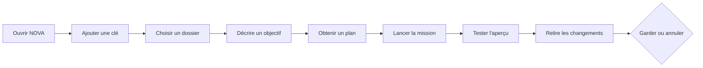

# Produit

## Promesse

> **Une idée. Un compagnon. Du concret.**

NOVA est un atelier personnel d'IA pour discuter, comprendre, créer des applications et automatiser son travail. Desktop d'abord, Web/PWA ensuite.

Pour qui : des personnes qui savent expliquer ce qu'elles veulent sans maîtriser le code. Les personnes qui codent y trouvent un mode Expert, sans logique dupliquée.

## Personas

| | Léa, 34 ans | Karim, 47 ans | Sofia, 28 ans |
| --- | --- | --- | --- |
| **Situation** | Graphiste indépendante. Utilise un assistant IA dans le navigateur, copie-colle du code qu'elle ne sait pas vérifier. | Gère une entreprise de plomberie de 6 personnes. Devis et relances dans des tableurs, beaucoup de ressaisie. | Chargée d'études dans une association. Écrit des scripts Python et un petit site, sans être développeuse de métier. |
| **Ce qu'elle / il veut** | Un site portfolio et un petit outil de suivi de facturation, qu'elle peut modifier seule. | Automatiser la relance des devis et nettoyer ses fichiers clients, sans envoyer ses données n'importe où. | Corriger vite un bug de son site, comprendre un dépôt, choisir un modèle économique pour les tâches simples. |
| **Ce qui la / le bloque aujourd'hui** | Ne sait pas si le code proposé marche ; peur de casser ce qui fonctionnait. | Ne sait pas ce qui part sur Internet ni ce que ça coûte ; pas le temps d'apprendre un outil de développeur. | Les assistants modifient trop de fichiers d'un coup ; difficile de revenir en arrière. |
| **Ce que NOVA doit lui garantir** | Un aperçu à tester, un résumé clair des changements, « garder » ou « annuler » à chaque étape. | Données locales par défaut, coût affiché avant et après, confirmation avant toute action qui touche ses fichiers. | Diff par fichier, acceptation partielle, terminal contrôlé, tests réellement lancés, restauration ciblée. |
| **Mode** | Créer | Créer | Expert |
| **Premier jalon utile** | J2 | J1 (discussion), J3 (automatisation) | J2 |

## Parcours central

| Étape | Jalon | Ce que l'utilisateur voit |
| --- | --- | --- |
| Ouvrir NOVA, ajouter une clé | J1 | Écran d'accueil qui explique la clé OpenRouter, le niveau réel du coffre, le choix de stockage. |
| Discuter avec un modèle | J1 | Catalogue en direct, réponse en continu, arrêt, erreurs utiles, coût rapporté, historique conservé. |
| Choisir un dossier → garder ou annuler | J2 | Plan, mission, aperçu, diff, test réellement lancé, restauration. |

## Principes

1. **Simple d'abord, avancé ensuite.** L'écran initial fait une chose ; les fonctions avancées se découvrent (barre de commande, mode Expert).
2. **Modèles interchangeables.** OpenRouter d'abord, dont les modèles DeepSeek disponibles au moment de la construction ; puis fournisseurs directs, puis modèles locaux. Aucun modèle codé en dur.
3. **Local par défaut.** Sur desktop, les données restent sur la machine. Toute synchronisation ou service distant s'active explicitement.
4. **L'utilisateur garde la main** sur ses fichiers, ses dépenses, ses permissions et les données envoyées.
5. **Preuves, pas promesses.** NOVA montre ce qui a changé et comment c'est vérifié. Il n'affirme jamais qu'une chose marche sans l'avoir testée ; ce qui est inconnu est affiché « inconnu ».
6. **Un compagnon réellement branché.** Nomi reflète des événements réels du runtime ; pas d'animation d'activité factice.
7. **Pas de GitHub obligatoire**, pas de compte obligatoire.

## Espaces et modes

Un espace n'apparaît dans la navigation que lorsqu'il fonctionne. Pas de page vide « bientôt ».

| Espace | Rôle | Jalon |
| --- | --- | --- |
| Accueil | Point de départ, reprise du travail récent, configuration initiale | J1 |
| Atelier | Conversation et travail sur un dossier (aperçu, fichiers, diff, terminal, documents) | J1 (conversation), J2 (dossier) |
| Réglages | Clé, coffre, modèle par défaut, thème, compagnon, confidentialité | J1 |
| Missions | Carte des missions, reprise, historique | J2–J3 |
| Bibliothèque | Mémoire, documents, productions | J3 |
| Extensions | Skills, serveurs MCP, hooks | J3 |
| Compagnon | Nomi, voix, préférences | J4 |

- **Mise en page** : trois zones redimensionnables — navigation, conversation ou tâche, panneau de travail.
- **Barre de commande universelle** : toute action disponible est accessible au clavier.
- **Créer / Expert** : deux densités d'affichage sur la même logique. Créer résume et guide ; Expert montre diff, terminal, identifiants de modèles, jetons.
- **Modes de travail** (J2+) : Discuter, Comprendre, Planifier, Construire, Corriger, Vérifier.

## Différenciateurs à construire et à mesurer

Aucun n'est encore construit. Chacun sera mesuré avant d'être présenté comme un avantage. Les jalons indiqués sont une proposition, sauf la correction en pointant et la passation entre modèles, prévues en J6.

| Différenciateur | Idée | Jalon |
| --- | --- | --- |
| Carte vivante de la mission | Plan, étape en cours, preuves, reliés à l'exécution réelle | J2–J3 |
| Autonomie par contrat | Ce que l'agent peut faire seul est écrit et appliqué par le moteur de permissions | J2 |
| Budget avant l'action | Estimation et réservation avant de lancer, suspension au plafond | J3 |
| Relecture par preuves | Chaque changement est accompagné de ce qui l'a vérifié | J2 |
| Essai à blanc | Voir ce qu'une mission ferait sans rien modifier | J3 |
| Correction en pointant | Désigner un élément de l'aperçu pour le corriger | J6 |
| Dossier de passation entre modèles | Changer de modèle en cours de mission sans perdre le contexte | J6 |
| Compagnon utile | Nomi informe sur l'état réel et interrompt seulement quand il le faut | J1 (états), J4 (voix) |

## Périmètre par jalon

Détail, dépendances et critères de sortie : [`ROADMAP.md`](ROADMAP.md).

| Jalon | Périmètre |
| --- | --- |
| J0 | Fondations : monorepo, contrat partagé, identité visuelle, CI, documents |
| J1 | Vraie conversation : plateforme de référence, coffre de clés, catalogue OpenRouter, streaming, arrêt, erreurs utiles, historique, usage |
| J2 | Première mission de code : dossier, lecture, recherche, patch, terminal contrôlé, aperçu, tests, diff, restauration, moteur de permissions |
| J3 | Extensibilité et reprise : une skill et un serveur MCP réels, missions persistantes, points de reprise, plafonds, reprise après plantage |
| J4 | Nomi et voix |
| J5 | Web et autres plateformes |
| J6 | Avancé : multi-agent borné, routage mesuré, correction visuelle, passation entre modèles, automatisations, collaboration |

## Non-objectifs

- Remplacer un IDE professionnel complet.
- Exiger un compte, un abonnement NOVA ou GitHub.
- Activer une synchronisation ou un service distant par défaut.
- Laisser un agent agir hors de ses permissions ou dépenser sans budget.
- Afficher ou conserver le raisonnement interne des modèles (ADR-008).
- Relancer automatiquement une requête payante.
- Héberger plusieurs utilisateurs avant J5.
- Entraîner ou affiner des modèles.
- Mesurer le succès au nombre de messages.

## Métriques de succès

Mesurées localement tant que la politique de télémétrie n'est pas décidée (question Q4). Les cibles chiffrées sont fixées après une première mesure réelle, pas avant.

| Métrique | Définition | Mesurable à partir de |
| --- | --- | --- |
| Temps jusqu'au premier résultat utile | Du premier lancement à la première réponse complète (J1), puis à la première mission gardée (J2) | J1 |
| Taux de missions acceptées | Missions dont les changements sont gardés ÷ missions terminées | J2 |
| Coût par mission réussie | Coût rapporté des missions gardées ÷ leur nombre ; les coûts inconnus sont comptés à part (le total est une borne basse) | J2 |
| Régressions | Scénarios de [`ACCEPTANCE.md`](ACCEPTANCE.md) qui repassent en échec d'une version à l'autre | J1 |
| Interruptions inutiles | Demandes de confirmation acceptées sans modification pour une opération déjà autorisée dans la même session | J2 |
| Consommation du compagnon au repos | CPU et mémoire de l'interface quand Nomi est affiché et qu'aucune activité n'a lieu, sur la machine de référence | J1 |
