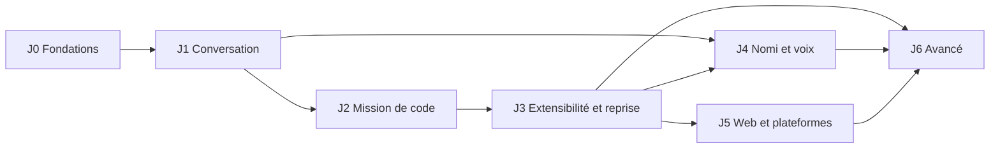

# Feuille de route

Jalons de NOVA, leurs dépendances et leurs critères de sortie. Un jalon n'est terminé que lorsque ses critères sont vérifiés dans l'environnement annoncé et consignés dans [`STATUS.md`](STATUS.md) (commande et résultat). Les scénarios cités sont ceux de [`ACCEPTANCE.md`](ACCEPTANCE.md).

| Jalon | Thème | Statut |
| --- | --- | --- |
| J0 | Fondations et design | **En cours** |
| J1 | Vraie conversation | **En cours** |
| J2 | Première mission de code | Prévu |
| J3 | Extensibilité et reprise | Prévu |
| J4 | Nomi et voix | Prévu |
| J5 | Web et autres plateformes | Prévu |
| J6 | Fonctions avancées | Prévu |

## Dépendances

- J4 dépend de J3 parce que Nomi doit refléter l'état réel des missions et des approbations, pas seulement celui d'une conversation.
- J5 dépend de J3 : un exécuteur distant ou un compagnon appairé suppose des missions persistantes et un moteur de permissions éprouvé.

## J0 — Fondations et design · en cours

Objectif : un socle sur lequel chaque jalon peut s'appuyer sans le refaire.

- [x] Monorepo pnpm (`apps/desktop`, `packages/shared`, `providers`, `storage`, `agent-runtime`, `ui`), TypeScript strict, Vitest (projets `node` et `dom`), oxlint — commit `b48b9e4`
- [x] Contrat partagé : types du domaine, schémas IPC zod, canaux, masquage des secrets et ses tests
- [x] Politique de chaîne d'approvisionnement dans `pnpm-workspace.yaml` (ADR-009)
- [x] Documents de référence dans `docs/` (première version, à relire)
- [x] Tokens de design, polices, icônes et assets de marque dans `packages/ui` — commits `a08ad93`, `996fd02` (logo en ruban, icônes régénérées)
- [x] Nomi : états visuels branchés sur les événements du runtime — commit `a08ad93`
- [x] CI GitHub Actions verte sur Linux, Windows et macOS (run 36320963259)

**Critère de sortie** : CI verte, c'est-à-dire `pnpm lint`, `pnpm typecheck` et `pnpm test` sur Linux (job `checks`, `ubuntu-latest` uniquement), puis build, E2E Playwright, `vault-smoke` et paquet non signé `electron-builder --dir` sur Linux, Windows et macOS (job `desktop`) ; les tokens validés sont reportés dans [`DESIGN_SYSTEM.md`](DESIGN_SYSTEM.md#tokens-validés). Les tests unitaires (dont `node:sqlite` et le coffre) ne tournent donc pas sous Windows ni macOS en CI.

## J1 — Vraie conversation · en cours

Objectif : une vraie requête fonctionne sur la plateforme de référence, et l'historique survit au redémarrage sans exposer la clé.

Dépend de : J0.

Les cases cochées sont livrées dans `a08ad93` et couvertes par les tests unitaires, et pour les parcours des scénarios 1, 2, 3, 14 et 15 par les E2E sur Linux x64 contre le faux serveur (détail dans [`STATUS.md`](STATUS.md)). Correctifs de revue en cours.

- [x] Application construite et lancée sur Linux x64 (référence, ADR-007)
- [x] Coffre de clés `safeStorage` : niveau réel affiché, clé de session par défaut sur coffre faible, consentement explicite au coffre faible
- [x] Vérification de clé (libellé, limite, reste) et suppression de la clé
- [x] Catalogue OpenRouter en direct, copie hors ligne datée, valeurs absentes affichées « inconnu »
- [x] Réponse en continu avec phases réelles (attente, réflexion, écriture) et usage final — faux serveur seulement ; pas encore essayé avec une vraie clé
- [x] Arrêt d'une génération, sans interface bloquée
- [x] Erreurs utiles : clé invalide, crédit épuisé, limite de débit, délai dépassé, coupure réseau, flux interrompu, aucun fournisseur disponible
- [x] Relance à l'initiative de l'utilisateur uniquement
- [x] Conversations persistées : liste, recherche, renommage, suppression
- [x] Reprise au démarrage : flux en cours marqués « interrompu », sans relance
- [x] Usage et coût par conversation (borne basse si un coût manque)
- [x] Réglages : thème, modèle par défaut, compagnon (visible, mouvement), `data_collection`
- [x] Renderer isolé, protocole `nova://`, CSP, IPC validé, permissions refusées (sauf écriture dans le presse-papiers, voir [`SECURITY.md`](SECURITY.md)), liens externes filtrés
- [x] E2E Playwright sur Linux sans écran (Xvfb) — coffre faible ou session uniquement, car Playwright force `--password-store=basic`
- [x] Niveau de coffre `os` sous Linux constaté hors Playwright (`e2e/vault-smoke.mjs` avec trousseau privé)
- [ ] Coffre `os` sous Linux de bout en bout : clé chiffrée, redémarrage, relecture (aucun test versionné)
- [x] Builds non signés et E2E en CI Windows et macOS (run 36320963259)
- [ ] Accessibilité du parcours de conversation : clavier, focus et audit axe-core faits ; lecteur d'écran non vérifié
- [ ] Scénario 1 avec un vrai compte OpenRouter

**Critères de sortie**

1. Scénarios 1, 2 et 3 réussis sur Linux x64 avec un vrai compte OpenRouter, et en E2E automatisé avec le faux serveur.
2. Après redémarrage, l'historique est intact et la clé est introuvable dans le dossier de données, les journaux et le renderer (scénario 16, partie J1).
3. Parties J1 des scénarios 14 et 15 réussies.
4. `STATUS.md` à jour : commandes, résultats, matrice des plateformes.

## J2 — Première mission de code

Objectif : NOVA corrige un bug identifié dans un dépôt de test, lance le test concerné, montre le changement et restaure l'état antérieur sans écraser une modification de l'utilisateur.

Dépend de : J1.

- Espace de travail (dossier choisi), explorateur, éditeur
- Outils : lecture, recherche, patchs multi-fichiers
- Terminal contrôlé (`node-pty`), dans un processus séparé
- Aperçu web isolé
- Lancement réel des tests, diff, acceptation partielle, restauration ciblée
- Git facultatif (jamais obligatoire)
- Moteur de permissions (allow / ask / deny) et profils
- Modes de travail : Discuter, Comprendre, Planifier, Construire, Corriger, Vérifier

**Critères de sortie** : scénarios 4, 5 et 6 ; partie « fichier » du scénario 7.

### J2-A — « L'atelier s'ouvre » · intégré sur `feat/j2a-atelier`

Périmètre et critères détaillés : [`FEATURES.md`](FEATURES.md) (§4, J2-A). Une case n'est cochée que si un test exécuté le couvre (Linux x64, faux serveur OpenRouter, vérification finale du 2026-09-28 sur `643b286` : lint, types, 1 746 tests unitaires, Playwright 29/29 deux fois ; détail dans [`STATUS.md`](STATUS.md)).

- [x] Socle : `node-pty` et ripgrep (ADR-012), quatre workers `utilityProcess`, migrations v2 à v5, nonce CSP (`atelier-foundations.spec.ts`)
- [x] Les 13 groupes IPC de l'atelier servis par leur service réel, aucune réponse `unavailable` (`atelier-wiring.spec.ts`)
- [x] Espace et éditeur : ouvrir un dossier, arbre, édition et enregistrement, changement externe détecté sans écrasement (parcours a)
- [x] Mission « Corriger » : approbations, vraie commande de test en preuve, relecture qui annule un fichier et garde l'autre, modifications de l'utilisateur conservées — scénarios 4 et 5 (parcours b)
- [x] Moteur de permissions : `..`, chemin absolu et lien symbolique refusés, écriture refusée jamais exécutée — scénario 6 (parcours c)
- [x] Instructions hostiles d'un fichier traitées comme données — scénario 7, partie fichier (parcours d)
- [x] Terminal `node-pty` dans le pty-host, Ctrl+C effectif (parcours e)
- [x] MCP stdio : ajout, outils listés, appel approuvé, outil refusé jamais appelé, plantage, désactivation, délai dépassé — scénario 8 partiel (parcours f)
- [x] Recherche web avec citations et coût, pages non fiables (parcours g) — faux serveur seulement
- [x] Nomi suit une mission réelle et explique un échec de tests (parcours h)
- [x] Plafond de budget avec suspension et reprise ; un seul résultat terminal à l'arrêt — scénario 10, un worker (parcours i)
- [x] Reprise après plantage sans relance d'un effet externe — scénario 11 (parcours j)
- [ ] Commandes de l'agent dans le terminal (E13, partie agent) : `run_command` et `run_tests` s'exécutent dans main, aucune session d'agent créée dans le pty-host
- [ ] Mémoriser une commande précise, journal des notifications de Nomi persistant, suivi des processus en arrière-plan, événement « modèle de secours utilisé » (Mo2), inspecteur de contexte exact (voir « Non vérifié » dans `STATUS.md`)
- [ ] Scénarios 15 et 16 rejoués sur le périmètre de l'atelier (axe-core et inspection des secrets du journal d'audit et des exports)
- [ ] Démonstration J2-A sur le build empaqueté (dépôt `e2e/fixtures/vite-bug` à créer) et mesures initiales de performance
- [ ] CI trois OS verte sur la tête de la branche (Windows et macOS n'ont jamais exécuté les specs J2-A)
- [ ] Appels d'outils, recherche web et serveurs MCP réels avec un vrai compte OpenRouter

### J2-B — « Parité Harness » · intégré sur `feat/j2b-parite-harness`

Périmètre : [`research/DEEPSEEK_HARNESS.md`](research/DEEPSEEK_HARNESS.md) (§2B, §3), carte des voies et contrats. Linux x64, faux serveur OpenRouter (2026-09-28 : lint, types, 2 212 tests unitaires, Playwright 42/42 ; détail dans [`STATUS.md`](STATUS.md)).

- [x] L1 — Terminal de l'agent et processus en arrière-plan : session en lecture seule, « Prendre la main », `process_list` / `process_output` / `process_stop`, aucun orphelin à la sortie (`j2b-terminal-agent.spec.ts`)
- [x] L2 — Compaction proposée puis appliquée par l'utilisateur, « /compact », dossier de passation au changement de modèle (`j2b-compaction.spec.ts`)
- [x] L3 — Skills : aperçu, installation, activation par projet, chargement dans une mission, désinstallation sans résidu (`j2b-skills.spec.ts`)
- [x] L4 — Mode « Chaîne » : hôte isolé, appels soumis au moteur et aux approbations, imbriqués sous leur programme (`j2b-chain.spec.ts`)
- [x] L5 — Sous-missions bornées : worktree, intégration après tests, arbre dans la mission (`j2b-submissions.spec.ts`)
- [x] L6 — Missions planifiées : exécution comme une mission normale, historique, pause (`j2b-schedules.spec.ts`)
- [x] L7 — Présence bureau, accueil, densité, pilote automatique, vision (`j2b-desktop.spec.ts`)
- [x] L8 — « Jusqu'à preuve », recherche dans la chronologie, « Bifurquer d'ici » (`j2b-proof-timeline.spec.ts`)
- [ ] CI trois OS sur la tête de la branche (Windows et macOS n'ont jamais exécuté les specs J2-B)
- [ ] Parcours J2-B avec un vrai compte OpenRouter (compaction, pilote automatique, vision, sous-missions)
- [ ] Limites listées dans « Non vérifié » de `STATUS.md` (skills de projet invalides expliquées, conflits d'intégration listés, pilote automatique à l'accueil, 6 skills livrées)

## J3 — Extensibilité et reprise

Dépend de : J2.

- Une skill réelle et un serveur MCP réel, soumis au moteur de permissions
- Missions persistantes, états `ready`, `running`, `waiting-approval`, `suspended`, `succeeded`, `failed`, `cancelled`
- Points de reprise, plafonds de budget avec réservation
- Reprise après plantage sans relance aveugle d'un effet externe (clés d'idempotence)

**Critères de sortie** : scénarios 7, 8, 9, 10, 11.

## J4 — Nomi et voix

Dépend de : J1, J3.

- Compagnon animé relié aux missions réelles
- Voix : appui pour parler d'abord, transcription visible, aucune conservation des enregistrements par défaut, confirmation explicite des actions destructrices

**Critères de sortie** : scénarios 12, 13 et 14 complets.

## J5 — Web et autres plateformes

Dépend de : J3.

- Client Web/PWA : exécuteur distant ou compagnon local appairé (voir [`ARCHITECTURE.md`](ARCHITECTURE.md#web-et-pwa-j5-prévu))
- Backend séparé (PostgreSQL, stockage objet) uniquement pour l'hébergement multi-utilisateur
- Plateformes supplémentaires

**Critères de sortie** : scénarios 17 et 18 sur chaque plateforme déclarée.

## J6 — Fonctions avancées

Dépend de : J3, J4, J5.

- Multi-agent borné, routage mesuré entre modèles
- Correction en pointant (visuelle), dossier de passation entre modèles
- Automatisations, collaboration

**Critères de sortie** : à définir au démarrage du jalon, avec des mesures de référence.

## Fonctions transverses sans jalon attribué

Proposition, à valider par le propriétaire (question Q6 de [`DECISIONS.md`](DECISIONS.md)).

| Fonction | Proposition |
| --- | --- |
| Mémoire en couches (provenance, portée, date) et inspecteur de contexte | J3 |
| Profils de modèles Économique, Équilibré, Qualité, Local, avec replis qui préservent capacités, budget et confidentialité | J3 |
| Fournisseurs directs (sans passer par OpenRouter) | Après J3 |
| Modèles locaux (Ollama) | Après J3, en même temps que le profil Local |

## Chaque jalon, sans exception

- Parcours de bout en bout, erreurs gérées, permissions respectées, état d'interface cohérent, données persistées.
- Vérifié dans l'environnement annoncé ; commandes et résultats consignés dans `STATUS.md`.
- Pas de faux compteur, faux outil, faux test ni bouton « bientôt » présenté comme terminé.
- Scénarios 15 (accessibilité) et 16 (secrets) rejoués sur le périmètre du jalon.
