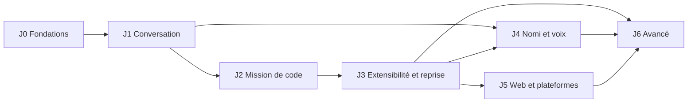

# Feuille de route

Jalons de NOVA, leurs dépendances et leurs critères de sortie. Un jalon n'est terminé que lorsque ses critères sont vérifiés dans l'environnement annoncé et consignés dans [`STATUS.md`](STATUS.md) (commande et résultat). Les scénarios cités sont ceux de [`ACCEPTANCE.md`](ACCEPTANCE.md).

| Jalon | Thème | Statut |
| --- | --- | --- |
| J0 | Fondations et design | **En cours** |
| J1 | Vraie conversation | **En cours** |
| J2 | Première mission de code | Prévu |
| J3 | Extensibilité et reprise | Prévu |
| J4 | Nomi et voix | Prévu |
| J5 | Web et autres plateformes | Prévu |
| J6 | Fonctions avancées | Prévu |

## Dépendances

- J4 dépend de J3 parce que Nomi doit refléter l'état réel des missions et des approbations, pas seulement celui d'une conversation.
- J5 dépend de J3 : un exécuteur distant ou un compagnon appairé suppose des missions persistantes et un moteur de permissions éprouvé.

## J0 — Fondations et design · en cours

Objectif : un socle sur lequel chaque jalon peut s'appuyer sans le refaire.

- [x] Monorepo pnpm (`apps/desktop`, `packages/shared`, `providers`, `storage`, `agent-runtime`, `ui`), TypeScript strict, Vitest (projets `node` et `dom`), oxlint — commit `b48b9e4`
- [x] Contrat partagé : types du domaine, schémas IPC zod, canaux, masquage des secrets et ses tests
- [x] Politique de chaîne d'approvisionnement dans `pnpm-workspace.yaml` (ADR-009)
- [x] Documents de référence dans `docs/` (première version, à relire)
- [ ] Tokens de design, polices, icônes et assets de marque dans `packages/ui`
- [ ] Nomi : états visuels branchés sur les événements du runtime
- [ ] CI GitHub Actions verte sur Linux, Windows et macOS

**Critère de sortie** : `pnpm check` passe en CI sur les trois OS ; les tokens validés sont reportés dans [`DESIGN_SYSTEM.md`](DESIGN_SYSTEM.md#tokens-validés).

## J1 — Vraie conversation · en cours

Objectif : une vraie requête fonctionne sur la plateforme de référence, et l'historique survit au redémarrage sans exposer la clé.

Dépend de : J0.

- [ ] Application construite et lancée sur Linux x64 (référence, ADR-007)
- [ ] Coffre de clés `safeStorage` : niveau réel affiché, clé de session par défaut sur coffre faible, consentement explicite au coffre faible
- [ ] Vérification de clé (libellé, limite, reste) et suppression de la clé
- [ ] Catalogue OpenRouter en direct, copie hors ligne datée, valeurs absentes affichées « inconnu »
- [ ] Réponse en continu avec phases réelles (attente, réflexion, écriture) et usage final
- [ ] Arrêt d'une génération, sans interface bloquée
- [ ] Erreurs utiles : clé invalide, crédit épuisé, limite de débit, délai dépassé, coupure réseau, flux interrompu, aucun fournisseur disponible
- [ ] Relance à l'initiative de l'utilisateur uniquement
- [ ] Conversations persistées : liste, recherche, renommage, suppression
- [ ] Reprise au démarrage : flux en cours marqués « interrompu », sans relance
- [ ] Usage et coût par conversation (borne basse si un coût manque)
- [ ] Réglages : thème, modèle par défaut, compagnon (visible, mouvement), `data_collection`
- [ ] Renderer isolé, protocole `nova://`, CSP, IPC validé, permissions refusées, liens externes filtrés
- [ ] E2E Playwright sur Linux sans écran (Xvfb), avec trousseau privé
- [ ] Builds non signés et E2E en CI Windows et macOS
- [ ] Accessibilité du parcours de conversation (clavier, focus, contraste, lecteur d'écran)

**Critères de sortie**

1. Scénarios 1, 2 et 3 réussis sur Linux x64 avec un vrai compte OpenRouter, et en E2E automatisé avec le faux serveur.
2. Après redémarrage, l'historique est intact et la clé est introuvable dans le dossier de données, les journaux et le renderer (scénario 16, partie J1).
3. Parties J1 des scénarios 14 et 15 réussies.
4. `STATUS.md` à jour : commandes, résultats, matrice des plateformes.

## J2 — Première mission de code

Objectif : NOVA corrige un bug identifié dans un dépôt de test, lance le test concerné, montre le changement et restaure l'état antérieur sans écraser une modification de l'utilisateur.

Dépend de : J1.

- Espace de travail (dossier choisi), explorateur, éditeur
- Outils : lecture, recherche, patchs multi-fichiers
- Terminal contrôlé (`node-pty`), dans un processus séparé
- Aperçu web isolé
- Lancement réel des tests, diff, acceptation partielle, restauration ciblée
- Git facultatif (jamais obligatoire)
- Moteur de permissions (allow / ask / deny) et profils
- Modes de travail : Discuter, Comprendre, Planifier, Construire, Corriger, Vérifier

**Critères de sortie** : scénarios 4, 5 et 6 ; partie « fichier » du scénario 7.

## J3 — Extensibilité et reprise

Dépend de : J2.

- Une skill réelle et un serveur MCP réel, soumis au moteur de permissions
- Missions persistantes, états `ready`, `running`, `waiting-approval`, `suspended`, `succeeded`, `failed`, `cancelled`
- Points de reprise, plafonds de budget avec réservation
- Reprise après plantage sans relance aveugle d'un effet externe (clés d'idempotence)

**Critères de sortie** : scénarios 7, 8, 9, 10, 11.

## J4 — Nomi et voix

Dépend de : J1, J3.

- Compagnon animé relié aux missions réelles
- Voix : appui pour parler d'abord, transcription visible, aucune conservation des enregistrements par défaut, confirmation explicite des actions destructrices

**Critères de sortie** : scénarios 12, 13 et 14 complets.

## J5 — Web et autres plateformes

Dépend de : J3.

- Client Web/PWA : exécuteur distant ou compagnon local appairé (voir [`ARCHITECTURE.md`](ARCHITECTURE.md#web-et-pwa-j5-prévu))
- Backend séparé (PostgreSQL, stockage objet) uniquement pour l'hébergement multi-utilisateur
- Plateformes supplémentaires

**Critères de sortie** : scénarios 17 et 18 sur chaque plateforme déclarée.

## J6 — Fonctions avancées

Dépend de : J3, J4, J5.

- Multi-agent borné, routage mesuré entre modèles
- Correction en pointant (visuelle), dossier de passation entre modèles
- Automatisations, collaboration

**Critères de sortie** : à définir au démarrage du jalon, avec des mesures de référence.

## Fonctions transverses sans jalon attribué

Proposition, à valider par le propriétaire (question Q6 de [`DECISIONS.md`](DECISIONS.md)).

| Fonction | Proposition |
| --- | --- |
| Mémoire en couches (provenance, portée, date) et inspecteur de contexte | J3 |
| Profils de modèles Économique, Équilibré, Qualité, Local, avec replis qui préservent capacités, budget et confidentialité | J3 |
| Fournisseurs directs (sans passer par OpenRouter) | Après J3 |
| Modèles locaux (Ollama) | Après J3, en même temps que le profil Local |

## Chaque jalon, sans exception

- Parcours de bout en bout, erreurs gérées, permissions respectées, état d'interface cohérent, données persistées.
- Vérifié dans l'environnement annoncé ; commandes et résultats consignés dans `STATUS.md`.
- Pas de faux compteur, faux outil, faux test ni bouton « bientôt » présenté comme terminé.
- Scénarios 15 (accessibilité) et 16 (secrets) rejoués sur le périmètre du jalon.
