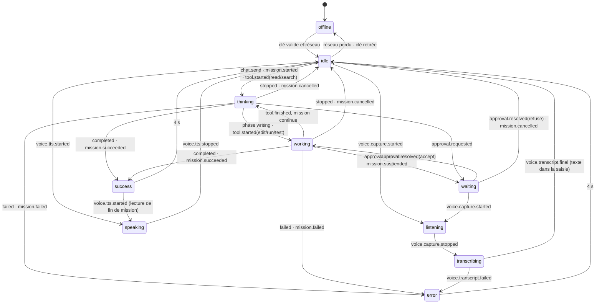
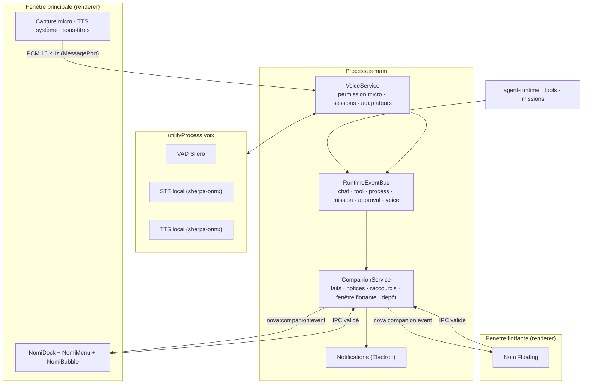
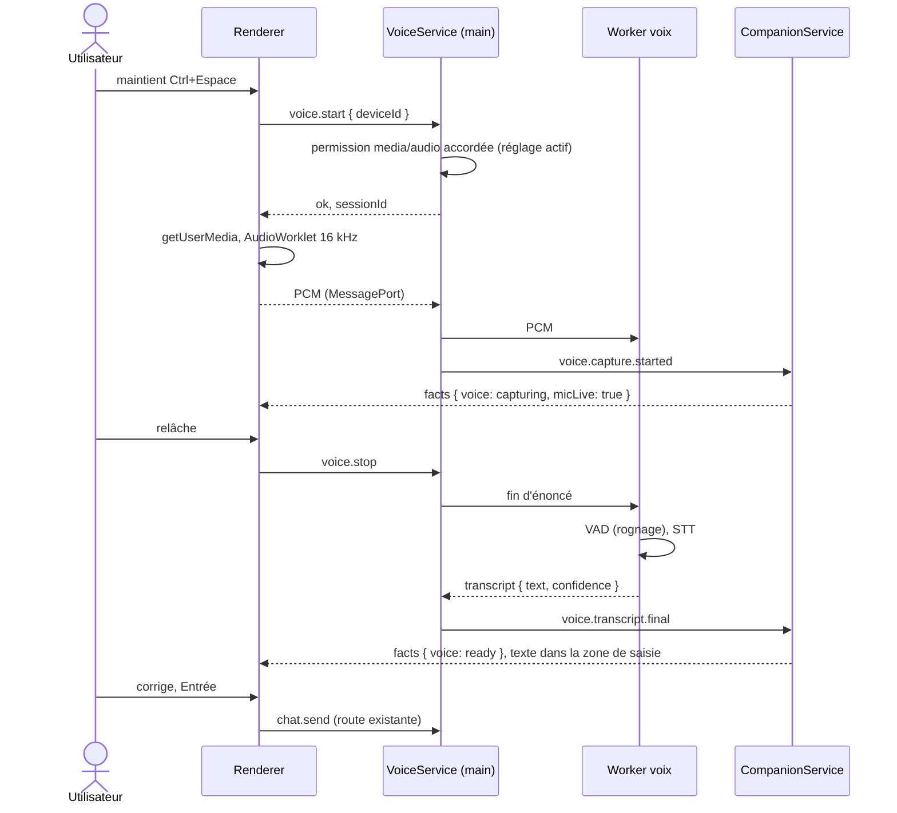

# Nomi — conception d'un compagnon utile

Document de conception (proposition, 2026-09-27). Il part du Nomi livré en J1 et décrit ce qu'il devient : un compagnon qui **agit** sur les mêmes missions et permissions que le reste de NOVA, sans jamais simuler une activité, culpabiliser ou réclamer l'attention. Il complète [`DESIGN_SYSTEM.md`](../DESIGN_SYSTEM.md) (identité, tokens, états J1), [`ARCHITECTURE.md`](../ARCHITECTURE.md) (processus, IPC, stockage) et les sections 11 et 12H du brief maître. Rien de ce qui est décrit ici n'existe dans le code tant que [`STATUS.md`](../STATUS.md) ne le dit pas.

Règle de lecture : « Nomi » désigne le compagnon (nom provisoire, question Q1 de [`DECISIONS.md`](../DECISIONS.md)). Les exemples de dialogue tutoient, comme les libellés actuels ; la forme d'adresse reste à trancher (Q7) et la couche de microcopie porte les deux formes (§ 4).

## Sommaire

1. [Diagnostic : ce que Nomi fait aujourd'hui](#1-diagnostic--ce-que-nomi-fait-aujourdhui)
2. [Principes non négociables](#2-principes-non-négociables)
3. [Pouvoirs](#3-pouvoirs)
4. [Dialogue, ton et réglages de personnalité](#4-dialogue-ton-et-réglages-de-personnalité)
5. [Modèle d'interaction](#5-modèle-dinteraction)
6. [Machine à états](#6-machine-à-états)
7. [Animations, budget de performance, mouvement réduit](#7-animations-budget-de-performance-mouvement-réduit)
8. [Nouveaux états visuels et accessoires (construction SVG)](#8-nouveaux-états-visuels-et-accessoires-construction-svg)
9. [Packs d'apparence](#9-packs-dapparence)
10. [Vie privée et garde-fous](#10-vie-privée-et-garde-fous)
11. [Architecture technique](#11-architecture-technique)
12. [Pipeline vocal : options vérifiées](#12-pipeline-vocal--options-vérifiées)
13. [Données](#13-données)
14. [Plan par phases et tests d'acceptation](#14-plan-par-phases-et-tests-dacceptation)
15. [Questions pour le propriétaire](#15-questions-pour-le-propriétaire)
16. [Sources vérifiées](#16-sources-vérifiées)

---

## 1. Diagnostic : ce que Nomi fait aujourd'hui

| Élément | Fichier | Constat |
| --- | --- | --- |
| Figure SVG | `packages/ui/src/nomi/Nomi.tsx`, `geometry.ts` | Cairn de trois galets sur une grille 64 × 64, deux yeux (pupille + reflet), orbite inclinée de −10° autour de la taille (`cx 32, cy 42, rx 24, ry 6`), satellite `r 2,7`. Bouche seulement en `speaking`. Yeux fermés `offline`, yeux heureux `success`. |
| États | `packages/ui/src/nomi/states.ts` | 9 états : `offline`, `idle`, `listening`, `thinking`, `working`, `waiting`, `speaking`, `success`, `error`, chacun avec un nom accessible en français. `listening`, `waiting` et `speaking` ne sont jamais produits par le renderer aujourd'hui. |
| Animations | `packages/ui/src/styles/nomi.css` | Respiration et clignement au repos ; orbite qui tourne en `thinking` (4,2 s) et `working` (1,6 s) avec contre-rotation du satellite ; pulsation en `waiting` ; saut en `success` (720 ms, une fois) ; affaissement en `error` (480 ms). Classe `nv-nomi--reduced-motion` : tout figé, pose statique par état. |
| Dérivation d'état | `apps/desktop/src/renderer/state/nomi.ts` | Fonction pure `deriveNomiState` : connexion (clé absente, invalide), réseau, phase du flux (`waiting` → `thinking`, `reasoning` → `thinking`, `writing` → `working`), dernier résultat pendant `OUTCOME_WINDOW_MS` = 4 000 ms. |
| Dock | `apps/desktop/src/renderer/components/layout/NomiDock.tsx` | Un bouton en bas de la navigation : figure 44 px, libellé, détail. **Le seul geste possible est un clic qui ouvre les réglages du compagnon.** Compagnon masqué : une pastille de statut. |
| Réglages | `AppSettings.companion` (`packages/shared/src/domain.ts`) | `visible` et `motion` (`system`, `reduce`, `full`). Rien d'autre. |
| Événements disponibles | `ChatStreamEvent` (`packages/shared/src/ipc.ts`) | `phase`, `delta`, `meta`, `usage`, `completed`, `stopped`, `failed`. Aucun événement de mission, d'outil, de processus ou d'approbation n'existe encore (J2–J3). |
| Voix | — | Rien. Toutes les permissions du navigateur sont refusées (`apps/desktop/src/main/security.ts`), sauf l'écriture dans le presse-papiers. |

Le verdict du propriétaire est juste : Nomi **affiche** l'état réel, ce qui est la bonne fondation (règle « pas de fausse activité » d'`AGENTS.md`), mais il ne **fait** rien. Ce document garde la fondation et y branche des capacités.

## 2. Principes non négociables

Issus du brief (§ 11, § 12H), de `DESIGN_SYSTEM.md` et de `SECURITY.md`. Chaque pouvoir du § 3 est vérifié contre cette liste.

1. **Nomi est une interface, pas un second runtime.** Il déclenche les mêmes requêtes IPC, missions et politiques que la barre de commande. Il n'a aucun droit propre.
2. **Chaque état vient d'un événement réel.** Une animation n'est jamais une preuve de travail ; `deriveNomiState` reste une fonction pure des faits du runtime.
3. **Aucun message culpabilisant, aucun score d'attachement, aucune notification artificielle.** Nomi ne dit jamais « tu m'as manqué », ne compte pas les jours d'absence, ne relance pas pour maintenir l'attention. La seule métrique produit qui le concerne est celle du brief : nombre d'interruptions inutiles et consommation au repos, à faire baisser.
4. **La voix n'est pas une authentification.** Une voix reconnue ou un mot d'activation n'ouvre aucun droit.
5. **Une action destructrice ou externe sensible n'est jamais validée par une transcription.** Elle ouvre le dialogue de confirmation habituel de l'interface, avec le même texte et le même bouton.
6. **Transcription visible avant action ; réponses écrites toujours disponibles ; sous-titres.** Rien n'exige le son.
7. **Aucun enregistrement conservé par défaut.** Les échantillons audio vivent en mémoire et meurent avec la session.
8. **Compagnon masqué ou mouvement réduit : aucune fonction perdue.** Tout ce que Nomi propose existe aussi dans la barre de commande (`Ctrl+K`) et les réglages.
9. **Silence honnête.** Quand il n'y a rien à signaler, Nomi ne dit rien ; il ne remplit pas le vide. Quand quelque chose échoue, il le dit, même en arrière-plan, et l'événement est enregistré (aucune action sans résultat visible ou raison consignée).
10. **Les faits avant le modèle.** Une explication, un résumé ou une suggestion s'appuie d'abord sur des données locales (événements, erreurs normalisées, diff, tests exécutés), gratuites et sûres. L'appel à un modèle est une seconde étape explicite, avec son coût affiché.

## 3. Pouvoirs

Chaque pouvoir précise : ce que voit l'utilisateur, le signal réel qui le rend disponible, la permission engagée, la phase de livraison (§ 14). Un pouvoir dont le signal manque est **masqué**, pas grisé : Nomi ne propose jamais un bouton qui ne mène nulle part.

### P1 — Lancer, piloter, arrêter une mission

- **Ce que voit l'utilisateur.** Depuis le menu de Nomi ou à la voix : « Nouvelle mission dans ce projet », « Continue la mission », « Suspends », « Arrête la mission ». Nomi affiche la mission courante (titre, étape, budget consommé / réservé) dans sa bulle.
- **Signal.** Une mission existe dans l'un des états `ready`, `running`, `waiting-approval`, `suspended` (J3). Sans mission, l'entrée « Nouvelle mission » n'apparaît que si un espace de travail est ouvert (J2).
- **Permission.** Même moteur de politiques que la carte de mission. « Arrête » interrompt les appels et processus descendants comme le bouton « Arrêter » ; Nomi signale les opérations parties vers un service distant qu'on ne peut plus rappeler (brief § 9).
- **Détail utile.** « Continue » reprend à partir du dernier checkpoint et l'affiche : « Reprise à l'étape 3 sur 5, après le point de reprise de 14 h 02. » Jamais de reprise silencieuse d'un effet externe (scénario 11).
- **Phase.** N2.

### P2 — Appui pour parler, transcription visible

- **Ce que voit l'utilisateur.** Il maintient `Ctrl+Espace` (ou clique-maintient le bouton micro de Nomi). L'oreille de Nomi s'éclaire (§ 8), un indicateur « Micro actif » apparaît en permanence tant que le micro capte, avec un bouton « Couper » toujours accessible. Le texte transcrit s'écrit **dans la zone de saisie**, corrigeable, puis part avec `Entrée` ou un second appui. Il ne part jamais seul en mode appui pour parler.
- **Signal.** Réglage voix activé, permission micro accordée, moteur de transcription prêt (modèle local téléchargé ou adaptateur distant configuré).
- **Permission.** Micro accordé par le main, uniquement pour l'origine de l'application, uniquement en `audio`, uniquement quand le réglage voix est actif (§ 11). Aucun enregistrement conservé.
- **Commandes reconnues localement** (sans modèle, sans réseau) : « Explique-moi cette erreur », « Continue la tâche/la mission », « Montre les changements », « Arrête la mission », « Combien a coûté ce projet ? », « Coupe le son », « Lis la réponse ». Tout le reste devient un message ordinaire. Une commande destructrice (« supprime », « envoie », « déploie ») ouvre le dialogue de confirmation, jamais l'action.
- **Phase.** N3 (appui pour parler), N5 (mains libres et interruption).

### P3 — Explique l'erreur courante

- **Ce que voit l'utilisateur.** Quand une génération, un outil, un test ou une mission a échoué, Nomi propose « Explique cette erreur ». Premier niveau, immédiat et gratuit : le code normalisé (`ProviderErrorInfo`, résultat d'outil, sortie de test), sa traduction selon la table de `DESIGN_SYSTEM.md` (ce qui s'est passé, pourquoi si on le sait, quoi faire), et les actions déjà câblées (`Réessayer`, `Choisir un autre modèle`, `Ouvrir les crédits`). Second niveau, sur demande : « Demander au modèle » envoie l'erreur et le contexte minimal (fichier, ligne, dernière commande) au modèle courant, avec le coût estimé affiché avant l'envoi.
- **Signal.** `lastOutcome.kind === "error"` (existe déjà), plus tard `tool.finished` avec échec, `process.exited` avec code ≠ 0, `mission.failed`.
- **Permission.** Aucune pour le premier niveau. Le second envoie des données au fournisseur : la bulle le dit (« Cette action enverra l'erreur et 40 lignes de `server.ts` au fournisseur choisi »).
- **Phase.** N0 (erreurs de conversation), N1 (outils, tests).

### P4 — Résume ce qui a changé

- **Ce que voit l'utilisateur.** « Qu'est-ce qui a changé ? » donne d'abord les faits : « 3 fichiers modifiés (`+42 / −7`), 1 test lancé et réussi (`auth.test.ts`), aucune dépendance ajoutée, checkpoint créé à 14 h 02 ». Chaque ligne ouvre sa preuve (diff par fichier, sortie du test). Sur demande, un résumé en phrases par le modèle, à partir du diff, coût affiché.
- **Signal.** Diff non vide dans l'espace de travail (J2), événements de mission (J3). En J1, la version conversation : « 4 messages, 2 modèles utilisés, 0,018 $ au moins ».
- **Phase.** N0 (conversation), N1 (diff et tests).

### P5 — Veille tests et builds, puis rapporte

- **Ce que voit l'utilisateur.** Depuis le terminal contrôlé ou le menu : « Surveille cette commande ». Nomi prend l'accessoire « carte de tests » (§ 8), et à la fin : « Tests terminés : 41 réussis, 1 échoué (`cart.test.ts`) » avec l'action « Explique l'échec » (P3). Si la fenêtre n'a pas le focus, une notification système (P13), sinon la bulle suffit.
- **Signal.** `process.started` avec `watch: true`, puis `process.exited`. Le résultat est lu de la sortie réelle ; Nomi n'affirme « Tests réussis » qu'après un code de sortie 0 (règle 6 de la voix et microcopie). Un format de test non reconnu donne « Commande terminée, code 0 » sans compter.
- **Phase.** N1.

### P6 — Prochaine étape suggérée à partir de signaux réels

- **Ce que voit l'utilisateur.** Au plus trois suggestions, chacune reliée à un fait et ouvrant la cible exacte. Règles déterministes, dans l'ordre :

| Fait (source) | Suggestion | Cible |
| --- | --- | --- |
| Clé absente (`connection.state === "absent"`) | « Ajoute une clé OpenRouter pour commencer. » | Réglages → Fournisseurs |
| Mission `waiting-approval` | « Une mission attend ta réponse : *modifier `db/schema.ts`*. » | Carte d'approbation |
| Mission `suspended` pour budget | « *Mission X* est suspendue au plafond (4,10 $ sur 4 $). Relever le plafond ou arrêter. » | Jauge de budget |
| Test échoué non traité | « `cart.test.ts` échoue depuis 14 h 05. » | Sortie du test + P3 |
| Diff en attente d'acceptation | « 3 fichiers modifiés attendent ta décision. » | Vue de diff |
| Dernière réponse en erreur relançable | « La dernière réponse a échoué (délai dépassé). Réessayer ? » | Bouton Réessayer |
| Réponse tronquée | « Réponse coupée à sa longueur maximale. » | Réessayer · Autre modèle |

- **Ce que Nomi ne suggère jamais.** Une idée inventée par le modèle sans demande, une relance « pour voir », un rappel d'inactivité. Une suggestion issue d'un modèle est possible en N5 (« Idées du modèle », sur clic, coût affiché), jamais mélangée aux faits.
- **Phase.** N0 (faits J1), puis chaque phase ajoute ses lignes.

### P7 — Brief des projets

- **Ce que voit l'utilisateur.** À l'ouverture de NOVA, ou sur « Où en est-on ? » : une carte tirée de la base locale. « Depuis hier : 2 missions terminées (*Facturation*, *Correctif date*), 1 en attente d'approbation, 1 échouée ; 0,84 $ dépensés au moins ; 1 diff non appliqué dans *Boutique*. » Chaque ligne ouvre l'élément. Rien de nouveau : « Rien de nouveau depuis ta dernière ouverture. » — une ligne, pas de carte.
- **Signal.** Tables `missions`, `usage_records`, `checkpoints`, dernier `opened_at` du profil. Aucun appel au modèle par défaut ; « Résumer en phrases » est optionnel et payant.
- **Politique.** Le brief est **tiré**, jamais poussé : pas de notification « ton brief est prêt ».
- **Phase.** N2.

### P8 — Mode apprentissage

- **Ce que voit l'utilisateur.** Réglage par projet « Explique tes changements ». Après une mission réussie, Nomi propose « Comprendre ce changement » : une explication en trois points (quoi, pourquoi, où le retrouver), reliée au diff, puis un exercice court et facultatif (« Modifie le message d'erreur de `validateEmail` et relance le test »). Nomi vérifie l'exercice avec le test réel, pas avec une opinion.
- **Signal.** `mission.succeeded` avec un diff et au moins un test exécuté.
- **Permission.** Lecture du diff (local) ; l'explication passe par le modèle, coût affiché. L'exercice ne modifie aucun fichier sans que l'utilisateur le fasse lui-même.
- **Phase.** N5 (brief § 16, « mode apprentissage »).

### P9 — Menu d'actions rapides

- **Ce que voit l'utilisateur.** Un clic sur Nomi ouvre un menu contextuel ancré au dock (plus les réglages directement — ils deviennent la dernière entrée). Contenu, filtré par les faits :

```
┌───────────────────────────────────────────┐
│ ◐ Nomi travaille · Facturation, étape 3/5 │  ← état + fait, texte identique au nom accessible
│ ───────────────────────────────────────── │
│ ● Parler (maintenir Ctrl+Espace)          │  ← si voix activée
│ ◻ Arrêter la mission                      │  ← si mission running
│ ◻ Répondre à l'approbation                │  ← si waiting-approval
│ ◻ Explique cette erreur                   │  ← si erreur récente
│ ◻ Qu'est-ce qui a changé ?                │  ← si diff / résultat
│ ◻ Surveille la commande en cours          │  ← si processus actif non surveillé
│ ◻ Où en est-on ? (brief)                  │
│ ───────────────────────────────────────── │
│ ◻ Mode discret pendant 1 h                │
│ ◻ Détacher en fenêtre flottante           │
│ ◻ Réglages du compagnon                   │
└───────────────────────────────────────────┘
```

- Toutes les entrées existent aussi dans la palette `Ctrl+K` sous le groupe « Nomi » (principe 8).
- **Phase.** N0.

### P10 — Déposer un fichier sur Nomi

- **Ce que voit l'utilisateur.** Il glisse un fichier ou un dossier sur Nomi (dock ou fenêtre flottante). Nomi tourne la tête vers l'objet et une petite « pochette » apparaît à côté du corps (§ 8). Au dépôt, une carte d'intention : nom, taille, type, et les choix réellement possibles :
  - fichier texte ou code → « Joindre à la conversation » (affiche « Cette action enverra *36 Ko* au fournisseur choisi ») ;
  - image → « Joindre » seulement si le modèle courant déclare `inputModalities` contenant `image` (catalogue), sinon « Ce modèle ne lit pas les images » avec « Choisir un modèle compatible » ;
  - dossier → « Ouvrir comme espace de travail » (J2) ;
  - fichier dans l'espace de travail → « Explique ce fichier », « Trouver ses tests ».
  Rien ne part sans le clic sur la carte.
- **Signal.** Événement `drop` du renderer ; le chemin est obtenu par `webUtils.getPathForFile` dans le preload, validé dans le main (existence, taille bornée, confinement à l'espace de travail quand il s'agit d'une action d'atelier).
- **Phase.** N1.

### P11 — Fenêtre flottante, facultative

- **Ce que voit l'utilisateur.** « Détacher » ouvre une petite fenêtre sans cadre, transparente, toujours au premier plan (niveau `floating`), 160 × 160 px par défaut, déplaçable, avec : Nomi à 96 px, une ligne d'état, le bouton micro (maintien) et « Couper ». Options : taille (S/M/L), opacité (40–100 %), « laisser passer les clics » (la fenêtre ne capte plus la souris ; on la réactive par le raccourci global ou depuis l'application), position mémorisée par écran.
- **Limites annoncées, pas cachées.** Sous Wayland, Electron ne prend pas en charge « toujours au premier plan » : NOVA le dit dans le réglage et ouvre quand même la fenêtre, sans promesse. Sous macOS, `invalidateShadow()` après une animation de taille.
- **Sécurité.** Même preload, même contrat IPC, page servie par `nova://companion` ; la vérification d'origine (`isTrustedSender`) accepte explicitement cette seconde page et rien d'autre.
- **Phase.** N4.

### P12 — Raccourcis

| Portée | Défaut | Action | Note |
| --- | --- | --- | --- |
| Application | `Ctrl+Espace` (maintenir) | Appui pour parler | Détection du relâchement par `keyup` dans le renderer |
| Application | `Ctrl+Maj+N` | Ouvrir le menu de Nomi | Focus sur la première entrée |
| Application | `Échap` | Couper la lecture vocale, puis arrêter la génération | Ordre fixe : le son d'abord (scénario 13) |
| Système (global) | `Ctrl+Alt+N` | Basculer l'écoute (marche/arrêt) | `globalShortcut` ne signale pas le relâchement d'une touche : en global, l'appui pour parler est **une bascule**, affichée comme telle |
| Système (global) | `Ctrl+Alt+M` | Couper le son immédiatement | |

Raccourcis globaux : désactivés par défaut, activés dans les réglages, listés dans la section Raccourcis existante. Sous Wayland, Electron passe par le portail du bureau et demande un consentement (GNOME) ; `desktopName: nova.desktop` est déjà déclaré dans `apps/desktop/package.json`, condition requise. Conflit avec une autre application : `register` renvoie `false`, NOVA l'affiche (« Raccourci déjà pris par une autre application »).

### P13 — Politique de notifications

Une notification système n'existe que pour un fait qui **bloque** ou **termine** un travail demandé, et seulement si la fenêtre n'a pas le focus.

| Déclencheur | Notification | Clic |
| --- | --- | --- |
| `approval.requested` | « *Facturation* attend ta réponse : exécuter `pnpm install`. » | Carte d'approbation |
| `mission.succeeded` / `mission.failed` / `mission.suspended` | « *Facturation* terminée : 3 fichiers, tests réussis. » / « … a échoué : délai dépassé. » / « … suspendue au plafond. » | Carte de mission |
| `process.exited` d'une commande surveillée (P5) | « Tests terminés : 41 réussis, 1 échoué. » | Sortie |
| `failed` d'une conversation non affichée | « *Article* a échoué : crédit épuisé. » | Conversation |

Règles :

- Coalescence : au plus une notification par mission toutes les 30 s ; les faits intermédiaires se regroupent (« 2 approbations en attente »).
- Chaque notification est **aussi** une ligne dans le journal des notices de NOVA (`companion_notices`, § 13), lue au retour : aucune information ne vit uniquement dans une notification système.
- Mode discret (menu, 1 h / jusqu'à demain) : tout est retenu sauf les approbations. Ne pas déranger du système respecté.
- **Jamais** : rappel d'inactivité, « tu n'as pas ouvert NOVA depuis 3 jours », brief poussé, promotion, félicitation sans mission, son sans réglage explicite.

### Récapitulatif pouvoirs × signaux × phases

| Pouvoir | Signal réel requis | Jalon du signal | Phase |
| --- | --- | --- | --- |
| P9 Menu | aucun | J1 | N0 |
| P6 Suggestions (faits J1) | connexion, dernier résultat, flux | J1 | N0 |
| P3 Explique l'erreur (conversation) | `failed` | J1 | N0 |
| P4 Résumé (conversation) | messages, usage | J1 | N0 |
| P10 Dépôt de fichier | `drop`, catalogue (`inputModalities`) | J1–J2 | N1 |
| P5 Veille de commande | `process.*` | J2 | N1 |
| P3/P4 Outils, diff, tests | `tool.*`, diff, tests | J2 | N1 |
| P1 Missions | `mission.*`, `approval.*` | J3 | N2 |
| P7 Brief | tables missions/usage | J3 | N2 |
| P13 Notifications | événements J2–J3 | J3 | N2 |
| P2 Voix, appui pour parler | permission micro, STT | J4 | N3 |
| P11 Fenêtre flottante, P12 raccourcis globaux | — | J4 | N4 |
| P8 Apprentissage, mains libres | mission + diff + tests | J6 | N5 |

## 4. Dialogue, ton et réglages de personnalité

### Ce qui se règle

Ces réglages changent **uniquement la couche de mots** (libellés, bulles, préambule de la consigne système pour les réponses de chat). Ils ne touchent ni permissions, ni règles de sécurité, ni fréquence des notifications.

| Réglage | Valeurs | Défaut |
| --- | --- | --- |
| Nom | texte libre, 1–24 caractères | « Nomi » |
| Adresse | tutoiement, vouvoiement | selon Q7 |
| Ton | sobre, chaleureux, direct | chaleureux |
| Longueur | bref, détaillé | bref |
| Humour | jamais, léger | jamais |
| Voix | activée, désactivée | désactivée |
| Voix : moteur, voix, vitesse | selon les adaptateurs disponibles | voix système |
| Parole spontanée | « seulement quand je le demande », « lit les fins de mission », « lit tout » | seulement quand je le demande |

L'humour « léger » ne s'applique jamais à une erreur, une approbation ou un coût. Le nom personnalisé apparaît partout où « Nomi » apparaît, y compris dans le nom accessible (`NOMI_STATE_LABELS` devient une fonction du nom).

### Règles d'écriture

Héritées de `DESIGN_SYSTEM.md` : phrases courtes, un verbe par action, pas de point d'exclamation, pas de reproche, inconnu s'écrit « inconnu », NOVA n'affirme pas ce qu'il n'a pas vérifié. Ajouts propres à Nomi :

- Une bulle = un fait + au plus deux actions. Pas de paragraphe.
- Nomi parle de lui à la première personne pour ce qu'il fait réellement (« j'ai lancé le test ») et jamais pour ce que le modèle a produit (« le modèle propose », pas « je pense que »).
- Nomi ne s'excuse pas ; il dit ce qui s'est passé et ce qu'on peut faire.
- Nomi ne qualifie jamais l'utilisateur (« bravo », « tu es rapide ») ni la relation.
- Chiffres au format français, coûts « au moins » quand un montant manque.

### Exemples par événement et par ton

| Événement | Sobre | Chaleureux (défaut) | Direct |
| --- | --- | --- | --- |
| Mission terminée | « Facturation terminée. 3 fichiers, tests réussis. » | « Facturation est terminée : 3 fichiers modifiés, les tests passent. Tu veux voir les changements ? » | « Terminé. 3 fichiers, tests OK. Voir le diff ? » |
| Test échoué | « `cart.test.ts` échoue : `expected 3, received 2`. » | « Un test échoue, `cart.test.ts` : il attendait 3 articles et en trouve 2. Je peux t'expliquer où ça se joue. » | « `cart.test.ts` casse : 2 au lieu de 3. Explication ? » |
| Approbation | « Autorisation demandée : exécuter `pnpm install` dans Boutique. » | « Avant de continuer, j'ai besoin de ton accord pour exécuter `pnpm install` dans Boutique. » | « Accord requis : `pnpm install` dans Boutique. » |
| Budget atteint | « Mission suspendue : 4,10 $ sur un plafond de 4 $. » | « Je me suis arrêté : le plafond de 4 $ est atteint (4,10 $ constatés). Tu décides : relever le plafond ou arrêter. » | « Plafond atteint (4,10 $ / 4 $). Relever ou arrêter ? » |
| Erreur fournisseur | « Le modèle n'a pas répondu à temps. » | « Le modèle n'a pas répondu à temps. Le texte reçu est conservé ; on peut réessayer ou changer de modèle. » | « Délai dépassé. Texte conservé. Réessayer ? » |
| Micro refusé | « Micro refusé par le système. Le clavier reste disponible. » | « Le système refuse le micro à NOVA. Tu peux l'autoriser dans les réglages du système ; en attendant, j'écoute au clavier. » | « Micro refusé par l'OS. Clavier disponible. » |
| Transcription incertaine | « Transcription incertaine : « arrête la *mission* » ou « arrête la *musique* » ? » | « Je n'ai pas bien compris la fin. Tu peux corriger le texte avant d'envoyer. » | « Mal compris. Corrige le texte. » |
| Commande destructrice à la voix | « Supprimer *Article* demande une confirmation à l'écran. » | « Supprimer la conversation *Article* : je te laisse confirmer à l'écran, je ne le fais pas à la voix. » | « Suppression : confirme à l'écran. » |
| Rien de nouveau | « Rien de nouveau depuis hier. » | « Rien de nouveau depuis hier. » | « Rien de nouveau. » |

Ce que Nomi ne dit dans aucun ton : « Tu m'as manqué », « Ça fait longtemps », « Tu as gagné 3 étoiles », « Reviens vite », « Je suis triste », « Désolé, je suis nul », « Prêt pour la production », « Le test passe » avant de l'avoir lancé.

### Réponses vocales (TTS)

La lecture à voix haute suit la même couche de mots, sans Markdown ni code : un bloc de code est annoncé « bloc de code de 12 lignes, affiché à l'écran ». Les sous-titres reprennent le texte lu, mot à mot, dans la bulle de Nomi. `Échap`, le bouton « Couper » ou `Ctrl+Alt+M` arrêtent le son sous 200 ms (scénario 13) ; aucune reprise automatique.

## 5. Modèle d'interaction

| Geste | Dock (dans l'application) | Fenêtre flottante | Clavier |
| --- | --- | --- | --- |
| Clic | Menu d'actions rapides (P9) | Menu identique | `Ctrl+Maj+N` |
| Double-clic | Ouvrir la cible de l'état courant (mission, conversation en erreur, approbation) | Ramener la fenêtre principale au premier plan, sur la cible | `Entrée` sur la première entrée du menu |
| Clic maintenu sur le bouton micro | Appui pour parler | Appui pour parler | `Ctrl+Espace` maintenu |
| Glisser-déposer d'un fichier | Carte d'intention (P10) | Carte d'intention, puis fenêtre principale | — (la palette propose « Joindre un fichier… ») |
| Glisser Nomi lui-même | — (ancré au dock) | Déplace la fenêtre (`-webkit-app-region: drag` sur la figure, pas sur les boutons) | — |
| Clic droit | Menu contextuel : Mode discret, Détacher/Rattacher, Masquer le compagnon, Réglages | Idem + Opacité, Taille, Laisser passer les clics | `Maj+F10` |
| Survol | Infobulle = nom accessible + détail (déjà le cas) | Idem | Focus visible |
| Molette | — | — | — |

Règles :

- Toute action du menu est aussi une commande de la palette et une entrée de réglage ; le compagnon masqué garde la pastille de statut cliquable qui ouvre le même menu.
- Focus et lecteur d'écran : le menu est un `menu` ARIA avec les noms accessibles ; le changement d'état de Nomi est annoncé en `aria-live="polite"` seulement pour les transitions terminales (`success`, `error`, `waiting`), jamais pour `thinking` → `working`.
- Le bouton « Couper » du micro et du son a une cible d'au moins 32 × 32 px et reste visible pendant toute la capture ou la lecture, dans la fenêtre qui a lancé l'action et dans l'autre.

## 6. Machine à états

### Deux axes, pas une liste

L'état visuel se compose de deux axes indépendants, ce qui évite l'explosion combinatoire tout en gardant des poses distinctes :

1. **`NomiState`** (posture, orbite, yeux) — étend l'union actuelle d'un état :
   `offline | idle | listening | transcribing | thinking | working | waiting | speaking | success | error`.
2. **`NomiActivity`** (accessoire tenu, § 8) — `none | reading | searching | editing | running | testing | debugging`. Il n'est rendu qu'en `thinking` ou `working`.

Plus deux drapeaux : `micLive` (indicateur permanent, indépendant de l'état) et `dragOver` (pochette).

### Faits d'entrée

`deriveNomiState` reste une fonction pure ; ses entrées passent de 5 à ceci :

```ts
interface CompanionFacts {
  online: boolean;
  connection: ProviderConnectionView | null;
  activeStreamPhase: StreamPhase | null;        // J1, existe
  lastOutcome: LastOutcome | null;              // J1, existe
  mission: { state: MissionState; step: number; steps: number; title: string } | null; // J3
  activity: { kind: NomiActivity; label: string } | null;  // J2 : dernier tool.started non terminé
  approvalPending: boolean;                     // J3
  voice: "off" | "ready" | "capturing" | "transcribing" | "speaking"; // J4
  micLive: boolean;                             // J4
  dragOver: boolean;
  now: number;
}
```

### Priorités (arbitrage)

Du plus fort au plus faible ; le premier fait vrai fixe l'état :

1. Clé absente ou connexion non lue → `offline` ; clé invalide → `error` (comme aujourd'hui).
2. Réseau coupé → `offline`.
3. `voice === "capturing"` → `listening` (le micro capte : rien ne passe devant).
4. `voice === "transcribing"` → `transcribing`.
5. `voice === "speaking"` → `speaking`.
6. `approvalPending` ou mission `waiting-approval` → `waiting`.
7. Flux `writing`, mission `running` avec activité `editing|running|testing` → `working`.
8. Flux `waiting|reasoning`, mission `running` avec activité `reading|searching|debugging|none` → `thinking`.
9. Résultat récent (< 4 000 ms, `OUTCOME_WINDOW_MS` inchangé) : `success` ou `error` ; `stopped` → `idle` avec le libellé « Génération arrêtée ».
10. Mission `suspended` → `waiting` avec le libellé « Mission suspendue : plafond atteint » (satellite ambre, pas de pulsation).
11. Sinon `idle`.

Le libellé et le détail sont calculés dans la même fonction, comme aujourd'hui, pour que le texte et la pose ne divergent jamais.

### Diagramme



Note : `listening` est atteignable depuis `waiting` (poser une question pendant une approbation) ; il ne l'est pas depuis `speaking` en N3 — l'interruption de la parole du compagnon arrive en N5 et s'y ajoute (`speaking --> listening`).

### Événements du runtime consommés

Existants (`ChatStreamEvent`) : `phase`, `completed`, `stopped`, `failed`.

À introduire avec J2–J4, dans `packages/shared`, sous une union `RuntimeEvent` (§ 11) :

| Événement | Champs utiles à Nomi | Produit par |
| --- | --- | --- |
| `tool.started` / `tool.finished` | `missionId`, `kind` (`read`, `search`, `edit`, `run`, `test`, `debug`), `label`, `ok`, `error` | Runtime d'outils (J2) |
| `process.started` / `process.exited` | `processId`, `command` (masquée), `watch`, `exitCode`, `summary` (tests comptés si format reconnu) | Terminal contrôlé (J2) |
| `mission.created` … `mission.cancelled` | `missionId`, `title`, `state`, `step`, `steps`, `budget { cap, reserved, spent }` | Runtime de missions (J3) |
| `approval.requested` / `approval.resolved` | `approvalId`, `missionId`, `summary`, `decision` | Moteur de permissions (J2–J3) |
| `checkpoint.created` | `missionId`, `at`, `files` | J3 |
| `voice.capture.started/stopped`, `voice.transcript.partial/final/failed`, `voice.tts.started/stopped`, `voice.device.lost`, `voice.permission.denied` | `sessionId`, `text`, `confidence`, `engine`, `error` | Service voix (J4) |

Chaque événement porte un horodatage et un identifiant d'entité ; Nomi n'a besoin d'aucun contenu de fichier ni de commande complète (les commandes passent par `redactSecrets` avant d'atteindre un libellé).

## 7. Animations, budget de performance, mouvement réduit

### Table des animations par état

Tout est en `transform` et `opacity` (composées par le compositeur, sans repeint), sur des éléments déjà présents dans `nomi.css`. Durées existantes conservées ; nouveautés en gras.

| État | Élément | Keyframes | Durée · itération | Mouvement réduit (pose statique) |
| --- | --- | --- | --- | --- |
| `idle` | `__breath` | `nv-nomi-breathe` scale(1) → (0.992, 1.028) | 4,8 s · infini | Aucune ; yeux ouverts, orbite à 35° |
| `idle` | `__eye` | `nv-nomi-blink` scaleY 1 → 0.1 à 94,5 % | 6,5 s · infini | — |
| `offline` | — | aucune | — | Yeux fermés, tête penchée +3°, satellite gris à 90° |
| `listening` | `__head` | `nv-nomi-attend` rotate 0 → −3° | 3,2 s · infini | Tête −7°, yeux ×1,12, **halos d'oreille fixes à 0,7** |
| `listening` | `__ring--front` | `nv-nomi-receive` opacité 0,85 → 0,35 | 3,2 s · infini | — |
| `listening` | **`__ear`** | **`nv-nomi-ear` opacité 0,35 → 0,9 → 0,35, alternée gauche/droite (décalage 0,8 s)** | **1,6 s · infini** | — |
| `transcribing` | **`__dots` (3 points)** | **`nv-nomi-dots` opacité 0,25 → 1 par point, décalés de 300 ms** | **0,9 s · infini** | **Trois points fixes à 0,7 ; tête −4°** |
| `thinking` | `__gaze` | `nv-nomi-look` (regard qui parcourt) | 4,2 s · infini | Tête +5°, regard (1,6, −1,8) |
| `thinking` | `__orbit` / `__sat` | `nv-nomi-spin` / `nv-nomi-counter-spin` | 4,2 s · infini | Orbite à 0°, immobile |
| `thinking` + `reading|searching` | **`__glasses`** | **apparition : opacité 0 → 1, translateY(−1 px → 0)** | **220 ms · une fois** | **Lunettes visibles, fixes** |
| `thinking` + `debugging` | **`__probe-disc`** | **`nv-nomi-probe` scale 1 → 1,12** | **1,2 s · infini** | **Sonde posée, fixe** |
| `working` | `__orbit` / `__sat` | spin / counter-spin | 1,6 s · infini | Orbite à 0°, yeux ×0,78 |
| `working` + `editing` | **`__tool`** | **`nv-nomi-tap` rotate −35° → −41° → −35°** | **1,6 s · infini (synchrone avec l'orbite)** | **Outil tenu, fixe** |
| `working` + `running|testing` | **`__card`** | **`nv-nomi-card-line` : la 3ᵉ ligne de la carte passe de 0,3 à 1 d'opacité** | **1,6 s · infini** | **Carte visible, lignes fixes** |
| `waiting` | `__figure` / `__satellite` | `nv-nomi-pulse` scale 1 → 1,035 ; `nv-nomi-glow` | 2,8 s · infini | Satellite ambre à 110°, regard levé ; **galet du haut −4° (sourcil)** |
| `waiting` (suspendue) | — | **aucune** (un plafond atteint n'est pas une attente active) | — | Satellite ambre à 110°, sans sourcil |
| `speaking` | `__head` / `__mouth` | `nv-nomi-speak` ; `nv-nomi-talk` | 0,9 s ; 0,45 s alterné | Bouche ouverte fixe, tête −0,8 px |
| `speaking` (voix locale) | `__mouth` | **hauteur pilotée par `--_level` (0–1), mise à jour ≤ 15 Hz depuis l'analyseur audio** | — | — |
| `success` | `__figure` / `__shadow` | `nv-nomi-hop` (−5 px) ; `nv-nomi-hop-shadow` | 720 ms · une fois | Yeux heureux, tête −3° |
| `success` | **`__satellite`** | **`nv-nomi-flare` opacité 1 → 0,4 → 1** | **720 ms · une fois** | — |
| `error` | `__head` | `nv-nomi-droop` | 480 ms · une fois | Tête +6° et +1,2 px, yeux ×0,55, satellite rouge à 125° |
| `dragOver` | **`__pocket`** | **apparition translateX(−4 px → 0), opacité 0 → 1 ; regard vers (−2, 1)** | **180 ms** | **Pochette visible, regard tourné** |
| dépôt | **`__pocket`** | **translate vers le corps (+6 px, +4 px), opacité → 0** | **220 ms · une fois** | **Disparition immédiate** |
| toute transition | `__head-pose`, `__gaze-pose`, `__eye`, `__orbit-pose`, `__sat-pose`, **accessoires** | `transition: transform, opacity` | `--nv-duration-slow` (220 ms) | 0 |

Invariant conservé : rotation de l'orbite et contre-rotation du satellite partagent durée et courbe linéaire (commentaire existant dans `nomi.css`), sinon le satellite se déforme.

### Budget de performance

Mesuré, pas promis (brief § 14) : les chiffres ci-dessous sont des **seuils de test**, à recaler sur la machine de référence après la première mesure.

| Situation | Seuil proposé | Mesure |
| --- | --- | --- |
| Repos, Nomi visible, fenêtre au premier plan | ≤ 1,5 % d'un cœur (processus renderer), 0 activité GPU hors compositeur | `app.getAppMetrics()` sur 60 s dans un script `e2e/companion-idle.mjs` (même forme que `vault-smoke.mjs`) |
| Fenêtre cachée ou Nomi hors écran | ≤ 0,3 % | idem, après `hide()` |
| État animé (`working`) | ≤ 3 % | idem pendant un flux contre le faux serveur |
| Fenêtre flottante, repos | ≤ 1 % pour son renderer | idem |
| Changement d'état | pas de mise en page (`layout`) déclenchée | trace Chromium : 0 `Layout` attribué à `.nv-nomi` |

Moyens :

- Animations mises en pause hors écran : classe `nv-nomi--paused` posée par `document.visibilityState` et un `IntersectionObserver` sur la figure (le dock peut être masqué par la navigation repliée). La pause fige la pose courante ; ce n'est pas le mode réduit.
- Au plus quatre propriétés animées simultanément par état (orbite, satellite, un accessoire, un détail de tête).
- Aucun `filter`, `blur` ou `box-shadow` animé ; les halos sont des traits dont seule l'opacité varie.
- `will-change` uniquement sur `__orbit` et `__sat` pendant `thinking`/`working` (posé par la classe d'état, retiré ailleurs).
- Fenêtre flottante : `paintWhenInitiallyHidden: false`, `backgroundThrottling` laissé actif ; la fenêtre est cachée (pas seulement transparente) quand « laisser passer les clics » est actif et que Nomi est `idle` depuis plus de 10 min, et réapparaît sur tout événement non `idle`.
- Les animations CSS ne se limitent pas en images par seconde ; la fréquence reste celle de l'écran. Ce point est accepté et compensé par la pause hors écran et le faible nombre de propriétés.

### Mouvement réduit

Inchangé dans son principe (`nv-nomi--reduced-motion`, réglage `system` / `reduce` / `full`) : aucune animation ni transition, chaque état et chaque accessoire ont une pose statique distincte (colonne de droite de la table). Deux ajouts : la mise à jour de `--_level` en `speaking` est désactivée (bouche ouverte fixe), et les points de `transcribing` restent fixes. Aucune information ne dépend d'un mouvement : le libellé porte tout.

## 8. Nouveaux états visuels et accessoires (construction SVG)

Toutes les coordonnées sont dans le `viewBox` `0 0 64 64` de `geometry.ts`. Repères : tête (ellipse approximative centrée en `(32, 30)`, de `x 16,5` à `47,5`, de `y 18,8` à `41,6`), yeux en `(27, 30)` et `(37,4, 30)`, galet du haut centré en `(33, 15)`, corps de `x 12` à `52` et de `y 40` à `58,8`, orbite centrée en `(32, 42)`. Les accessoires sont des groupes `<g class="nv-nomi__accessory" data-accessory="…">` insérés **entre la tête et l'anneau avant de l'orbite**, pour que l'orbite passe devant. Couleurs : uniquement les tokens existants (`--nv-nomi-*`, `--nv-accent`, `--nv-amber`, `--nv-danger`) ; traits `stroke-width 1` à `1,6`, `stroke-linecap round`, comme les galets. Silhouette lisible à 32 px : chaque accessoire fait au moins 5 unités dans sa plus grande dimension et ne recouvre jamais les deux yeux.

### Halos d'oreille (`listening`)

Deux arcs de chaque côté de la tête, à l'extérieur, en couleur d'accent, sans remplissage.

```svg
<g class="nv-nomi__ear nv-nomi__ear--left">
  <path d="M14.6 25.5Q11.4 30.4 14.6 35.3"/>
  <path d="M11.4 23.8Q7.4 30.4 11.4 37" opacity="0.5"/>
</g>
<g class="nv-nomi__ear nv-nomi__ear--right">
  <path d="M49.4 25.5Q52.6 30.4 49.4 35.3"/>
  <path d="M52.6 23.8Q56.6 30.4 52.6 37" opacity="0.5"/>
</g>
```

`stroke: var(--nv-accent)`, `stroke-width 1.6`. L'animation joue sur l'opacité du groupe (0,35 → 0,9), le second arc reste à la moitié du premier. Le satellite se place à 150° (déjà défini).

### Points de transcription (`transcribing`)

Trois disques `r 1,1` au-dessus du galet du haut, à droite : `(41, 9)`, `(44,4, 8,2)`, `(47,8, 7,4)`, remplissage `--nv-nomi-head`, contour `--nv-nomi-edge` 0,8. Ils suggèrent « quelque chose s'écrit » sans lettre ni glyphe (rien à traduire, rien à lire). La tête garde la pose de `listening` atténuée (−4°).

### Lunettes de lecture (`thinking` + `reading|searching`)

```svg
<g class="nv-nomi__glasses">
  <circle cx="27" cy="30.2" r="4.6"/>
  <circle cx="37.4" cy="30.2" r="4.6"/>
  <path d="M31.6 30.2H32.8"/>
  <path d="M22.4 29.4L17.6 28.4"/>
  <path d="M42 29.4L46.8 28.4"/>
</g>
```

`stroke: var(--nv-nomi-edge)`, `stroke-width 1.2`, `fill: var(--nv-nomi-head)` à `fill-opacity 0.14` (teinte de verre). Les verres encerclent les yeux sans les couvrir (pupille `rx 2,4`, verre `r 4,6`). En `searching`, le regard suit `nv-nomi-look` ; en `reading`, il reste bas (`translate(0, 1.2px)`).

### Outil tenu (`working` + `editing`)

Un petit burin, tenu à droite du corps, côté satellite au repos.

```svg
<g class="nv-nomi__tool" transform="translate(50.5 45)">
  <g class="nv-nomi__tool-swing">   <!-- rotate(-35deg) au repos, tape jusqu'à -41deg -->
    <rect x="-1.2" y="-6.5" width="2.4" height="11" rx="1.2"/>
    <path d="M-1.8 -6.5L0 -10.2L1.8 -6.5Z"/>
  </g>
</g>
```

Remplissage `--nv-nomi-top`, contour `--nv-nomi-edge` 1, pointe en `--nv-accent`. `transform-origin` au bas du manche (`0 4.5`) pour que le geste ressemble à un petit coup.

### Carte de tests (`working` + `running|testing`)

Une carte posée à gauche du corps.

```svg
<g class="nv-nomi__card" transform="translate(9.5 44)">
  <rect x="0" y="0" width="8.5" height="10.5" rx="1.6"/>
  <path class="nv-nomi__card-line" d="M2 3H6.5"/>
  <path class="nv-nomi__card-line" d="M2 5.5H6.5"/>
  <path class="nv-nomi__card-line nv-nomi__card-line--live" d="M2 8H5"/>
</g>
```

Carte en `--nv-nomi-head`, contour `--nv-nomi-edge` 1, lignes `--nv-nomi-eye` 1. Après `process.exited` : la 3ᵉ ligne devient une coche `M2 8L3.4 9.4L6.5 6.2` en `--nv-accent` (succès) ou une courte barre en `--nv-danger` (échec), pendant la fenêtre de 4 s.

### Sonde d'écoute (`thinking` + `debugging`)

Un petit disque posé sur le corps, relié à la tête par un tube souple ; Nomi « ausculte » son propre travail.

```svg
<g class="nv-nomi__probe">
  <path class="nv-nomi__probe-tube" d="M40.5 38.5C46 38.5 46.5 43 44.6 46.2"/>
  <g class="nv-nomi__probe-disc" transform="translate(44.6 46.6)">
    <circle r="2.6"/>
    <circle r="1.1" class="nv-nomi__probe-core"/>
  </g>
</g>
```

Tube `--nv-nomi-edge` 1,2 sans remplissage ; disque `--nv-nomi-top` contour `--nv-nomi-edge` ; cœur `--nv-accent`. Pulsation lente du disque (1,2 s).

### Pochette (`dragOver`)

```svg
<g class="nv-nomi__pocket" transform="translate(13 45.5)">
  <path d="M0 1.5Q0 0 1.5 0H4L5 1.2H8.5Q10 1.2 10 2.7V8Q10 9.5 8.5 9.5H1.5Q0 9.5 0 8Z"/>
</g>
```

Remplissage `--nv-nomi-top`, contour `--nv-nomi-edge` 1. La tête se tourne vers elle (`--gaze` `translate(-2px, 1px)`, `--head-pose` `rotate(-4deg)`). Au dépôt, la pochette glisse dans le corps et disparaît.

### Sourcil (`waiting` actif)

Pas de nouvel élément : le galet du haut passe de `rotate(7deg)` à `rotate(3deg)` et `translateY(-0.6px)`, ce qui lit comme un sourcil levé. Satellite ambre à 110°, conservé.

### Mode discret

Yeux mi-clos (`scaleY(0.5)`), orbite à 90°, aucune animation, opacité de la figure 0,7. Libellé : « Nomi est en mode discret jusqu'à 15 h 10 ».

### Cohérence

- Les accessoires n'apparaissent qu'en `thinking`/`working` ; ils disparaissent (220 ms) dès l'événement terminal, avant le saut ou l'affaissement.
- `packages/ui/assets/nomi.svg` reste la pose `idle` (contrat de `brand-assets.test.ts`) ; les accessoires vivent dans le composant. Une galerie de développement (`ComponentGallery`) montre chaque combinaison état × accessoire, en mouvement et en réduit, à 96 px et à 32 px.

## 9. Packs d'apparence

Un pack remplace les formes et couleurs de Nomi, jamais son comportement. Il ne contient aucun code.

### Format

Un dossier (ou une archive `.zip` de ce dossier) :

```
nomi-pack-quartz/
  manifest.json
  LICENSE
  figure.svg           # pose de base, viewBox 0 0 64 64, classes nv-nomi__* obligatoires
  accessories/         # facultatif, un fichier par accessoire
    glasses.svg
    tool.svg
    card.svg
    probe.svg
    pocket.svg
    ear.svg
    dots.svg
  preview.png          # 256 × 256, affiché avant installation
```

`manifest.json` (validé par un schéma zod dans `packages/companion`) :

```json
{
  "format": 1,
  "id": "quartz",
  "name": "Quartz",
  "version": "1.0.0",
  "author": "…",
  "license": "CC-BY-4.0",
  "homepage": "https://…",
  "figure": "figure.svg",
  "accessories": { "glasses": "accessories/glasses.svg", "tool": "accessories/tool.svg" },
  "colors": {
    "dark":  { "head": "#D8D2E6", "body": "#8C82A6", "top": "#B0A6C4", "eye": "#111619", "edge": "#6E6588" },
    "light": { "head": "#CFC8DE", "body": "#8A7FA5", "top": "#ADA1C2", "eye": "#172328", "edge": "#5C5476" }
  },
  "motion": {
    "breathe": { "durationMs": 4800, "scaleX": 0.992, "scaleY": 1.028 },
    "spinWorkingMs": 1600,
    "spinThinkingMs": 4200
  },
  "sizes": { "min": 32, "max": 256 }
}
```

- `format` : version du format ; un format inconnu est refusé avec message.
- `license` : identifiant SPDX obligatoire, ou `"proprietary"` ; affiché avant l'installation avec le fichier `LICENSE`.
- `colors` : les cinq tokens de Nomi par thème ; les variantes `error` et `offline` sont dérivées par NOVA (désaturation et teinte) pour que les états restent cohérents. Le contraste yeux/tête est vérifié à l'installation (`packages/ui/src/contrast.ts`, seuil 3:1) ; un pack qui échoue est refusé avec les valeurs mesurées.
- `motion` : uniquement des **paramètres** des keyframes existantes, bornés (durées entre 600 ms et 12 s, échelles entre 0,95 et 1,05). Un pack ne définit pas de nouvelle animation.

### Validation des SVG (pas de JavaScript, pas de réseau)

À l'import, chaque SVG est analysé par un parseur XML strict dans le main et **réécrit** (jamais copié tel quel) :

- refusés : `<script>`, `<foreignObject>`, `<use>` avec `href` externe, `<image>`, `<a>`, `<style>`, tout attribut `on*`, `href`/`xlink:href` non locaux, `url(…)` dans un attribut, entités externes, DOCTYPE ;
- conservés : formes (`path`, `circle`, `ellipse`, `rect`, `line`, `polyline`, `polygon`), `g`, `defs`, `linearGradient`/`radialGradient` locaux, `clipPath`, `transform`, `class`, `fill`, `stroke*`, `opacity` ;
- taille bornée : 64 Ko par fichier, 2 000 nœuds ; `viewBox` exact `0 0 64 64` ;
- classes : la figure doit contenir `nv-nomi__body`, `nv-nomi__face`, `nv-nomi__top`, `nv-nomi__eye` (× 2), `nv-nomi__orbit`, `nv-nomi__sat` ; sinon les états ne peuvent pas s'appliquer et le pack est refusé en nommant la classe manquante.
- SMIL (`<animate>`) refusé : les animations viennent des keyframes de NOVA, paramétrées par `motion`.

Le résultat réécrit est stocké dans `dataDir/skins/<id>/`, avec l'empreinte SHA-256 de l'archive d'origine en base (§ 13). Le renderer charge les SVG réécrits par `nova://skins/<id>/…`, couverts par la CSP existante (aucune ressource distante).

### Cycle de vie

Importer (dossier ou archive, aperçu, licence, résultat de validation) → activer (immédiat, sans redémarrage) → désactiver → supprimer (fichiers et ligne). Un pack invalide après mise à jour de NOVA (changement de format) revient à l'apparence par défaut avec un message, jamais à un rendu cassé. Aucun téléchargement automatique ; un catalogue arrive avec le registre de skills (brief § 10), pas avant.

## 10. Vie privée et garde-fous

| Sujet | Règle | Vérification |
| --- | --- | --- |
| Audio | Capturé en mémoire, transmis au worker voix en tranches PCM 16 kHz, jamais écrit sur disque par défaut. Le réglage « conserver les enregistrements » (désactivé) écrit des WAV dans `dataDir/voice/`, avec durée de rétention affichée et suppression en un clic. | Scénario 12 ; test : après une session, aucun fichier audio dans `dataDir` |
| Transcription | Visible avant envoi ; devient un message seulement sur action de l'utilisateur (appui pour parler) ou après la fenêtre d'annulation (mains libres, N5). Le texte transcrit non envoyé n'est pas conservé. | Test du composant ; E2E avec transcription simulée |
| Moteur distant | Jamais activé par défaut. Quand un adaptateur distant est choisi, l'écran « Ce qui quitte ton appareil » ajoute « ta voix (audio) vers *fournisseur* » et le coût de transcription apparaît séparément de celui du modèle. | Réglages → Confidentialité |
| Micro | Indicateur permanent tant que le flux capte, dans toutes les fenêtres ; bouton « Couper » à un clic ; coupure = arrêt des pistes (`track.stop()`) sous 200 ms et libération du périphérique (le voyant matériel s'éteint). Permission demandée au premier usage, révocable dans les réglages (le main cesse d'accorder `media`). | Scénario 13 ; E2E : `getUserMedia` refusé après révocation |
| Autorité | La voix ne déverrouille rien : pas de clé, pas de mission autonome, pas de changement de profil de permissions à la voix. Une transcription est un texte tapé, ni plus ni moins. | Test : les commandes vocales appellent les mêmes routes IPC que la palette, sans drapeau particulier |
| Actions destructrices ou externes | Ouvrent le `Dialog` de confirmation existant ; la transcription n'y coche rien. Liste initiale : supprimer (conversation, clé, fichier), envoyer, publier, déployer, payer, `git push`, tout outil marqué `external` par le moteur de permissions. | Scénario 12 : « prononcer une commande ambiguë » |
| Mot d'activation | Uniquement local (aucun flux continu vers un service), désactivé par défaut, et seulement si un modèle de détection pour la langue existe ; sinon l'option n'apparaît pas. Il ouvre l'écoute ; il n'authentifie rien. | N5 |
| Partage d'écran | Hors périmètre de Nomi : capture ponctuelle par le panneau de travail, avec choix de fenêtre et aperçu. Nomi ne regarde jamais le bureau. | — |
| Notifications | § 3 P13 ; jamais de contenu de conversation dans une notification (titre et fait seulement). | Test de la politique |
| Attention | Aucun score, streak, badge, compteur de présence ; le profil ne stocke aucune donnée d'assiduité. `opened_at` sert au brief (« depuis hier ») et à rien d'autre. | Revue du schéma |
| Journaux | Les événements voix journalisent durée, moteur, erreur ; jamais le texte, jamais l'audio. `redactSecrets` sur tout libellé. | Scénario 16 |
| Packs | Aucun code exécutable, réécriture des SVG, licence affichée. | § 9 |

## 11. Architecture technique

### Vue d'ensemble



### Paquets et modules

| Module | Rôle | Dépend de |
| --- | --- | --- |
| `packages/shared` | `RuntimeEvent` (union discriminée), `CompanionFacts`, `CompanionEvent`, schémas IPC des nouveaux canaux, types `PetProfile`, `VoiceSession`, `SkinManifest` | — |
| `packages/companion` (remplace le `packages/pets` prévu) | `deriveNomiState` (déplacé depuis le renderer pour être partagé par les deux fenêtres et testé sans React), règles de suggestion (P6), constructeur de brief (P7), politique de notifications (P13), schéma et réécriture des packs (§ 9), matcher de commandes vocales | `shared` |
| `packages/voice` | Interfaces `SttAdapter`, `TtsAdapter`, `VadAdapter` ; implémentations Node (`sherpa-onnx-node`) ; gestion des modèles (manifeste, SHA-256, téléchargement explicite) | `shared` |
| `apps/desktop/src/main/services/companion-service.ts` | Abonné au bus ; maintient `CompanionFacts` ; pousse `nova:companion:event` à toutes les fenêtres de l'application ; crée les notices ; enregistre les raccourcis globaux ; gère la fenêtre flottante et le dépôt de fichiers | `companion`, `storage` |
| `apps/desktop/src/main/services/voice-service.ts` | Accorde ou refuse `media` ; lance le `utilityProcess` voix ; relie les `MessagePort` ; produit les événements `voice.*` ; enregistre les `voice_sessions` | `voice` |
| `apps/desktop/src/main/voice-worker.ts` | Point d'entrée du `utilityProcess` : VAD + STT + TTS hors du thread principal | `voice` |
| `apps/desktop/src/renderer/companion/*` | `NomiDock` (existant, étendu), `NomiMenu`, `NomiBubble` (bulle + sous-titres + indicateur micro), `NomiFloating` (page `nova://companion`), `useCompanion` (abonnement) | `ui`, `shared` |
| `apps/desktop/src/renderer/voice/*` | `MicCapture` (`getUserMedia`, `AudioWorklet` de rééchantillonnage 16 kHz, envoi par port), `SystemTts` (`speechSynthesis`), `LevelMeter` (`--_level`) | `shared` |
| `packages/ui` | `Nomi` avec `activity`, `micLive`, `dragOver` ; accessoires ; styles ; `NomiGallery` | — |

Sens des dépendances : inchangé (`ARCHITECTURE.md`). Le renderer n'importe ni `voice` ni `companion` côté Node ; il reçoit des faits et des événements par IPC. `deriveNomiState` vit dans `companion` et n'a aucune dépendance Node : le renderer peut l'importer (fonction pure, comme `shared`).

### Bus d'événements

`RuntimeEventBus` est un émetteur typé dans `agent-runtime`, alimenté par `ChatRunner` (déjà `emit`), puis par les outils, le terminal, les missions et le moteur de permissions. `ChatEventHub` (`services/chat-events.ts`) devient un abonné parmi d'autres ; `CompanionService` en est un second. Ordre garanti : l'événement terminal est émis après persistance (contrat existant), donc un fait lu par Nomi est déjà en base. Le bus est **process-local** ; la fenêtre flottante n'y accède qu'à travers `CompanionService`.

### Canaux IPC ajoutés

| Canal | Méthode | Requête (zod) | Résultat |
| --- | --- | --- | --- |
| `nova:companion:facts` | `companion.facts()` | — | `CompanionFacts` (état complet, pour l'hydratation) |
| `nova:companion:event` | `companion.onEvent` (poussé) | — | `CompanionEvent` = `{ type: "facts", facts }` ou `{ type: "notice", notice }` |
| `nova:companion:action` | `companion.act` | `{ action: "stop-mission" \| "resume-mission" \| "open-approval" \| "explain-error" \| "summarize" \| "watch-process" \| "brief" \| "quiet", target: {...} }` (union stricte) | `ActionOutcome` : ce qui a été fait, ou pourquoi rien (`{ ok: false, reason }`) |
| `nova:companion:profile:get/update` | `companion.profile` | `PetProfilePatch` (strict, partiel) | `PetProfile` |
| `nova:companion:notices:list/read` | `companion.notices` | `{ since }` / `{ id }` | `CompanionNotice[]` |
| `nova:companion:float:open/close/update` | `companion.float` | `{ size, opacity, clickThrough, x, y }` | état de la fenêtre |
| `nova:companion:drop` | `companion.drop` | `{ paths: string[] }` (bornés à 20, chemins absolus) | `DropIntent[]` (actions réellement possibles) |
| `nova:companion:skins:*` | `companion.skins` | import (chemin), activate, remove | `SkinInstall[]` |
| `nova:voice:*` | `voice.start/stop/mute/devices/setDevice/tts.speak/tts.stop/models.list/models.install` | schémas bornés | états et listes |
| `nova:voice:event` | `voice.onEvent` (poussé) | — | `VoiceEvent` |

Chaque `companion.act` renvoie un résultat visible : Nomi affiche « Mission arrêtée » ou « Rien à arrêter : la mission était déjà terminée ». Aucun clic ne se perd.

### Fenêtre flottante

`BrowserWindow` séparée : `frame: false`, `transparent: true`, `alwaysOnTop: true` (niveau `floating`), `skipTaskbar: true`, `resizable: false`, `hasShadow: false`, `focusable: true`, mêmes `webPreferences` que la fenêtre principale (preload, sandbox, isolation), chargement de `nova://companion` servi par `handleAppProtocol`. `setVisibleOnAllWorkspaces(true)` sur macOS et Linux. `setIgnoreMouseEvents(true, { forward: true })` pour « laisser passer les clics » (les événements de survol continuent d'arriver, ce qui permet de réafficher les boutons quand le pointeur passe sur Nomi). `isTrustedSender` accepte les deux URL `nova://app` et `nova://companion`, toujours en cadre principal. Position et taille persistées dans `pet_profiles.floating`, validées à l'ouverture contre `screen.getAllDisplays()` (jamais hors écran).

### Permission micro

`hardenSession` évolue : `allowed(permission, url, details)` accorde `media` seulement si `details.mediaType === "audio"`, l'URL est celle de l'application (`nova://app` ou `nova://companion`, ou le serveur de développement), et `voiceService.isEnabled()` est vrai. Tout le reste reste refusé. macOS : `systemPreferences.askForMediaAccess("microphone")` avant le premier `getUserMedia`, sinon la promesse peut se résoudre sans audio (comportement documenté par Electron) ; le refus système donne le message « Micro refusé par le système » avec le chemin des réglages. Linux : PipeWire ou PulseAudio via Chromium, aucun paquet natif supplémentaire ; le changement de périphérique passe par `devicechange`, et la perte du périphérique pendant l'écoute émet `voice.device.lost` (scénario 12).

### Raccourcis globaux

Enregistrés par `CompanionService` à l'activation du réglage, désenregistrés à sa désactivation et au `will-quit`. Bascule et coupure uniquement (pas de maintien : limitation vérifiée de `globalShortcut`). En cas d'échec d'enregistrement, le réglage se remet à « désactivé » avec la raison.

### Fichier déposé

Le renderer reçoit `drop`, appelle `webUtils.getPathForFile` (preload) et envoie `companion.drop` avec les chemins. Le main vérifie : existence, taille (≤ 20 Mo pour une pièce jointe), type par extension puis contenu (texte / image / dossier), et calcule les intentions réellement possibles selon le catalogue (`inputModalities` du modèle courant), l'espace de travail ouvert et les permissions. Rien n'est lu au-delà des 512 premiers octets tant que l'utilisateur n'a pas choisi une intention.

## 12. Pipeline vocal : options vérifiées

Faits contrôlés le 2026-09-27 (registre npm, API GitHub, documentation Electron ; § 16). Ce qui n'a pas été essayé est marqué « à mesurer ».

### Reconnaissance (STT)

| Option | Licence · version · date | Plateformes | Verdict |
| --- | --- | --- | --- |
| **`sherpa-onnx-node`** (k2-fsa) | Apache-2.0 · 1.13.8 · 2026-09-10 (dépôt actif, poussé le 2026-09-22) | Binaires précompilés en dépendances optionnelles : `darwin-arm64`, `darwin-x64`, `linux-x64`, `linux-arm64`, `win-x64`, `win-ia32` | **Retenu.** Un seul module natif pour VAD (Silero), STT (Whisper multilingue, Zipformer, Paraformer, SenseVoice, Moonshine, Parakeet…), TTS (VITS-Piper, Kokoro, Matcha, PocketTTS) et mot-clé. Le français passe par Whisper (les modèles SenseVoice et Parakeet ne couvrent pas le français). Point à vérifier au premier essai : la bibliothèque dynamique demande `LD_LIBRARY_PATH`/`DYLD_LIBRARY_PATH` dans les exemples officiels ; dans le paquet Electron, il faut la sortir de l'archive (`asarUnpack`) et charger le chemin explicitement dans le `utilityProcess`. Ajout à `allowBuilds` non nécessaire (pas de script d'installation), à confirmer. |
| `smart-whisper` | MIT · 0.8.1 · 2024-10-02 (dépôt poussé le 2026-09-27, mais aucune version publiée depuis deux ans) | Compilation native (`node-addon-api`), reconstruction pour Electron | Écarté : maintenance incertaine, compilation à l'installation contraire à la politique de chaîne d'approvisionnement (ADR-009). |
| `whisper-node-addon` | MIT · 1.0.2 · 2025-08-13 | `cmake-js` à l'installation | Écarté pour la même raison ; à reconsidérer si des binaires précompilés apparaissent. |
| `@huggingface/transformers` (Whisper dans le renderer, WASM ou WebGPU) | Apache-2.0 · 4.3.0 · 2026-09-16 | Renderer ; tire `onnxruntime-web`, `onnxruntime-node` et `sharp` | Écarté pour le desktop : exige d'assouplir la CSP (`wasm-unsafe-eval`, workers), charge le thread de l'interface, dépendances lourdes. **Retenu comme piste pour la version Web (J5)**, où aucun module natif n'existe. |
| Web Speech API (`SpeechRecognition`) | Chromium | Electron | **Inutilisable** : la reconnaissance de Chromium passe par les serveurs de Google, désactivés pour Electron ; erreur `network` reproduite dans l'issue electron/electron#46143. |
| Adaptateur distant | selon fournisseur | — | Interface `SttAdapter` prévue, aucune implémentation par défaut. Un modèle OpenRouter acceptant l'audio en entrée (`inputModalities` contenant `audio`) est un candidat ; non vérifié, non promis. |

Modèles locaux proposés (téléchargement explicite, taille et empreinte affichées, stockage dans `dataDir/models/`) : Whisper `base` int8 (rapide, français correct en environnement calme) et Whisper `small` int8 (meilleur, plus lent). Latence de transcription d'une phrase de 5 s : **à mesurer** sur la machine de référence avant tout affichage de délai. Un modèle non téléchargé donne le message « Transcription locale : modèle à télécharger (74 Mo) » avec le bouton, jamais un échec silencieux.

### Détection de parole (VAD)

Silero VAD (MIT, dépôt actif) via `sherpa-onnx-node` dans le worker : un seul module, aucune ressource WASM à servir au renderer. `@ricky0123/vad-web` (ISC, 0.0.31, 2026-09-12, sur `onnxruntime-web`) est l'équivalent navigateur, réservé à la version Web. En appui pour parler, la VAD sert à couper les silences de début et de fin et à détecter « rien n'a été dit » (message « Je n'ai rien entendu » au lieu d'une transcription vide). En mains libres (N5), elle délimite les tours.

### Synthèse (TTS)

| Option | Licence · version · date | Verdict |
| --- | --- | --- |
| **`speechSynthesis`** (voix du système, dans le renderer) | API Web, fonctionne dans Electron | **Défaut en N3** : zéro dépendance, zéro modèle. Qualité variable : macOS et Windows ont des voix françaises ; sous Linux, souvent aucune ou une voix `espeak-ng` très mécanique. NOVA liste les voix réellement présentes et dit « Aucune voix française installée » le cas échéant. Coupure : `speechSynthesis.cancel()`. |
| **VITS-Piper via `sherpa-onnx-node`** | Runtime Apache-2.0 ; voix `fr_FR` disponibles dans `rhasspy/piper-voices` : `gilles`, `mls`, `mls_1840`, `siwis`, `tom`, `upmc`, chacune avec sa propre carte de licence à afficher | **Retenu en N4** comme voix locale de qualité. Le projet Piper lui-même vit désormais dans `OHF-Voice/piper1-gpl` (GPL-3.0, 1.8.0 du 2026-09-04 ; `rhasspy/piper` archivé en octobre 2025) : NOVA n'embarque pas ce runtime, il exécute les voix ONNX avec sherpa-onnx, ce qui évite la question GPL tant que la licence du dépôt (Q2) n'est pas tranchée. |
| Kokoro (`kokoro-js` 1.2.1, 2025-05-03, Apache-2.0 ; modèle Apache-2.0 ; aussi servi par sherpa-onnx) | | Option ultérieure : bonne qualité, ~82 M de paramètres (plus lourd que Piper), une voix française annoncée dans Kokoro v1.0 (à vérifier sur la carte du modèle). `kokoro-js` dépend de `@huggingface/transformers` 3.x, en retard sur la 4.x : préférer le chemin sherpa-onnx. |
| Adaptateur distant | selon fournisseur | Interface `TtsAdapter` prévue ; coût affiché séparément ; aucune implémentation par défaut. |

Coupure sous 200 ms (scénario 13) : voix système → `cancel()` ; voix locale → arrêt de l'`AudioBufferSourceNode` courant et vidage de la file ; les deux chemins passent par la même commande `voice.tts.stop`, testée avec un chronomètre dans l'E2E.

### Mot d'activation

`sherpa-onnx` propose une détection de mots-clés, mais les modèles publiés couvrent le chinois et l'anglais ; **aucun modèle français connu** au 2026-09-27. L'option n'est donc pas proposée tant qu'un modèle vérifié n'existe pas (principe : pas de bouton qui ne mène nulle part).

### Chaîne complète (appui pour parler)



Les événements `voice.*` passent par le bus comme les autres : Nomi, le journal et les tests les voient de la même façon.

### Dépendances à justifier dans `DECISIONS.md`

| Dépendance | Où | Pourquoi | Licence |
| --- | --- | --- | --- |
| `sherpa-onnx-node` (+ binaire optionnel par plateforme) | `packages/voice` | VAD, STT et TTS locaux avec binaires précompilés, un seul module natif | Apache-2.0 |
| Modèles (Whisper int8, voix Piper `fr_FR`) | téléchargés à la demande, non embarqués | Taille ; licence par modèle affichée avant téléchargement | selon modèle |

Aucune dépendance nouvelle pour le compagnon lui-même (menu, bulle, fenêtre flottante, packs) : tout est fait avec React, Electron, zod et le parseur XML déjà disponible dans Node (`DOMParser` n'existe pas dans le main ; utiliser un parseur strict minimal ou `@xmldom/xmldom`, à justifier si retenu).

## 13. Données

Nouvelles tables, chacune par une migration versionnée dans `packages/storage/src/migrations.ts` (ajout seul, `PRAGMA user_version`). Aucun secret, aucun audio, aucun texte de transcription non envoyé.

| Table | Colonnes principales | Rôle |
| --- | --- | --- |
| `pet_profiles` | `id`, `name`, `address` (`tu`/`vous`), `tone`, `verbosity`, `humor`, `voice` (JSON : moteur, voix, vitesse, parole spontanée, périphériques), `skin_id` (nullable), `floating` (JSON : `enabled`, `size`, `opacity`, `clickThrough`, position par écran), `shortcuts` (JSON), `quiet_until` (nullable), `opened_at`, `updated_at` | Un profil par défaut ; le brief lit `opened_at`. Aucune donnée d'assiduité. |
| `skin_installs` | `id`, `name`, `version`, `license`, `author`, `source_path`, `sha256`, `installed_at`, `enabled`, `validation` (JSON : contraste mesuré, avertissements) | Packs importés (§ 9). |
| `voice_sessions` | `id`, `started_at`, `ended_at`, `engine`, `model`, `device_label`, `duration_ms`, `outcome` (`sent`, `discarded`, `failed`, `cancelled`), `message_id` (nullable), `error_code` (nullable) | Diagnostic et coût (durée) ; le texte n'y est pas : s'il est envoyé, il vit dans `messages`. |
| `companion_notices` | `id`, `kind`, `entity_type`, `entity_id`, `title`, `created_at`, `delivered` (`bubble`, `system`, `held`), `read_at` (nullable) | Le fait enregistré derrière chaque notification (P13) ; lu au retour ; purgé après 30 jours. |
| `watched_processes` (J2) | `process_id`, `mission_id` (nullable), `command_redacted`, `started_at`, `exited_at`, `exit_code`, `summary` (JSON) | Source de P5. |

`AppSettings.companion` garde `visible` et `motion` (contrat existant, `SettingsPatchSchema`) ; tout le reste vit dans `pet_profiles`, exposé par `companion.profile`. Export des données : les profils et notices sont inclus, les sessions vocales aussi (métadonnées), jamais d'audio.

## 14. Plan par phases et tests d'acceptation

Chaque phase est une tranche verticale (interface → IPC → service → stockage → tests), livrable seule, avec les commandes et résultats consignés dans `STATUS.md`. Les scénarios cités sont ceux d'[`ACCEPTANCE.md`](../ACCEPTANCE.md).

### N0 — Un Nomi qui agit avec les faits de J1 (sur J1)

Livrables : `packages/companion` (dérivation d'état déplacée, suggestions, matcher de commandes en réserve) ; `CompanionService` et canaux `companion:facts/event/action/notices` ; `NomiMenu`, `NomiBubble` ; P9, P6 (faits J1), P3 (conversation), P4 (conversation), mode discret ; pause hors écran ; galerie état × accessoire (accessoires rendus mais non déclenchés) ; script de mesure au repos.

Tests d'acceptation :

1. Un clic sur Nomi ouvre le menu ; chaque entrée visible correspond à un fait présent (test unitaire : pour chaque combinaison de faits, l'ensemble des entrées attendu ; aucune entrée sans action). Le compagnon masqué offre le même menu depuis la pastille (scénario 14).
2. Après un `failed` de type `timeout`, « Explique cette erreur » affiche le message de la table de `DESIGN_SYSTEM.md` et les actions `Réessayer` / `Choisir un autre modèle` sans appel réseau (E2E contre le faux serveur, compteur de requêtes à 0). « Demander au modèle » affiche l'estimation puis envoie ; l'appel apparaît dans l'usage.
3. Toute action du menu se termine par une bulle de résultat, y compris quand il n'y a rien à faire (test unitaire de `companion.act` : aucune branche ne renvoie sans `ActionOutcome`).
4. Mesure au repos : `e2e/companion-idle.mjs` imprime la CPU du renderer sur 60 s, visible puis caché ; les seuils du § 7 deviennent des assertions après la première mesure consignée.
5. Menu et bulle au clavier et avec Orca : noms accessibles, focus, `aria-live` uniquement sur les transitions terminales (scénario 15, partie J1 étendue).
6. Lint, types, tests : verts.

### N1 — Atelier (sur J2)

Livrables : événements `tool.*`, `process.*` sur le bus ; activités et accessoires ; P5 (veille), P3/P4 (outils, diff, tests), P10 (dépôt), suggestions J2.

Tests :

1. Pendant un outil `edit`, Nomi tient l'outil ; pendant `test`, la carte ; l'accessoire disparaît sur `tool.finished` (test de composant piloté par une séquence d'événements enregistrée).
2. « Surveille cette commande » sur `pnpm test` du dépôt de test : à la fin, la bulle donne le compte réel, la notice est enregistrée, et un format inconnu donne « Commande terminée, code 0 » (test avec deux sorties simulées : Vitest et format inconnu).
3. Dépôt d'un fichier `.ts` : carte d'intention avec la taille et la mention d'envoi ; rien n'est envoyé avant le clic (E2E : aucune requête sur le faux serveur avant le clic). Dépôt d'une image avec un modèle sans `image` en entrée : l'action « Joindre » n'existe pas, « Choisir un modèle compatible » existe.
4. Un chemin hors de l'espace de travail déposé pour « Explique ce fichier » est refusé avec message (scénario 6 appliqué au dépôt).

### N2 — Missions (sur J3)

Livrables : `mission.*`, `approval.*`, `checkpoint.*` sur le bus ; P1, P7, P13 ; états `waiting` (actif / suspendu) ; `companion_notices`.

Tests :

1. Une mission qui passe en `waiting-approval` fait passer Nomi en `waiting` en moins de 220 ms après l'événement, avec une notification système si la fenêtre n'a pas le focus, aucune sinon (E2E avec `BrowserWindow.blur()` simulé).
2. « Arrête la mission » depuis le menu et depuis la carte de mission produisent la même séquence d'événements (test d'égalité des journaux d'événements).
3. Deux approbations en 10 s donnent une seule notification (« 2 approbations en attente ») ; le journal des notices en contient deux (test de la politique).
4. Mode discret : aucune notification sauf approbation pendant la durée ; les notices sont conservées et affichées au retour.
5. Brief : sur une base contenant 2 missions terminées, 1 suspendue et un diff non appliqué, la carte liste exactement ces faits et « au moins » sur le coût si un `cost` est nul ; base sans nouveauté → une ligne. Aucune requête réseau (compteur à 0).
6. Aucune colonne d'assiduité dans le schéma (test de migration : liste blanche des colonnes de `pet_profiles`).

### N3 — Voix, appui pour parler (J4, première moitié)

Livrables : `packages/voice`, `VoiceService`, worker `utilityProcess`, permission micro conditionnelle, `MicCapture`, indicateur micro, bouton Couper, STT local (`sherpa-onnx-node` + Whisper téléchargeable), TTS système, sous-titres, matcher de commandes, états `listening` / `transcribing` / `speaking`, réglages voix (micro, haut-parleur, langue, voix).

Tests :

1. Scénario 12 : micro refusé (permission système simulée refusée) → message et clavier ; périphérique retiré pendant l'écoute (`devicechange` simulé) → `voice.device.lost`, état cohérent, transcription du texte déjà capté proposée ou « Je n'ai rien entendu » ; bruit ambiant (fichier PCM de bruit) → aucune commande déclenchée ; commande ambiguë « supprime la conversation » → dialogue de confirmation ouvert, rien supprimé.
2. Scénario 13 : pendant une lecture, `Échap`, le bouton et `Ctrl+Alt+M` arrêtent le son ; l'E2E mesure < 200 ms entre la commande et la fin de la piste ; aucune reprise.
3. Aucun fichier audio dans `dataDir` après une session (réglage par défaut) ; avec le réglage activé, un WAV apparaît et la suppression le retire (scénario 12, « aucun enregistrement conservé par défaut »).
4. Une demande vocale « crée une liste de courses » et la même demande tapée produisent la même route IPC et la même requête vers le faux serveur (critère de sortie J4 : « une demande vocale produit la même mission vérifiable qu'une demande écrite »).
5. Permission `media` refusée pour toute origine autre que l'application et quand la voix est désactivée (test unitaire de `hardenSession` avec `mediaType` `audio` / `video`).
6. Journaux : aucune transcription, aucun échantillon (scénario 16 étendu à la voix).
7. Paquet Linux : le module natif se charge depuis le paquet `electron-builder --dir` (test dans `vault-smoke`-like : `voice-smoke.mjs` transcrit un WAV de test embarqué et vérifie une sous-chaîne attendue).

### N4 — Présence (J4, seconde moitié)

Livrables : fenêtre flottante, raccourcis globaux, voix locales Piper, réglages de personnalité (nom, ton, longueur, humour, adresse), packs d'apparence avec validation.

Tests :

1. La fenêtre flottante reçoit les mêmes faits que le dock (test : même `CompanionFacts` observé dans les deux renderers après un événement).
2. IPC depuis une page autre que `nova://app` et `nova://companion` refusé (extension de `bridge-security.spec.ts`).
3. Sous Wayland (variable de session simulée), le réglage « toujours au premier plan » affiche sa limite ; la fenêtre s'ouvre quand même.
4. Raccourci global déjà pris : le réglage revient à désactivé avec la raison (test avec `register` renvoyant `false`).
5. Pack valide : importé, licence affichée, activé sans redémarrage ; pack avec `<script>`, `href` externe ou `viewBox` incorrect : refusé en nommant la cause ; pack au contraste yeux/tête < 3:1 : refusé avec la valeur mesurée. Un pack désinstallé ne laisse aucun fichier (scénario 9 appliqué aux packs).
6. Changement de nom : le nom accessible et les bulles l'utilisent ; les permissions et notifications sont inchangées (test : diff de comportement vide entre deux profils qui ne diffèrent que par la personnalité).

### N5 — Après stabilisation (J6)

Livrables : P8 (apprentissage), mains libres avec fenêtre d'annulation et interruption de la parole du compagnon, « Idées du modèle » séparées des faits, version Web de la voix (Transformers.js) si J5 est livré, mot d'activation seulement si un modèle français vérifié existe.

Tests : exercice d'apprentissage vérifié par le test réel du dépôt de test ; en mains libres, un tour sans parole n'envoie rien ; l'interruption arrête la lecture puis ouvre l'écoute dans le même geste ; critères mesurés du brief (temps jusqu'au premier résultat, interruptions inutiles, consommation au repos) reportés dans `STATUS.md`.

### Critère transverse

À chaque phase : scénarios 14, 15 et 16 rejoués sur le périmètre de la phase ; `pnpm lint`, `pnpm typecheck`, `pnpm test`, E2E Linux ; matrice des plateformes mise à jour pour tout ce qui touche un module natif ou une fenêtre.

## 15. Questions pour le propriétaire

| # | Question | Pourquoi | Proposition |
| --- | --- | --- | --- |
| N-1 | Le clic sur Nomi ouvre le menu (et non plus les réglages) | Change un geste livré en J1 | Oui ; « Réglages du compagnon » reste la dernière entrée |
| N-2 | Raccourci d'appui pour parler `Ctrl+Espace` | Entre en conflit avec certains éditeurs de méthode d'entrée (chinois, japonais) | Configurable ; défaut `Ctrl+Espace`, secours `Ctrl+Maj+Espace` |
| N-3 | Voix locale Piper dès N4, ou voix système seule jusqu'à J5 | Ajoute des modèles à télécharger et une licence par voix | N4, avec téléchargement explicite |
| N-4 | Tutoiement ou vouvoiement (Q7) | Fixe tous les exemples du § 4 | Tutoiement par défaut, réglage « Adresse » |
| N-5 | Nom de `packages/companion` à la place de `packages/pets` prévu dans `ARCHITECTURE.md` | Cohérence de vocabulaire (« compagnon » partout dans le produit) | Renommer dans `ARCHITECTURE.md` au démarrage de N0 |
| N-6 | Seuils de performance du § 7 | Ils ne valent qu'après une mesure sur la machine de référence (ADR-001) | Mesurer en N0, puis figer |

## 16. Sources vérifiées

Consultées le 2026-09-27.

- Code NOVA : `packages/ui/src/nomi/{Nomi.tsx,geometry.ts,states.ts,Nomi.test.tsx}`, `packages/ui/src/styles/nomi.css`, `packages/ui/src/tokens.ts`, `apps/desktop/src/renderer/state/{nomi.ts,store.ts}`, `apps/desktop/src/renderer/components/layout/NomiDock.tsx`, `apps/desktop/src/renderer/copy/fr.ts`, `apps/desktop/src/main/{index.ts,security.ts}`, `apps/desktop/src/main/services/chat-events.ts`, `packages/shared/src/{domain.ts,ipc.ts,channels.ts}`, `packages/agent-runtime/src/{chat-runner.ts,prompt.ts}`, `docs/{DESIGN_SYSTEM,ARCHITECTURE,SECURITY,ACCEPTANCE,ROADMAP,DECISIONS,STATUS}.md`, `AGENTS.md`, `pnpm-workspace.yaml`.
- Brief maître, sections 3, 9, 11, 12 (dont 12H), 13, 14, 16, 17, 18.
- Registre npm (`registry.npmjs.org`) : `sherpa-onnx-node` 1.13.8 (Apache-2.0, 2026-09-10, dépendances optionnelles par plateforme) ; `@ricky0123/vad-web` 0.0.31 (ISC, 2026-09-12) ; `kokoro-js` 1.2.1 (Apache-2.0, 2025-05-03) ; `@huggingface/transformers` 4.3.0 (Apache-2.0, 2026-09-16) ; `onnxruntime-web` et `onnxruntime-node` 1.30.0 (MIT) ; `smart-whisper` 0.8.1 (MIT, 2024-10-02) ; `whisper-node-addon` 1.0.2 (MIT, 2025-08-13).
- API GitHub : licences et dates de dernier push de `k2-fsa/sherpa-onnx` (Apache-2.0), `ggml-org/whisper.cpp` (MIT), `snakers4/silero-vad` (MIT), `OHF-Voice/piper1-gpl` (GPL-3.0), `hexgrad/kokoro` (Apache-2.0), `JacobLinCool/smart-whisper` (MIT).
- Hugging Face, `rhasspy/piper-voices`, dossier `fr/fr_FR` : voix `gilles`, `mls`, `mls_1840`, `siwis`, `tom`, `upmc`.
- Documentation Electron (`electronjs.org/docs/latest/api`) : `session.setPermissionRequestHandler` (permission `media`, `details.mediaType` `audio`/`video`/`unknown`), `BrowserWindow` (`alwaysOnTop` et niveaux, non pris en charge sous Wayland ; fenêtres transparentes sans cadre ; `setIgnoreMouseEvents` avec `forward` ; `setVisibleOnAllWorkspaces`), `globalShortcut` (pas de détection du relâchement ; portail du bureau et `desktopName` sous Wayland).
- Electron, issue #46143 : `SpeechRecognition` échoue avec `network` dans Electron (reconnaissance Google désactivée) ; `speechSynthesis` fonctionne.
- `k2-fsa/sherpa-onnx`, `nodejs-addon-examples/README.md` : nom du paquet, plateformes, variables de chemin de bibliothèque, familles de modèles STT/TTS, VAD Silero ; page des versions : 1.13.8 du 2026-09-10.
